# Adrian Cantrill's AWS Certified Solutions Architect - Associate Notes (SAA-C03) — Victor Patru's Notes

## About This Repository

Comprehensive, Q&A-formatted study notes for the **AWS Certified Solutions Architect - Associate (SAA-C03)** exam. **1,261+ Q&A cards** covering all major AWS services (EC2, S3, VPC, RDS, ECS, Route53, CloudFront, DynamoDB, etc.) plus foundational networking, containerization, and serverless architectures.

---

### Tech Fundamentals

- What is contained within the OSI 7-Layer Model?
    
    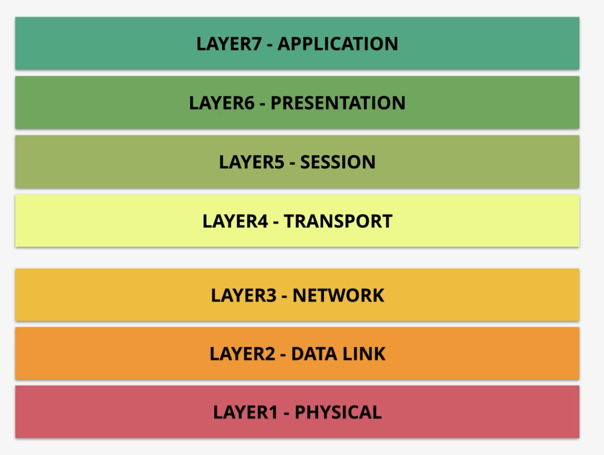
    
- What is the OSI 7-Layer Model?
    
    The OSI (Open Systems Interconnection) model is a framework that describes the functions and interactions of computer systems in a network. 
    
    It is divided into seven layers, with each layer responsible for specific functions in data transmission.
    
- What is another common name of the OSI 7-Layer Model?
    
    Networking Stack
    
- What is contained within the Media Layers?
    
    
    
- What is contained within the Host Layers?
    
    
    
- What is the conceptual model you should have of the media layers?
    
    Media layers should be viewed of how data is moved from point A to point B.
    
- What is the conceptual model you should have of the transport layers?
    
    Transport layer should be viewed as the way our data is chopped up and reassembled for transport. It also includes the formatting required to be understood by both sides of the network connection
    
- What’s one real world example of the Application Layer (Layer 7)? What about the Physical Layer (Layer 1)?
    
    Layer 7 ⇒ Browser (client) and server
    
    Layer 1 ⇒ Physical network interface cards
    
- What is Layer 1 responsible for?
    
    Layer 1 is responsible for the physical transmission of data over a communication channel (cable/wireless signal)
    
- From this picture which is the device and which is the shared physical medium?
    
    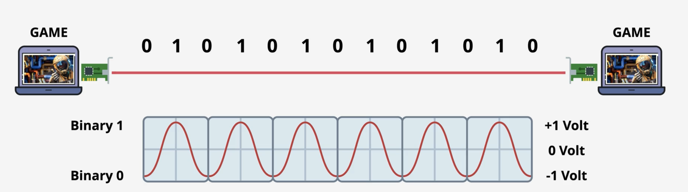
    
    In the example below: the device is the networking interface card and the shared physical medium is the copper/electrical signal in binary being sent between them
    
- What are the three features of layer 1?
    
    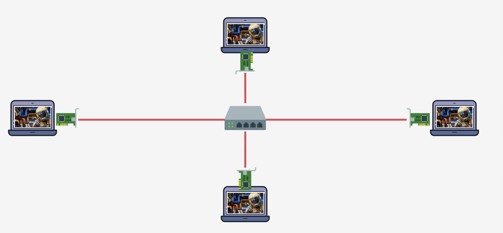
    
    use this picture in the question itself
    
    1. No device addressing, all data is processed by all devices (eg. device on the left transmits and all other listen and receive that data)
    2. Anything received on any port, is transmitted on every other port (while connected to the above hub you do not have the ability to pick what you want to receive)
    3. If multiple devices transmit at the same time, collisions can occur. (corrupting any transmissions on the shared medium)
- What doesn’t Layer 1 offer?
    
    No Media Access Control
    
    No Collision Detection
    
    No Uniquely Identified Devices
    
    No Method for Device to Device Communication (broadcast only on the shared medium)
    
- How would layer 2 interact with layer 1 in a practical sense?
    
    Layer 2 would provide the “frames” while layer 1 handles the physical transmission and reception onto and from physical shared medium
    
- What is the purpose of Layer 2?
    
    Its purpose is to serve controlled access for the physical medium (present in Layer 1)
    
- What is the name of Layer 2?
    
    The Data Link Layer
    
- What are the bare minimum requirements for a functioning Layer 1?
    
    Two network interfaces
    
    A shared medium between them
    
- What is a frame?
    
    They are a format for sending information over a Layer 2 network
    
- Who can frames be addressed to?
    
    A specific mac address or broadcasted (to everyone using all F’s)
    
- What are the four components of a Layer 2 frame?
    
    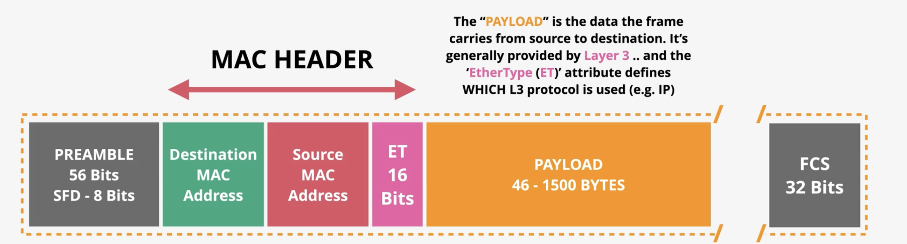
    
    Preamble (allows devices to know where the frame starts)
    
    Mac Header (Mac address source + destination, EtherType — defining which Layer 3 protocol is used eg. IP)
    
    Payload (data we carry from the source to the destination)
    
    Frame Check Sequence (error checking)
    
- What does mac address facilitate in Layer 2?
    
    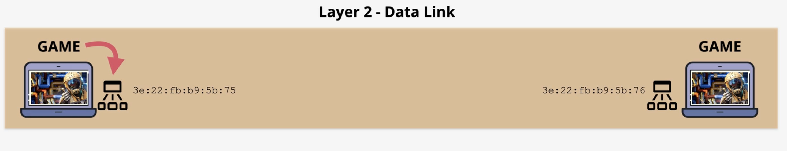
    
    It facilitates machine to machine communication because when you create the frame you should two mac address: the sender and receiver.
    
- Explain how two games in Layer 2 would communicate with each other
    
    
    
    1 Create Frame with the intention of sending data to mac address 5b:76
    
    2 Check carrier (if it find one it means that it is transmitting)
    
    3 If no carries is found, layer 1 takes the frame data (created in Layer 2) and converts it to physical standard and transmits it
    
    4 L1 (on the right) receives it and passes the frame to layer 2
    
    4.1 Layer 2 reviews the destination mac address, sees that it it addressed for itself so it passed to the game on the right
    
    5 Game on the right needs to send to game on the left, its layer 2 needs to build a frame
    
- Imagine this scenario where you have a hub and you’re the computer at the top and trying to send (game) data to the computer on the bottom. How would that work?
    
    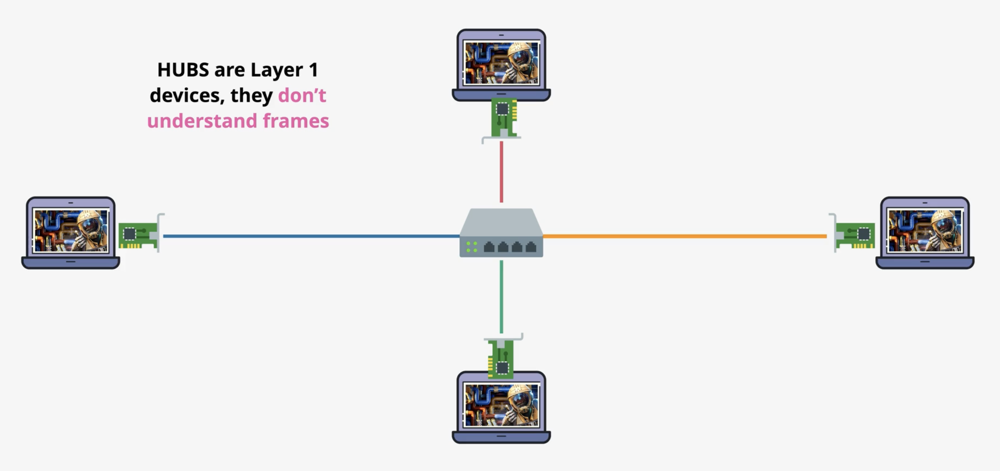
    
    Well, layer 1 sends data to everyone that is connected to the hub. In this case everyone would receive the frame, but it would be the responsibility of the Layer 2 to determine the correct destination mac address and ensure that only that computer (the one at the bottom) is the one accepting the payload/frame
    
- What is a switch? How it is different than a hub?
    
    Switch is the smarter equivalent version of a hub (layer 1) that only works by sending frame between participants on the network (mac address table)
    
    A switch will send the data to the specific mac address if it is aware of it in its registry otherwise it will send it to all. This is smarter than layer 1 hub solutions that always send the frames to all participants on the network
    
    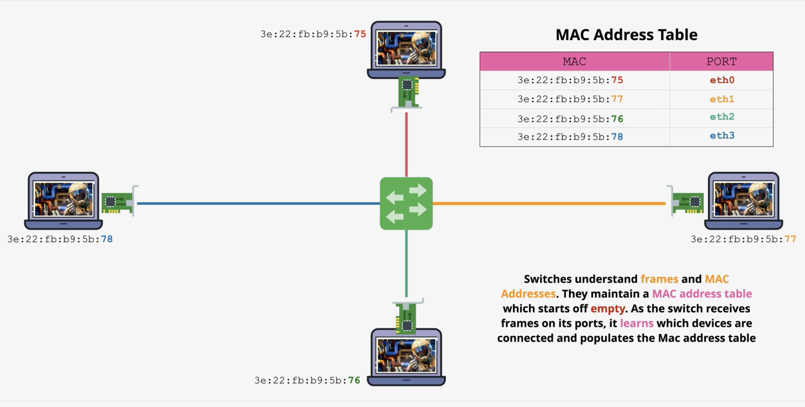
    
- What is the benefit of switches when it comes to dealing with collisions?
    
    Switches will only transport valid frames over its network. So if the frame is invalid (aka collision) then the transport won’t happen and the issue will be isolated on the port they occurred.
    
- What are the improvements that Layer 2 brings over Layer 1?
    
    Enables Identifiable devices (using mac addresses)
    
    Enables Media access control
    
    Enables Collision detection
    
    Enables Unicast communication (one-to-one communication)
    
    Enables Broadcast communication (one-to-all communication)
    
- What layer is ethernet part of? What is it generally used for?
    
    Ethernet is a L2 protocol that is generally used for local networks.
    
- What is one downside of L2 and how is that addressed by L3 protocol?
    
    L2 are isolated local area networks and using only L2 solutions you’d have to have a direct point to point connection between two local network.
    
    L3 solves the issue of having to have direct point to point communication (often expensive) by introducing Internet Protocol. IPs allow the movement of data between Local Area Networks without needing direct point to point communication.
    
- What is IP from a Layer perspective? What features does it add to the respective layer?
    
    Internet Protocol (IP) is a layer 3 protocol.
    
    It adds cross-network IP addressing and routing.
    
- What is the purpose of IP Packets?
    
    They are a way to move data from the source to the destination using intermediary networks
    
- At what layer can we find packets? What about frames?
    
    Packets ⇒ Layer 3
    
    Frames ⇒ Layer 2
    
- What is one similar thing between packets and frames? What about one different thing?
    
    Packets and frames both contain a source and destination
    
    Frames have the source and destination on the same network while for packets the two can be on two opposites sides of the globe.
    
- What are the important contents to keep in mind about IP v4?
    
    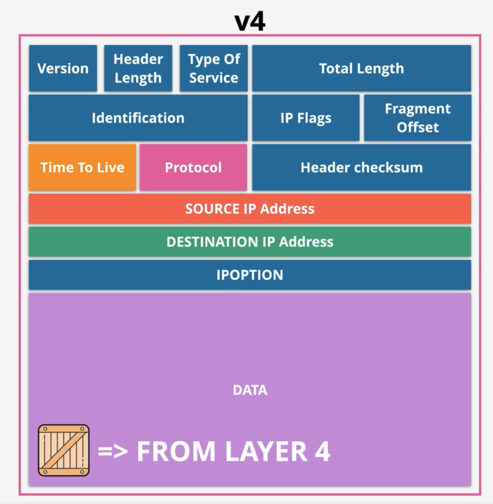
    
    Protocol (what layer 4 protocol the packet uses)
    
    Time to Live (number of maximum hops it should make to get to the destination)
    
    Source Ip Address
    
    Destination Ip Address
    
    Data (received from layer 4)
    
- What interaction do layer 3 packets have with layer 4 and layer 2?
    
    Packets hold information from layer 4
    
    Packets are held in multiple layer 2 frames
    
- What are the main differences between IP v4 and v6?
    
    v4 calls it Time to Live while v6 calls it Hop Limit
    
    v6 uses larger source and destination ip addresses
    
    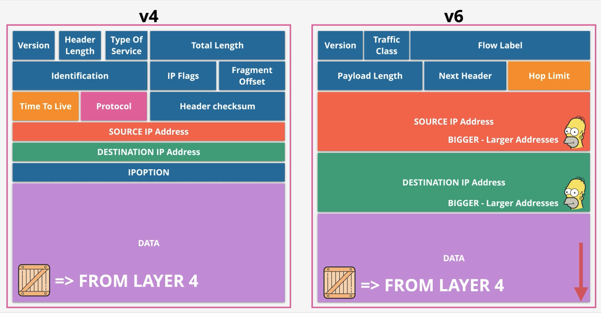
    
- How do you write an IP address?
    
    Dotted-decimal notation
    
    4 x 0-255
    
    eg. 133.33.3.7
    
- What is an IP address composed of?
    
    A network part (first two numbers)
    
    A host part (last two numbers)
    
    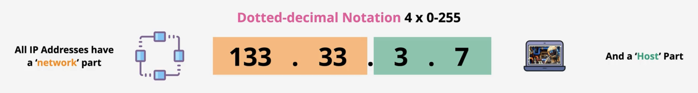
    
- How can you tell if two ip addresses are on the same network?
    
    
    
    This will happen if the “network” part matches for both ip addresses (first and second octets)
    
    eg. both ip addresses will start with 133.33
    
- How may bits does an ip address have?
    
    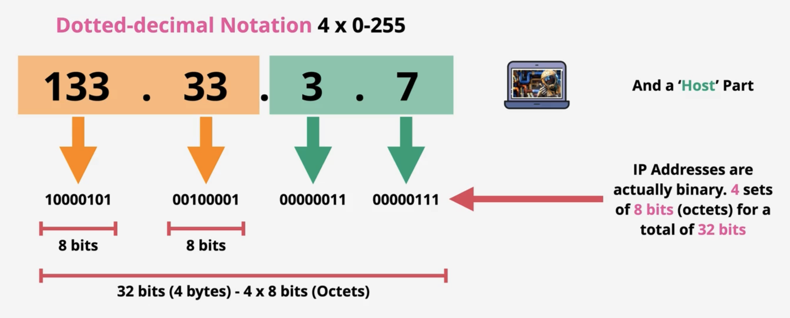
    
    32 bits spread across 4 sets of 8 bits (octets)
    
- Who usually assign IP addresses?
    
    Machines (using DHCP servers)
    
    Humans
    
- What is the purpose of subnet masks?
    
    It helps determine if a IP address is local or remote — which dictates if it uses a gateway or communicates locally
    
- Could you do a breakdown of L3 Route Tables and Routes?
    
    Your goal is to send data to AWS (destination 52.217.13.37 from local 1.3.3.7)
    
    1. You set destination 52.217.13.37 which using the default route of 0.0.0.0/0 forwards that data to your ISP provider
    2. ISP’s router has multiple interfaces set to various ip. It is the job of the Route Table to determine where you should end up
    3. Routers compares the destination IP & route table to decide the matching destination. Packet is forwarded to the Next Hop/Target
- What does the “/24” mean in “52.217.13.0/24”?
    
    It means that the first 24 bits are for the host while the remaining 8 bits being for the host
    
    (255.255.255.0)
    
- How do you write a default route
    
    Default route notation: 0.0.0.0/0
    
- How does default routing work in the example below?
    
    
    
    The power of a default route is that we will send data to that “target” if we do not match any other destinations (that are more specific)
    
    In our example, we will send to the upstream ISP (52.43.214.1) ONLY if we don’t match the IPs of AWS or Netflix. If we match AWS we will send data there and ignore the override the default routing.
    
- What enables packets to move from source to destination? How is that done in practice?
    
    
    
    Packets are routed using a “Route Table” from source to destination using the “Next Hop/Target” section of the route table.
    
    (It can be that you pass multiple hops before you data gets to its destination)
    
- What is the purpose of Address Resolution Protocol (ARP)? How it is helpful?
    
    It helps provide the mac address for a given ip address. This is useful because L2 needs a mac address to create the frame that will be send from one network to another
    
- Explain how data would get from D2 to D3 in this example
    
    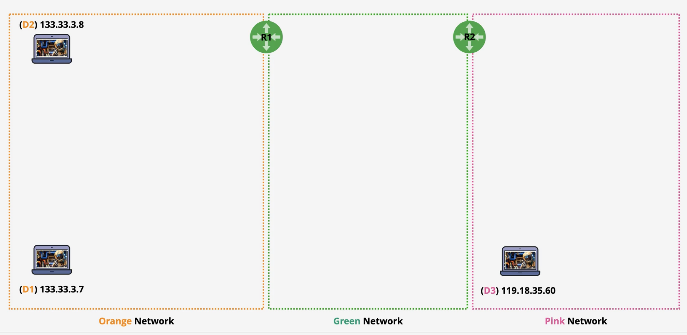
    
    use this screen as hint
    
    
    
    1. Subnet Mask + Destination Ip to determine that D3 is not local
    2. Use ARP to find MAC Address of R1
    3. P2 (Payload) is encapsulated and sent to R1 MAC from D2
    4. R1 removes the frame around P2 and reviews packet + IP destination (D3 in this case)
    5. Green network encapsulated P2 in another frame and uses R2 as the destination MAC address
    6. R2 removes the frame around P2, confirming using Subnet Mask + destination ip that the destination is on the same network
    7. R2 uses ARP to get the MAC address of D3. It creates frame for P2 (F4P2) and sends it to the final destination. 
    
- What does L3 add on top of the features presented in L2 and L1?
    
    IP Addresses (v4/v6) - cross network addressing
    
    ARP - find MAC address based on a given IP address
    
    Route - where to forward packets
    
    Route Tables - multiple routes
    
    Routers - move packets from source to destination encapsulating in L2 frames along the way
    
- What does L3 allow for at its most fundamental level?
    
    It enables device to device communication over the internet. It routes data from source to destination across multiple interconnected networks.
    
- What are some of the problems with L3 packets? What layer helps address these issues?
    
    No ordering
    
    No error checking
    
    No association
    
    ---
    
    TCP Segments at Layer 4
    
    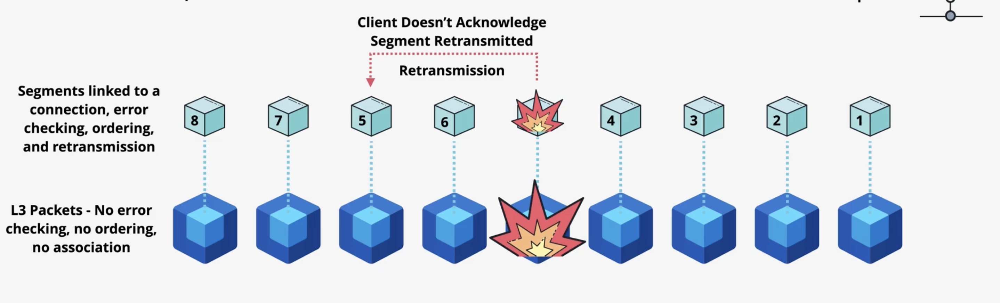
    
- What are the two important components of L2?
    
    TCP and UDP
    
- What is the main difference between TCP and UDP? Which of the two is more used in practice?
    
    TCP is slower but reliable while UDP is faster but less reliable.
    
    The most used one is TCP
    
- What application layer protocols use TCP?
    
    HTTP, HTTPS, SSH
    
- What is the benefit of TCP segments?
    
    They add extra functionality to L3 IP packets
    
- How are TCP segments similar to other L3/L2 solutions?
    
    Segments are similar to packets (L3) or frames (L2) as they have a way to encapsulate data that facilitates the movements of information
    
- What are some of the important components of TCP header?
    
    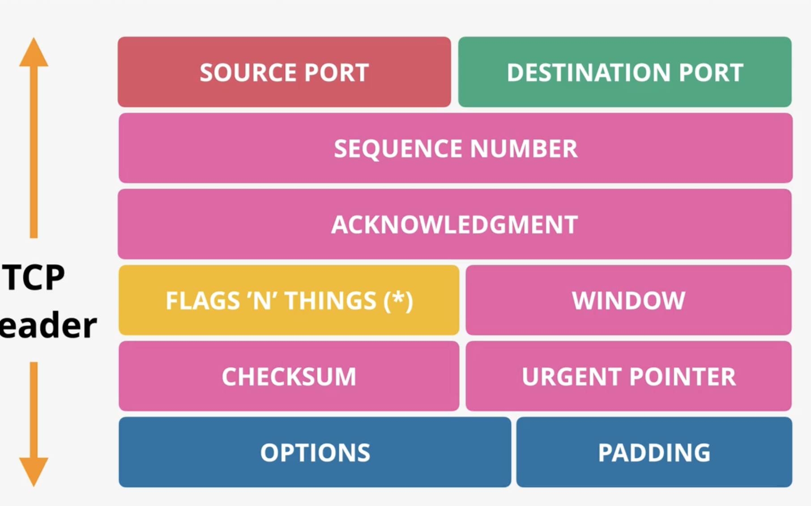
    
    Source PORT
    
    Destination PORT
    
    Sequence number + Acknowledgement (plays into the reliability of TCP because these two components ensure that your segments are ordered appropriately and received successfully)
    
    Checksum (error checking)
    
- What does TCP stand for?
    
    Transmission Control Protocol
    
- What are the components of a TCP segment?
    
    TCP Header
    
    Data
    
- What do PORTs help with? At which layer can they be observed?
    
    PORTs (combined with IP at L3) allow the multiple stream of communications at the same time
    
    e.g. you can have connections with the Netflix and AWS websites at the same time. on a pure L3 solution that would not be possible
    
- From a L4 perspective what happen when you access AWS?
    
    When you open the AWS web interface you communicate from a port on your local machine to a PORT on the AWS server — TCP PORT 443 (HTTPS)
    
- How does Amazon distinguish between the multiple streams of communications it has open with the millions of clients on its servers?
    
    It does so by tracking four values: source + destination IPs, source + destination PORTs  
    
- What is TCP?
    
    TCP is a connection protocol that establishes a bidirectional connection between two devices using a random PORT on the client and a known PORT on the server.
    
- What is the “Ephemeral port” (also known as high ports)?
    
    The port range that the client chooses as the source port
    
    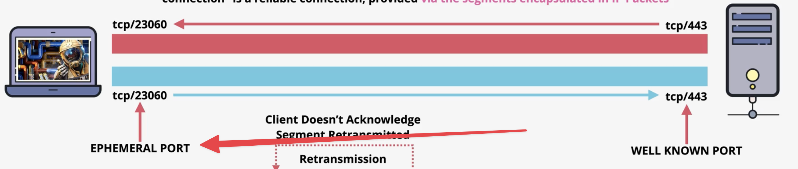
    
- How do you establish a TCP connection?
    
    It is called a 3-way Handshake
    
- How does the 3-way Handshake work?
    1. SYN ⇒ Send a segment with SYN random sequence set “cs” (Initial Sequence Number or ISN)
    2. SYN-ACK ⇒ Pick a random ISN sequence “ss”. Sends segment - SYN & ACK and acknowledge set to “cs” + 1 (meaning that “I’ve received up to “cs” now send “cs” + 1)
    3. ACK ⇒ Send segment with ACK. Acknowledge set to “ss” + 1 and sequence set to “cs” + 1 (I’ve received “ss”, send “ss” + 1; sequence set to “cs” + 1)
    4. Connection established (as both the client and the server agree on the sequence values)
- Say the TCP connection is opened. What happens behind the scenes whenever the client would send data to the server?
    1. Client increments the sequence
    2. Server acknowledges the sequence value + 1
- Practically how does this sequence + acknowledgment operation help whenever we open a TCP connection?
    
    Allows for retransmission when data is lost.
    
- When talking about a Layer 4 connection what do you actually talk about?
    
    TCP connection
    
- At L4/L5 what are the two types of Firewalls you will encounter?
    
    Stateless ⇒ you need to define the firewall rules for the outbound and response
    
    Stateful ⇒ you only need to define the firewall rules for the outbound (as that will allow implicitly the inbound response)
    
    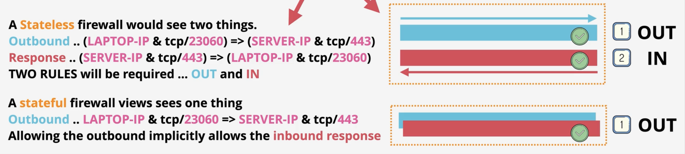
    
- What AWS services use stateless and stateful firewall?
    
    AWS Network ACL ⇒ stateless firewall
    
    AWS Security Groups ⇒ stateful firewall
    
- What does NAT stand for?
    
    Network Address Translation
    
- What is the purpose of NAT?
    
    The purpose of a NAT is to translate private IPv4 addresses to public address. By doing this you give access to the internet in both direction for said private IPv4 address.
    
- What are the three types of translations we can have with NAT?
    
    Static NAT ⇒ 1 private to 1 (fixed) public address
    
    Dynamic NAT ⇒ 1 private to the 1st available Public
    
    Port Address Translation (PAT) ⇒ many private to 1 public 
    
- When should you use dynamic NAT?
    
    When the number of private IP addresses outnumbers the number of public IP addresses you own.
    
- Could you provide one real world example of Port Address Translation?
    
    Home internet router ⇒ using PAT the various phones, laptops and tablets you have in your home will be transformed to all have the same public IP address
    
- What is another word for the “many private to 1 public” translation?
    
    Overloading
    
- Why is NAT a thing in IPv4 but not IPv6?
    
    Network Address Translation (NAT) is a workaround around the shortage of IPv4 addresses. We create private addresses and translate them to increase the total pool of IP addresses.
    
    But IPv6 does not suffer from the same shortage and as such it is not necessary.
    
- How do you write a private address using IPv4?
    
    10.0.0.[introduce your desired unique device identifier]
    
- How does NAT work if we want to send data from a private IP to Netflix?
    1. Create a packet that has the source destination the private IP (e.g. 10.0.0.42) and a destination ip
    2. As the packet passes through the NAT device, the source IP gets replaced with the assigned public IPv4 address
    
    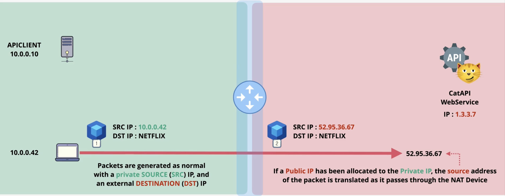
    
- What are the four components of a NAT table? What’s the NAT table useful for?
    
    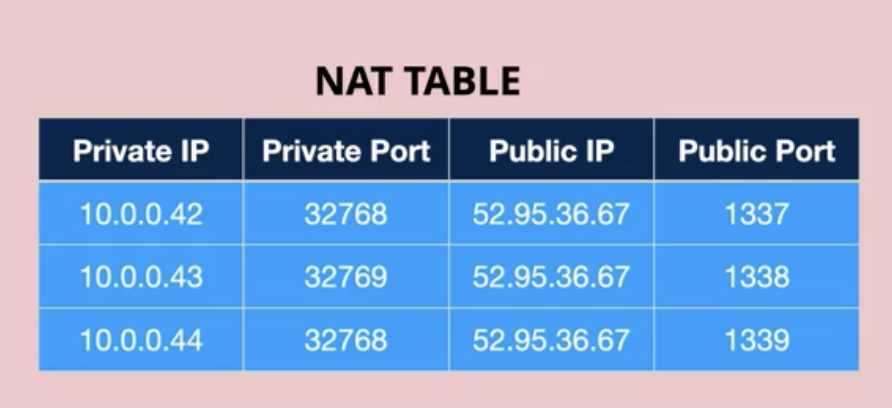
    
    Private IP/PORT with their respective Public IP/PORT
    
    A nat table is useful to keep track of the private to public mapping your NAT device has made.
    
- Theoretically why wouldn’t you be able to initiate traffic to private addresses?
    
    Because without an entry in the NAT table, the NAT device won’t know to which devices traffic should be translated and forwarded to.
    
- Could you break down the IPv4 address space?
    
    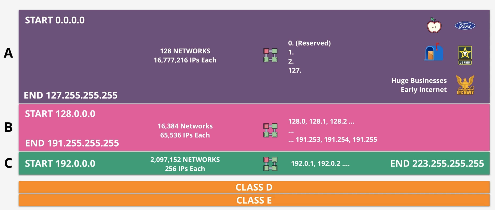
    
    Class A ⇒ 0. to 127. (0. being reserved)
    
    Class B ⇒ 128. to 191.
    
    Class C ⇒ 192. to 233.
    
- How many total IPv4 address are in total?
    
    Around 4 billion
    
- What are the three ranges of IPv4 addresses that are meant to be used as private addresses?
    
    10-dot range ⇒ 10.0.0.0 to 10.255.255.255 (Class A private network range)
    
    172.16 range ⇒ 172.16.0.0 - 172.31.255.255 (Class B private network range)
    
    192.168 range ⇒ 192.168.0.0 - 192.168.255.255 (Class C private network range)
    
- What does 10.0.0.0/8 mean?
    
    It means that the first 8 bits (10. in this case) are reserved to the network and the rest is available to hosts and subnetting
    
- Which part of the address is reserved for the network in 10.16.0.0/16?
    
    10.16. ⇒ for network
    
    .0.0 to 255.255 ⇒ for hosts and subnetting 
    
- What is the rule of thumb with IP address prefixing?
    
    The larger the prefix (/16 in 10.16.0.0/16) the smaller the network
    
- How does IP Subnetting work using 10.16.0.0/16 example?
    
    By subnetting 10.16.0.0/16 you get two networks: 10.16.0.0/17 and 10.16.128.0/17
    
    
    
- How would you subnet 10.16.128.0/17 into two smaller subnets?
    
    You would do it by creating two subnets: 10.16.128.0/18 and 10.16.192.0/18
    
    
    
- What does DDoS stand for?
    
    Distributed Denial of Service (attacks)
    
- How are DDoS attacks?
    
    They are attacks that are designed to overload websites by competing against legitimate connections. The difficulty with these types of attacks is the distributed nature making it difficult to block individual IPs/ranges
    
- What are the three most common types of DDoS attacks? Please provide examples for each one.
    
    Application Layer Attack ⇒ e.g. HTTP Flood
    
    Protocol Layer Attack ⇒ e.g. SYN Flood
    
    Volumetric Attacks ⇒ e.g. DNS Amplification
    
- What is a HTTP flood?
    
    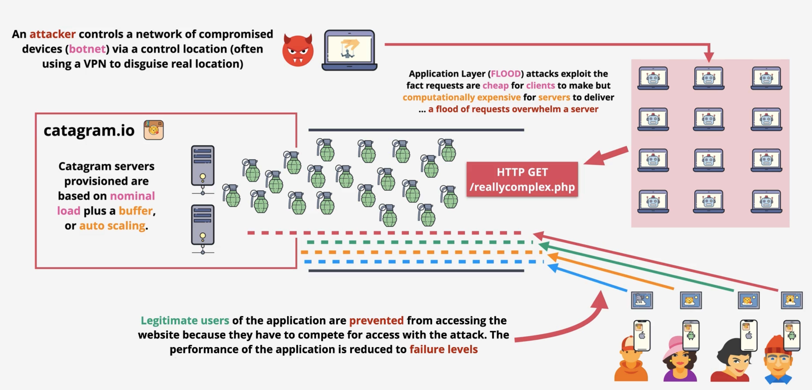
    
    HTTP floods take advantage of the computational imbalance of client-server communication as an attack method.
    
    More specifically, it is often easy for the client to request a page but hard for the server to deliver in a timely manner. HTTP flood is in a nutshell abusing this difference at a large scale.
    
- How do SYN floods work?
    
    
    
    1. Spoof source IP address and initiate connection attempt with the server
    2. The server now tries to perform step two of the 3-way handshake (sending back SYN+ACK) but given that the source IP address is spoofed it is unable to do so.
    3. At this point the connection hangs for a specified duration thus consuming network resources (multiplying this by billions can cause major problems to your ability to provide the service)
- What do both HTTP and SYN floods have in common?
    
    They’re both using botnets (compromised devices) to overload an application’s services and thus denying/delaying actual users from interaction with the application
    
- What is a botnet?
    
    It is a compromised device often used in large quantities in DDoS attacks.
    
- How do DNS amplification works?
    
    
    
    Botnet exploits a protocol where the response is much larger than the request. It does so by spoofing the victim application’s IP and established a larger number of DNS requests. Now the spoofed IP (catagram.io) will receive a large number of response temporarily blocking/delaying access to the service by legitimate users.
    
- What is known as a byte?
    
    8 bits
    
- What is known as a octet?
    
    1 byte or 8 bits
    
- How does the binary value table look like?
    
    
    
- Calculate the binary of 133.
    
    10000101
    
- What does SSL stand for?
    
    Secure Sockets Layer
    
- What does TLS stand for?
    
    Transport Layer Security
    
- What is the purpose of SSL/TLS?
    
    Their purpose is to ensure privacy and data integrity between the client and the server by encrypting the communication
    
- When should the TLS process begin?
    
    When the TCP connection has been established (with the help of the three-way handshake
    
- What is the main difference between SSL/TLS?
    
    TLS is a newer and more secure version of SSL
    
- How does SSL/TLS ensure privacy between the client and the server?
    
    It does so by encrypting the communication between the two.
    
    Only the client and server have access to the unencrypted communication.
    
- In the context of SSL/TLS when should we use asymmetric and symmetric encryption?
    
    Asymmetric ⇒ when initially establishing the secure communication between the client and the server
    
    Symmetric ⇒ after the initial communication channel has been set up, you should keep to move to symmetric as it is faster and less computationally intensive
    
- What are three things that SSL/TLS helps with?
    
    Ensure that the communication between the client is private using encryption.
    
    It allows the verification of the server and client/server
    
    It creates a reliable connection that’s guarded against alterations
    
- What are the three stages that SSL/TLS go through to established a secure communication?
    
    Cipher Suites ⇒ agreeing on the method of communication
    
    Authentication ⇒ ensure that the server certificate is authentic and the server is legitimate
    
    Key Exchange ⇒ enabled the move from asymmetric to symmetric encryption
    
- What happens within the Cipher Suite step of setting up SSL/TLS?
    
    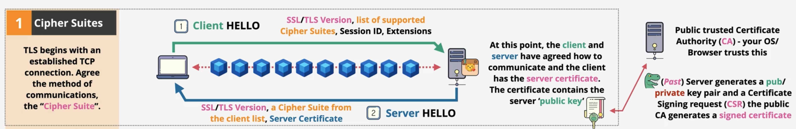
    
    The client sends data to the server regarding the SSL/TLS version, listed of supported Cipher Suites, Session ID and Extensions.
    
    The server responds to the client by sending the SSL/TLS version, a cipher suite from the client list, and a server certificate.
    
- What happens within the Authentication step of setting up SSL/TLS?
    
    
    
    The client using the server certificate checks against the CA (Public Trusted Certificate Authority) that the certificate is valid and hasn’t been revoked and that the DNS matches the names on the cert. This allows us to prove that the server id is valid.
    
    The client attempts to encrypts and send some random data using the public key provided by the server at step 2. This ensures that the server has control over the private key.
    
- What happens within the Key Exchange step of setting up SSL/TLS?
    
    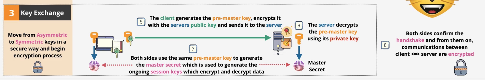
    
    The client generates the pre-master key, encrypts it with the servers’ public key and sends it to the server
    
    The server decrypts the pre-master key using its private key
    
    Both use the pre-master key to generate the master secret which is used to generate ongoing session keys which encrypt and decrypt data (moving from asymmetric to symmetric keys)
    
    Both sides confirm the handshake and from now on the communication between the client AND server is now encrypted.
    
- What happens if the client sends a cipher suite that is not supported by the server?
    
    The connection to create the SSL/TLS secure communication fails.
    
- When do we get the server certificate? What does the server certificate contain?
    
    We get it after the server has received and processed the client’s request for a secure SSL/TLS connection.
    
    The server certificate contains the server’s public key.
    
- Why is the server sending back the public key to the client helpful (establishing SSL/TLS secure communication)?
    
    The public key is helpful because the client can use it to encrypt communication that can be delivered and decrypted only by the server’s private key.
    
- What is the purpose of the authentication step in the SSL/TLS secure communication process?
    
    It is meant to ensure that the server certificate is authentic, verifying that the server is legitimate.
    
- What is the purpose of a Public Certificate Authority?
    
    To give out certification that the OS/browser to 
    
- What is the process of getting a signed certificate?
    
    Server generates a public/private key pair and a Certificate Signing Request (CSR). With this CSR the CA (Certificate Authority) generates a signed certificate
    
- What does CA stand for in the context of SSL/TLS?
    
    Certificate Authority
    
- What does CSR stand for?
    
    Certificate Signing Request
    
- When are pre-master key used?
    
    In the Key Exchange step of setting up SSL/TLS which are temporary before we generate the master secret (used for ongoing communication after SSL/TLS has finished setting up)
    
- When are session keys used?
    
    After the SSL/TLS process has finished allowing the client/server to send data between them in a secure manner
    
- How do we generate the master secret?
    
    Using the pre-master key the client sends (which the server decrypts) in the Key Exchange step of the SSL/TLS secure communication process.
    
- How many rules will you need for a stateless firewall?
    
    Two in total: one rule for the inbound, and another for the outbound
    
    This is because the firewall sees both request / response as two different, unrelated, calls.
    
- What is one major problem with stateless firewall?
    
    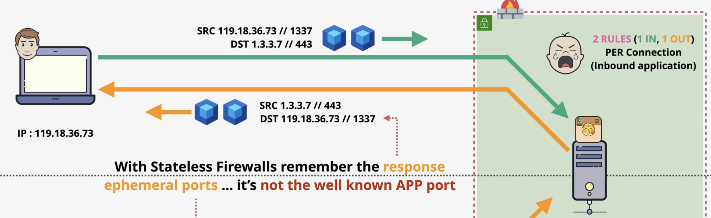
    
    Given that the client often uses ephemeral ports to make the request (random PORT) it is often the case that your servers needs to allow the entire Ephemeral port range as outbound in your firewall settings.
    
    The problem is that allowing all these ephemeral ports can leave you exposed to security risks
    
- What is a Jumbo Frame?
    
    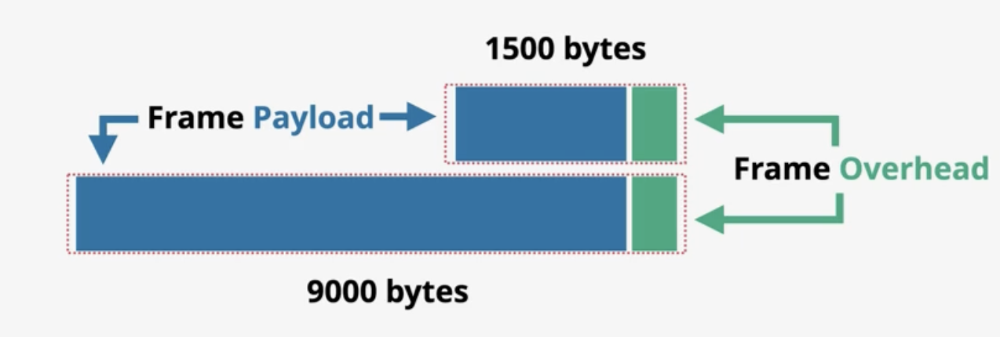
    
    They are improved frames (Ethernet on L2) that allow the transmission of more data (9000 byte payload compared to the traditional 1500)
    
- Why are jumbo frames useful?
    
    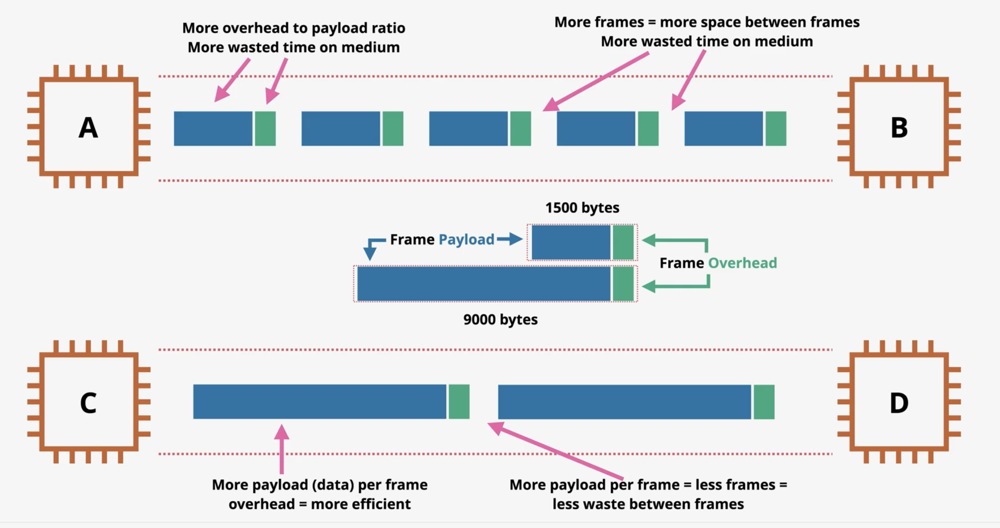
    
    More frame payload: They allow us to increase the payload of data per frame making the transmission of data more efficient (e.g. more efficient communication between two EC2 instances).
    
    Less frames used: They allow us to use less frames thus cutting down on the wasted time between frames.
    
- What is one thing to keep in mind regarding the downsides of Jumbo Frames?
    
    You need to ensure that all steps in the networking layer support Jumbo frames otherwise you can lead to issues with the fragmentation of your stack.
    
- How can L5 help us streamline the communication between the client and the server?
    
    Request + Response = Session: L5 introduces session which means that instead of seeing request/response between the client/server as two distinct events we see them as one.
    
- How is L5 session useful?
    
    It allows us to reduce admin overhead (do not have to worry about request/response as separate events)
    
    It allows us to add more contextual security (treat outbound = response differently than outbound = request from a firewall perspective)
    
- What is the purpose of Layer 7 firewalls? Could you provide a real world example to illustrate this?
    
    Layer 7 firewall keeps all of the layer 3, 4, 5 features but can react to layer 7 elements (e.g. HTTPS) to decide whether to block or allow access.
    
- Could you provide a real world example of the benefit that L7 firewall brings?
    
    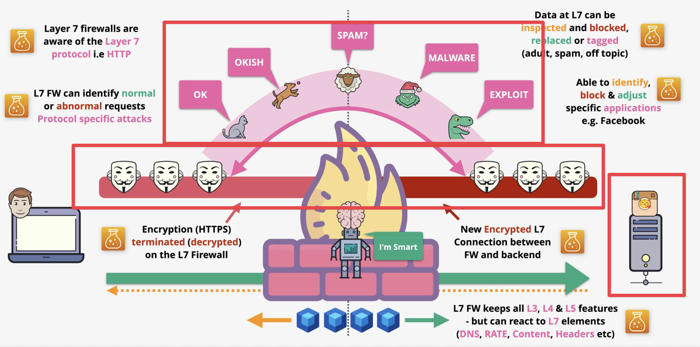
    
    Think that given that L3 ⇒ L5 do not have visibility into L7 it means that for these firewalls a cat image is the same as a dog image all being the same as a malware. With L7 firewall we can filter out malware before reaching the server.
    
- What is IPSEC VPN?
    
    It is a group of protocols that set up secure tunnels across insecure networks (between two peers, local and remote)
    
- How is IPSEC VPN useful?
    
    It is useful if you are a business and want to connect together various locations that are spread apart geographically.
    
- What are the features of IPSEC VPN?
    
    Requires authentication
    
    All traffic carried by the IPSEC protocol is encrypted by default
    
- What are the two phases of setting up an IPSEC VPN?
    
    Internet Key Exchange (IKE) Phase 1 (slow & heavy) ⇒ this phase is all about allowing peers to communicate securely
    
    IKE Phase 2 (fast & agile) ⇒ this phase is all about setting up the details of how the VPN will be constructed
    
- What are fibre optic cables?
    
    It is an alternative to copper cable for transferring data by transmitting data over the glass/plastic core
    
- Why would you choose fibre optic cable over copper cables?
    
    Can cover larger distances
    
    Has higher speeds for data transfer
    
    More resistant to electromagnetic interference
    
    More consistent experience vs copper
    
- What is a Fibre Optic Transceivers?
    
    They are the devices that are plugged at both ends on the fibre optic cable that are tasked with creating and translating data to light (and vice-versa)
    
- What are the two approaches to encryption? Could you provide examples?
    
    Encryption at rest ⇒ e.g. encrypting your hard drive
    
    Encryption in transit ⇒ e.g. encrypting your data before it reaches your banking app where it gets decrypted by the service provider
    
- What does the term “plaintext” refer to?
    
    Unencrypted data (can be anything a document, an image and an application)
    
- What does the term “ciphertext” refer to?
    
    Plaintext + encryption algorithm = “ciphertext”
    
- How does envelope encryption work
    
    In envelope encryption, a symmetric data encryption key is generated for each piece of data or user, and it is then encrypted with a separate key known as the key encryption key (KEK — often an asymmetric key allowing for greater security)
    
- Why is envelope encryption helpful?
    
    Symmetric keys are often the best in terms of performance of encryption/decryption. The problem is sending them across the internet securely is impossible (hard to pass private keys around). That’s why you need to use envelope encryption which uses a asymmetric KEK (managed by services such as AWS’ KMS) to secure your symmetric key.
    
- What does the acronym KEK refer to?
    
    Key Encryption Keys
    
- What does the acronym KMS (AWS service) stand for?
    
    Key Management Service
    
- What is the purpose of Key Encryption Keys (KEK)?
    
    Keys that are used to encrypt data less than 4kb in size (often meaning other encryption keys)
    
- What AWS services works with KEK?
    
    KMS - Key Management Service
    
- What is the flow of encrypting an S3 cat picture using AWS KMS?
    
    
    
    1. Use a KMS Key (KEK — Key Encryption Key) to generate two DEK (Data Encryption Key) keys
        1. A plaintext DEK key used to encrypt data immediately.
        2. A wrapped DEK that will be stored with the ciphertext (data that you encrypted with DEK) 
    2. Encrypt the S3 cat picture using the DEK. The DEK itself gets discarded and the wrapped DEK gets passed along with the ciphertext.
- What is the benefit of encrypting with DEK a cat picture in S3?
    
    
    
    1. The data is encrypted (encrypted DEK along with the ciphertext)
    2. Each S3 encrypted object has a unique DEK so any leaks are contained within that object (not threatening the security of all encrypted items in S3)
- What is the relation between KEK and DEK in AWS KMS?
    
    One Key Encryption Key can be used to generate millions of Data Encryption Keys each used to encrypt a single object
    
- Say you have a ciphertext and a wrapped DEK. What is the process of retrieving your plaintext from the encrypted data?
    
    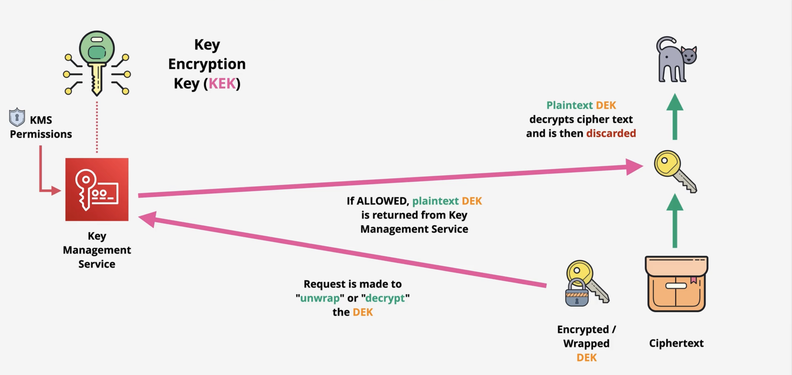
    
    1. We assume you have a wrapped DEK and the ciphertext. You make a request to KMS to unwrap your DEK
    2. KMS checks for the appropriate permission (from the caller of the service). If satisfactory KMS uses its KEK and returns the plaintext DEK.
    3. Using the plaintext DEK, the user can now decrypt their ciphertext to receive their unencrypted data (original plaintext)
- How can hashing help us verify downloaded data?
    
    Imagine you make some data available for download. You can have the download in one location and the hash in another external system. 
    
    This allows you to download the data, hash it and ensure that there was no tempering to the data IF the hashes matches the one in the external system.
    
- What is the purpose of digital signatures?
    
    Their purpose is to verify that:
    
    - The document hasn't been altered since it was signed (integrity).
    - The signature was created using the sender's private key (authentication).
- What is the step by step processing of how digital signatures work? Provide an example
    
    
    
    1. The sender hashes the data and using their private he creates a signature. The original document and the digital signature are then stored on the internet.
    2. The receiver uses the sender’s public key to retrieve the hash. He then also makes sure that hash from the digital signature matches hashing the received document. 
- How do you verify the authenticity and integrity of a document using digital signatures?
    
     You do that by comparing two things:
    
    1. The hash value derived from the received document (computed independently by the recipient).
    2. The hash value obtained by decrypting the digital signature using the sender's public key.
- What are the three main reasons why we don’t see one main DNS server?
    
    Risk problem ⇒ Prone to hacking given that there is one central place to be attacked
    
    Scaling problem ⇒ Everyone using the internets needs to go through a DNS, so scaling is another issue
    
    Data volume problem ⇒ 341 million domains each with many more subdomains
    
- What are the important steps in the DNS hierarchal design?
    
    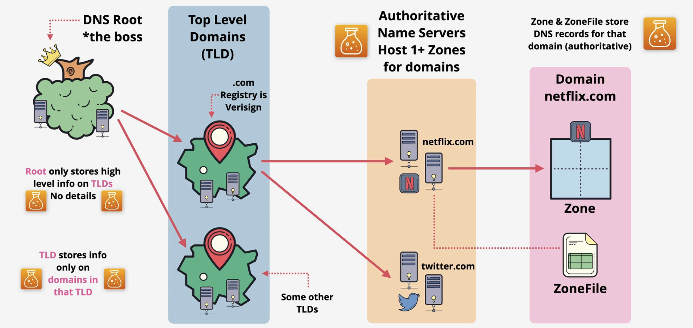
    
    DNS Root ⇒ root zone knows which names servers the .com zone is on
    
    Top Level Domains (TLD) ⇒ the .com zone knows which name servers [netflix.com](http://netflix.com) is on
    
    Authoritative Name Servers ⇒ [netflix.com](http://netflix.com) zone contains records for the netflix/com domain
    
- How does DNS address the issues of having one large DNS server?
    
    It does so by adopting a hierarchical structure where you have DNS Root, TLDs and Domain Servers each holding a small fraction of the overall data.
    
- What is a DNS zone?
    
    You can think of it as a database containing DNS records for a given domain.
    
    e.g. [netflix.com](http://netflix.com) DNS zone would contain the data that would turn the domain into an IP that would point to the netflix server
    
- What is a ZoneFile?
    
    How we store a DNS zone on the disk
    
- What are Name Servers?
    
    They are a DNS server that host 1+ DNS Zones and 1+ Zonefiles
    
- What does non-authoritative mean in the context of DNS?
    
    Authoritative answers can only come from TLDs pointing to the authoritative name servers (who have actual control over the DNS records for that domain) it means that all other DNS responses are non-authoritative.
    
    e.g. you could have a DNS resolve cache the mapping for netflix/com but that would be called a non-authoritative answer
    
- In a nutshell what is the purpose of DNS?
    
    The job of DNS is to help you locate and get a query response from the authoritative zone which hosts the DNS record(s) you need
    
- Could you do a walking the (DNS) tree for Netflix?
    
    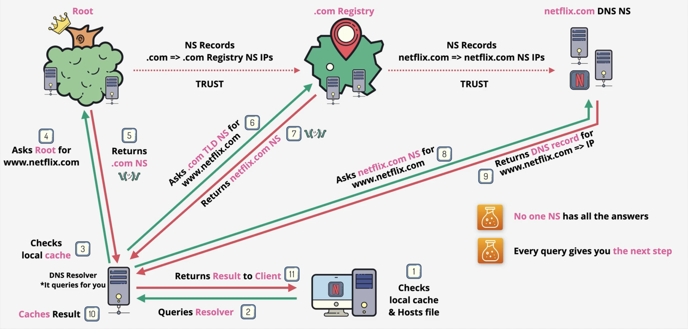
    
    1. Check local cache
    2. Query DNS resolver
    3. DNS resolvers checks its own local cache
    4. Ask root for www.netflix.com. It returns the .com NS
    5. Ask .com TLD NS for www.netflix.com. It returns netflix.com NS
    6. Ask netflix.com NS for www.netflix.com. It returns DNS records that transforms www.netflix.com to its respective IP
    7. DNS resolver caches the result for further www.netflix.com queries.
    8. Return result to client
- Could you break down what a the purpose of a domain registrar and DNS hosting provider is? What is the difference between the two?
    
    Domain Registrar ⇒ lets you purchase domain
    
    DNS Hosting Provider ⇒ they operate DNS NS (name servers) which can host DNS zones (allowing you to manage the content of these zones)
    
    Some companies are both domain registrar and DNS hosting providers (e.g. Route53) but not all.
    

### Kubernetes

- What is a Kubernetes cluster?
    
    Highly available cluster of compute resources which are organised to work as one unit
    
- What are the components of a Kubernetes cluster?
    
    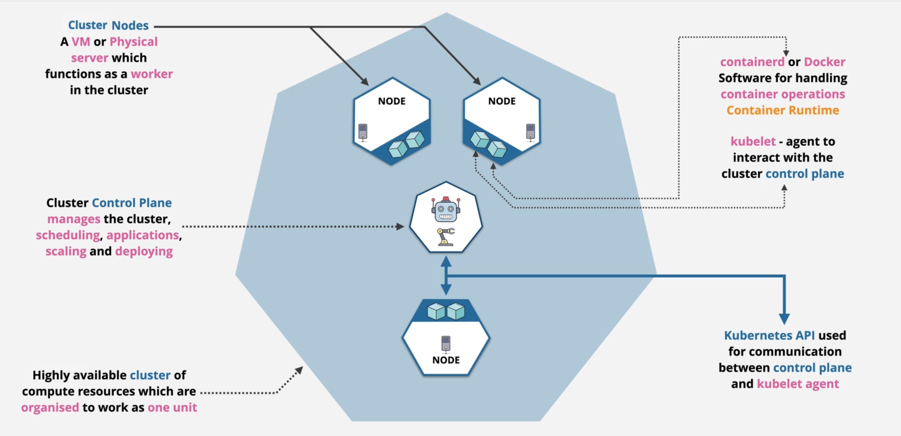
    
    Cluster Control Plane ⇒ the way in which you manage the Kubernetes cluster (scheduling, scaling, deploying)
    
    Cluster Nodes ⇒ VM/Physical servers which function as workers in the cluster (workers that are in charge of running your containerized application)
    
    software on each of the nodes: Docker (used to handle all container operations) + Kubelet (used to interact with the cluster control plane)
    
- What are the bare minimum requirements for a Kubernetes cluster nodes?
    
    
    
    Container runtime (used to handle all container operations) e.g. Docker
    
    Kubelet (used to interact with the cluster control plane of that specific Kubernetes cluster)
    
- What are Kubernetes nodes?
    
    Nodes provide the actual compute resources and pods run on these nodes.
    
- What are pods in Kubernetes?
    
    Pods are the smallest units of computing in Kubernetes. 
    
    Pods are temporary because their goal is to do a job after which they are disposed of.
    
- What is the most common Kubernetes pod architecture? What would be one example where that isn’t the case?
    
    “One-container-one-pod” architecture is most common in Kubernetes so you shouldn’t think in container and instead think in **pods**
    
    That would happen mostly if you have various applications that are tightly coupled together and depend on each other in a close way.
    
- What are Kubernetes service?
    
    It is an abstraction that can be viewed as the way we access the application in Kubernetes (one that can run on multiple pods)
    
- What is the purpose of Kubernetes jobs?
    
    To create pods until completion
    
- What is the purpose of Ingress?
    
    It is a way to expose access into a Kubernetes service 
    
    Often the architecture for this will look something like: Ingress ⇒ Routing ⇒ Service ⇒1+ Pods)
    
- What is the purpose of the Ingress controller?
    
    Ingress Controller is responsible for implementing the Ingress rules we defined by configuring the necessary network components
    
- What is the purpose of Persistent Storage in Kubernetes?
    
    Pods tend to be created and destroyed without any persistence between the pods. Persistent storage allows us store information beyond the lifecycle of any one pods in our Kubernetes nodes.
    

### Backups

- What does the acronym RPO stand for?
    
    Recovery Point Object
    
- What is the purpose of Recovery Point Object?
    
    It represents the maximum amount of data loss that an organization can tolerate (often measured in time)
    
- What does it mean when an organization tells you they have an RPO of 6?
    
    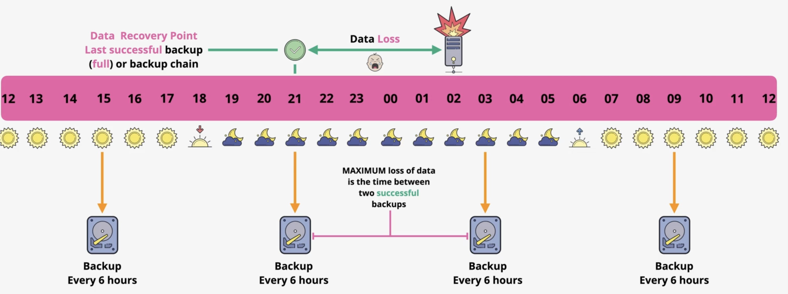
    
    It means that the organization cannot tolerate more than 6 hours of data loss in the case of a disaster (e.g. server failure)
    
- What are recovery points?
    
    Last successful full backup OR backup chain (containing multiple partial backups put together)
    
- How do we decide RPO?
    
    Based on the needs of the business. 
    
    For financial data a low RPO will ensure that no financial data is lost in the case of a failure while for website/presentational data a higher RPO might be good to balance the costs of having low RPO across the board.
    
- What is does the acronym RTO stand for?
    
    Recovery Time Object
    
- What is Recovery Time Object (RTO)?
    
    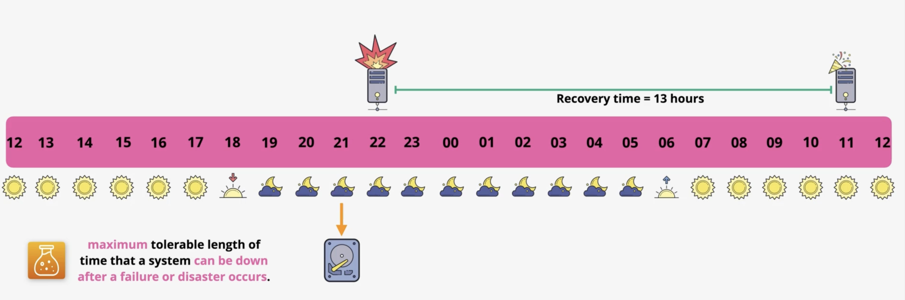
    
    It is the maximum tolerable length of time that a system can be down after a failure or disaster occurs.
    

- What are the 5 essential features of cloud computing?
    1. On-demand self-service ⇒ you can provision resources as needed without requiring human interaction
    2. Broad Network Access ⇒ Capabilities are available over the network and accessed through standard mechanisms
    3. Resource pooling ⇒ no control + knowledge about exact location of resources + resources are pooled to serve multiple customers
    4. Rapid elasticity ⇒ Capabilities can be elastically provisioned and released to scale rapidly + provisioning abilities appear unlimited
    5. Measured service ⇒ Resource usage can be monitored, controlled, reported ... and billed
- What do are [X]aaS solutions all about?
    
    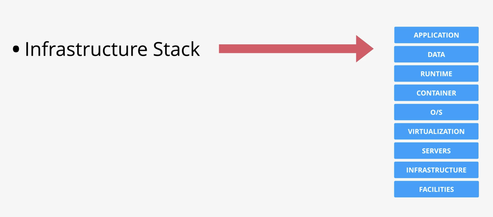
    
    add in the question
    
    They are meant to describe the parts that you manage versus the ones that are managed by vendors. 
    
    SaaS means control over using the application (last layer) while IaaS means you control everything from the O/S to the application layer 
    
    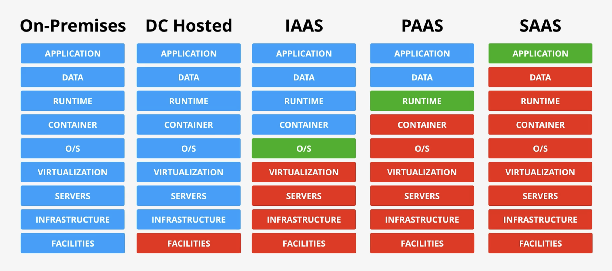
    

### Docker

- What are three benefits that Virtual Machines have over normal servers?
    
    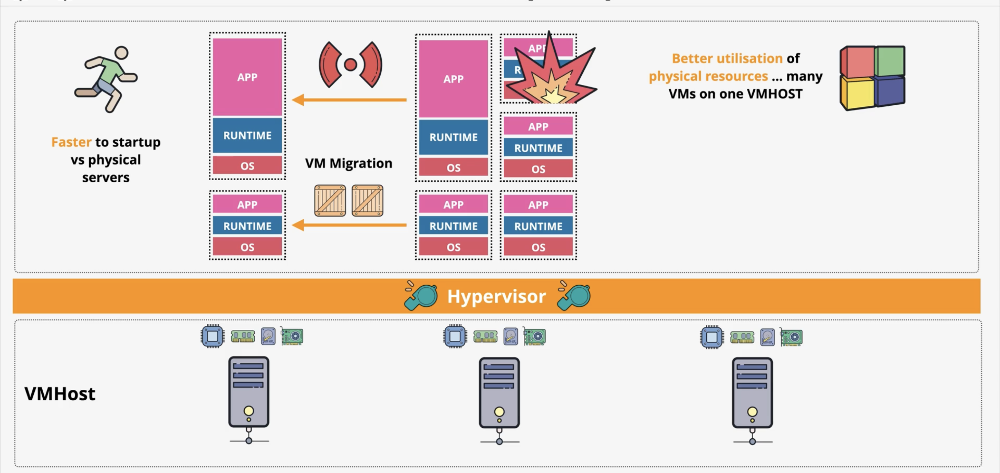
    
    1. **Disaster proof**
    
    In case of a disaster having multiple applications on a single server would mean that all applications would crash.
    
    With Virtual Machines we can have multiple applications running without needing to worry about hardware failure impacting the availability of our application (you could theoretically just move to another VM to another VM Host without much trouble).
    
    1. **Better resource utilization**
    
    You can have multiple VMs on a single VM Host
    
    1. **VMs have a faster startup than physical servers**
- What is the difference between Virtual Machines (VM) and Docker?
    
    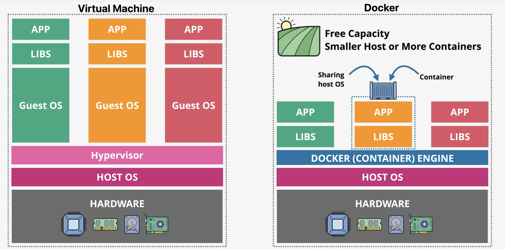
    
    Docker uses the Docker Engine while VMs use Hypervisior. Docker Engine tends to be lighter than the Hypervisor (has less to do)
    
    Docker allows you to reuse the Host OS for your applications. In contrast, VMs have a Host OS that is separate from the Guest OS
    
- Overall what is the compelling selling point of Docker over VMs?
    
    By having a light Docker Engine and sharing the OS with all its containers, we overall have more free capacity. 
    
- What allows Docker containers to function?
    
    A container host (physical hardware) via the Docker Engine
    
- What can you find inside of a Docker container?
    
    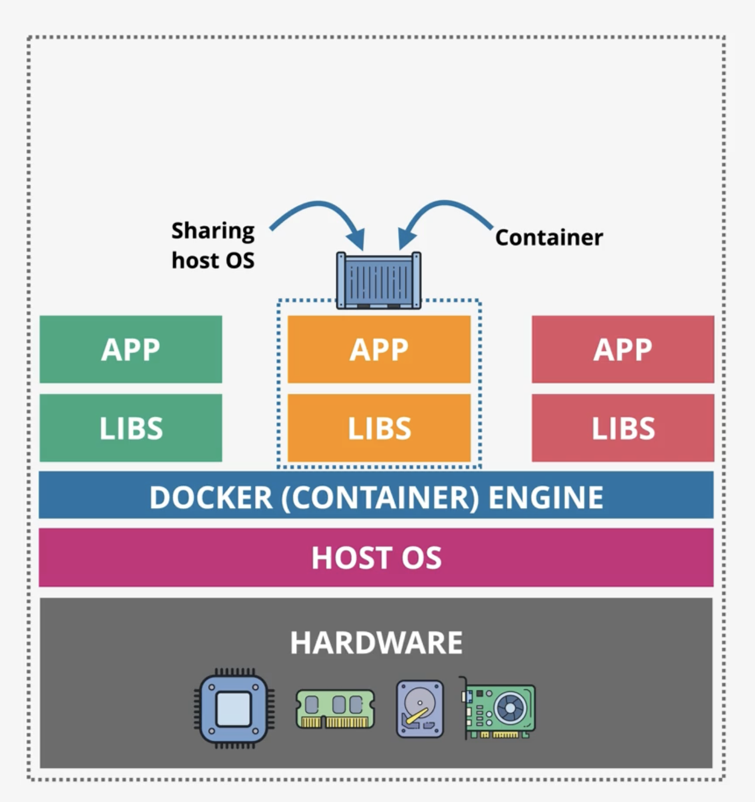
    
    Hardware
    
    Host OS
    
    Docker Engine
    
    Container with libraries and applications
    
- What is the colocvial line for how Docker was created?
    
    “It works on my computer” => “ok, let's ship your computer”
    
- What are the two ways to get images on the Docker Host (allowing us to create Docker containers)?
    
    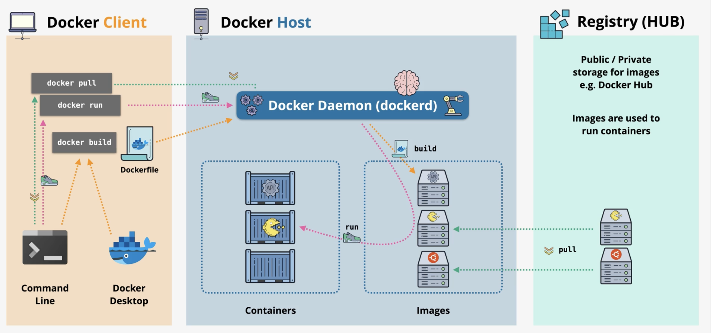
    
    **Download them**: Using Docker Pull command ⇒ we install them from the Docker Hub
    
    **Create them**: Using Docker Build command ⇒ we install them by passing a Dockerfile
    
- How is a container different than an image in Docker?
    
    Images are read-only while containers gain the read/write ability.
    
- What is Docker Host?
    
    A Docker host is a physical or virtual machine where Docker Daemon is installed and runs.
    
- What is the purpose of a Docker Daemon?
    
    A Docker daemon allows us to manage Docker objects such as images and containers
    
- What is the Docker Registry?
    
    Docker (container) registry is like GitHub but for docker images.
    
- What does docker push command do?
    
    It takes a container running on the Docker Host and pushes it to the registry (Docker Hub)
    
- What should you visualize when you hear Docker or Docker Engine?
    
    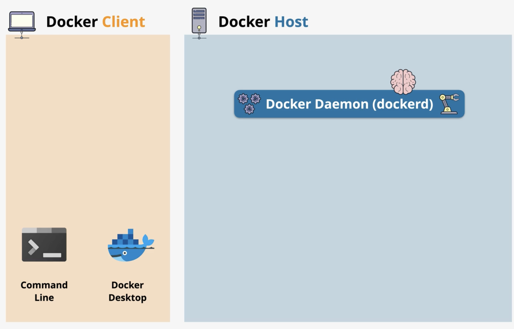
    
    It should think about to a client-server application. Docker Daemon would be the server and Docker client would be the client-side application.
    
- What is the purpose of Docker images?
    
    Images are used to run containers. If you want to run an application in the container, you need an image that has that application + libraries + runtime environments.
    
- What Docker command should we use create containers?
    
    Assuming you have one or more Docker images on the Docker host you can run the docker run command and the Docker Daemon will create containers based on the existing images.
    
- What does the `docker ps` do?
    
    `docker ps` lists the currently running Docker containers.
    
- What does docker ps -a do?
    
    `docker ps -a` lists all Docker containers, including those that are currently running and those that have exited.
    
- How should you think of Docker images?
    
    You should think of them as immutable read-only templates
    
- What are the components of a Docker image?
    
    It contains various file system layer each containing only the differences between the layers.
    
    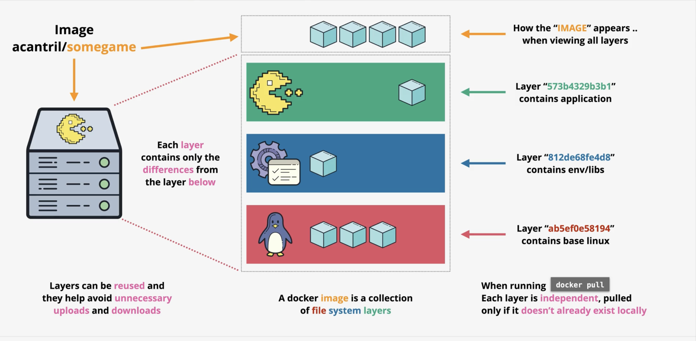
    
- What is the purpose of having layers within Docker images?
    
    Layers can be reused and they help avoid unnecessary uploads and downloads
    
- What are the 6 most important components present in a Dockerfile?
    
    FROM ⇒ Sets the base image for a build (e.g. Alpine - lightweight linux tailored to running Docker applications)
    
    LABEL ⇒ Adds metadata to an Image (e.g. description/maintainer)
    
    RUN ⇒ Runs commands in a new layer (e.g installs or configuration)
    
    COPY/ADD ⇒ adds folders to your application (COPY from local, ADD from remote url)
    
    CMD ⇒ tell Docker to run the command whenever the container is created from an image (e.g. CMD ["npm", "start"] would, by default, run `npm start` when the container is created)
    
    EXPOSE ⇒ tell Docker what PORT to run the application on
    
- How many Docker layers do we have in the following picture?
    
    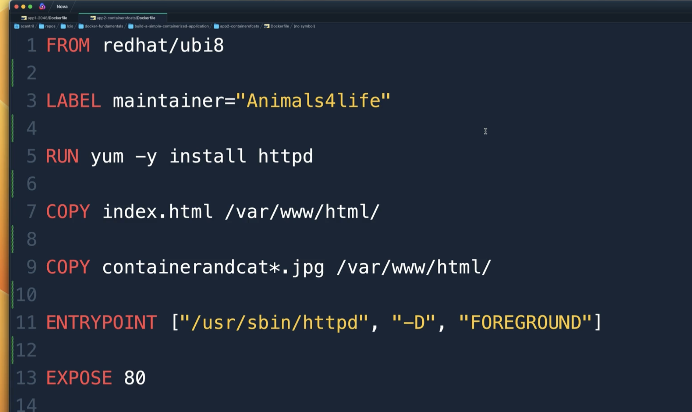
    
    use this as hint
    
    4 layers
    
    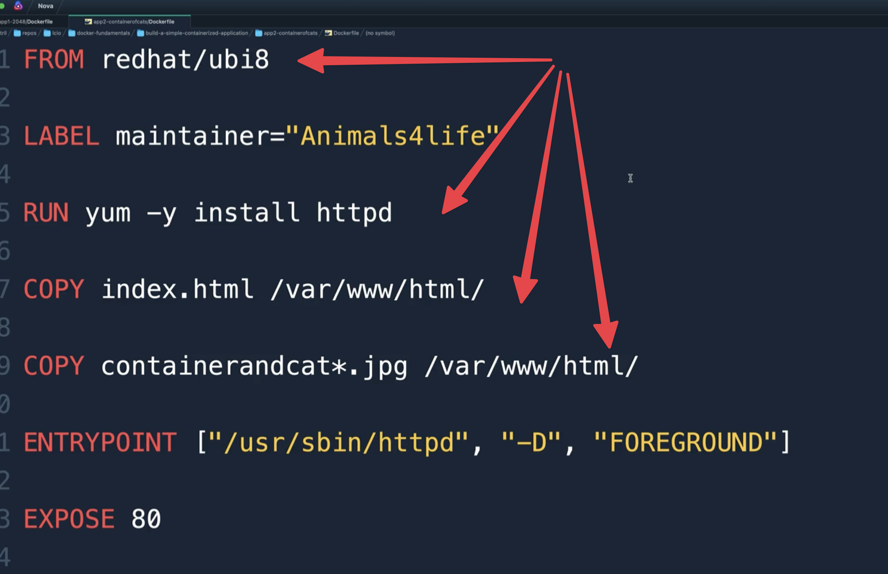
    
- What is the difference between using Nginx vs Red Hat?
    
    Nginx is a base Docker base image designed for web application while Red Hat is more general purpose (and thus has a bigger payload as base image — less efficient)
    
- What are the four ways of Docker storage we have available?
    
    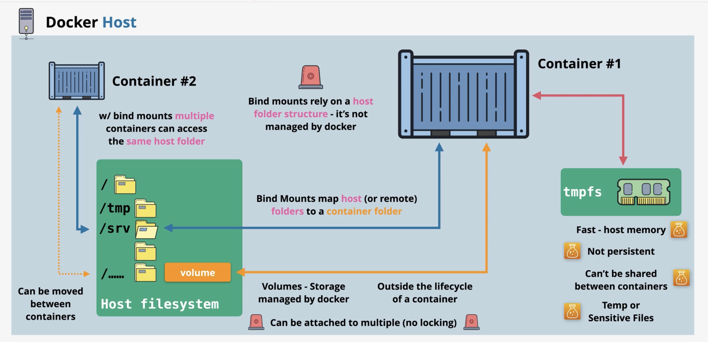
    
    1. **Volumes**: Docker volumes are the preferred way to persist data generated by and used by Docker containers. Volumes are independent of the container's lifecycle and can be shared among multiple containers.
    2. **Bind mounts**: With bind mounts, you can mount a file or directory on the host machine into a container. This allows the container to read and write files on the host filesystem.
    3. **tmpfs mounts**: tmpfs mounts create a temporary filesystem in the container's memory. This is useful for storing temporary data that does not need to persist across container restarts.
    4. **Container filesystem**: Data can also be stored directly within the container's filesystem, but this data is not persistent and will be lost when the container is removed.
- When is Docker Host networking not suitable?
    
    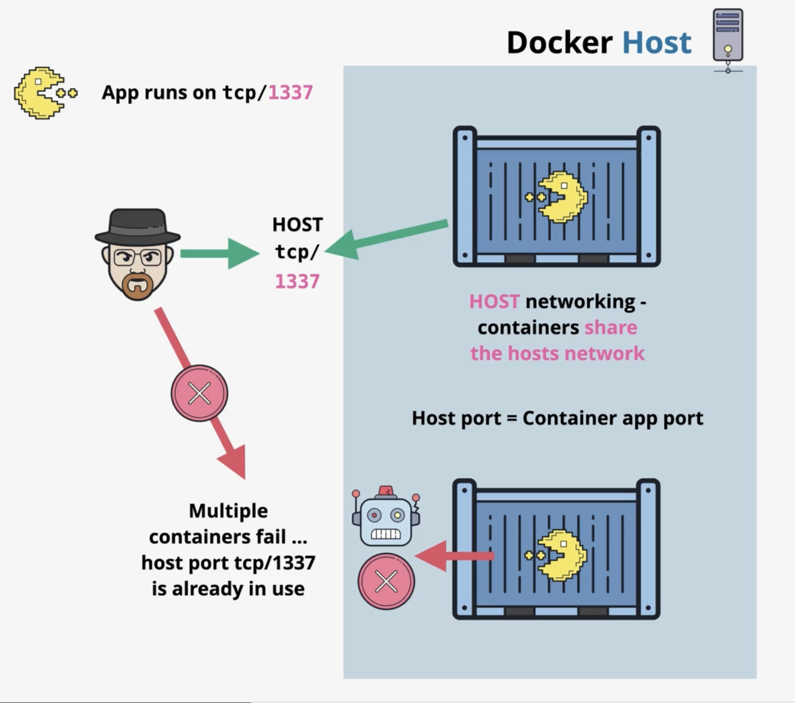
    
    The problem with docker hosts arises when you want to run multiple of the same container (scaling horizontally)
    
- What are the two most common types of networking for Docker?
    
    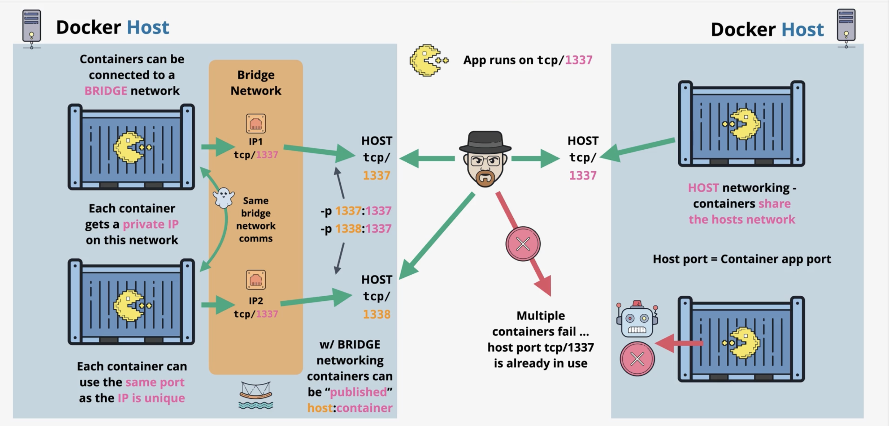
    
    HOST networking ⇒ containers share the host’s network (Host port = Container app port; e.g. app running on port 1337 means that the user will need to use that port when requesting data from the host)
    
    Bridge networking ⇒ use a bridge to publish the same container to different host ports (e.g. -p {host port}:{container port})
    
- What is the purpose of docker compose?
    
    Docker compose is a way to create and manage multi-container applications. It works using a YAML configuration file called `compose.yaml`
    

### AWS Fundamentals

- What are the three different network zones (AWS perspective)? #AWSInfra
    
    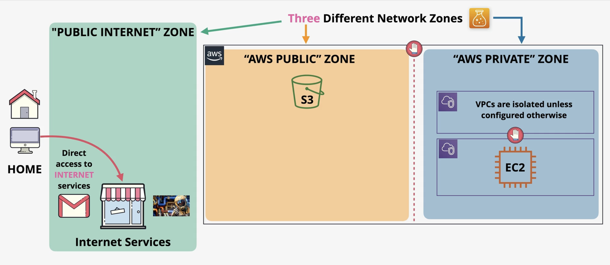
    
    Public Internet Zone
    
    AWS Public Zone ⇒ It is the place where public AWS services live (e.g. S3)
    
    AWS Private Zone ⇒ VPC
    
- How are AWS regions different than AWS Edge locations?
    
    AWS regions represent places where Amazon deploys its entire infrastructure making its entire suite of services accessible. On the other hand, AWS Edge locations are present in a larger number but they are mainly used for caching content closer to end-users to improve latency and performance.
    
- What are the benefits of AWS Regions?
    1. Geographic separation ⇒ A problem in one region would not affect infrastructure in another region
    2. Geopolitical separation
    3. Location control ⇒ increasing performance
- What is the purpose of Availability Zones?
    
    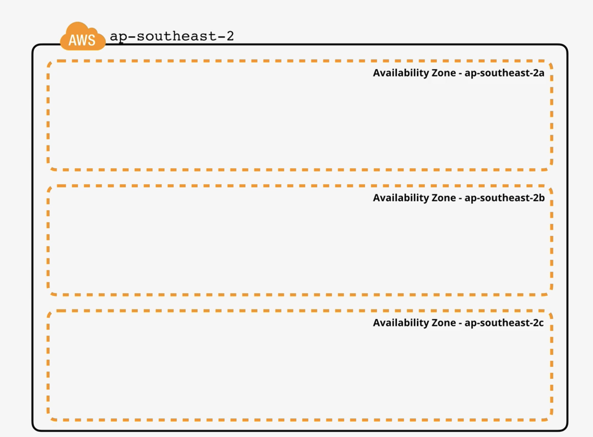
    
    Its purpose is to make your application more robust by providing **isolated** infrastructure within a specified AWS Region.
    
- What are the three types of service resillience you should think about when designing AWS products?
    
    Global resilience ⇒ can withstand failure across multiple regions e.g. IAM will still be available even if us-west-1 and us-east-1 fail
    
    Region resilience ⇒ can withstand failure in another region e.g. EC2 instance will still work in Virginia and Frankfurt fails
    
    Availability Zone resilience ⇒  resilient to failure in another AZ in the same region e.g. if you place your application only on Virginia AZ-1, then if that AZ fails your application becomes unavailable 
    
- What does acronym VPC stand for?
    
    Virtual Private Cloud
    
- What is the purpose of a VPC?
    
    It is used to create a virtual network within AWS
    
- What is the type of resilience of a VPC?
    
    Region resilient
    
    More info: This means that our VPC will be subnetted across multiple Availability Zones as seen with the default VPC subnet for us-east-1
    
    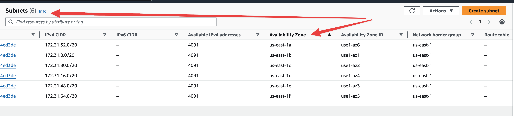
    
- What are the features that a VPC displays by default?
    
    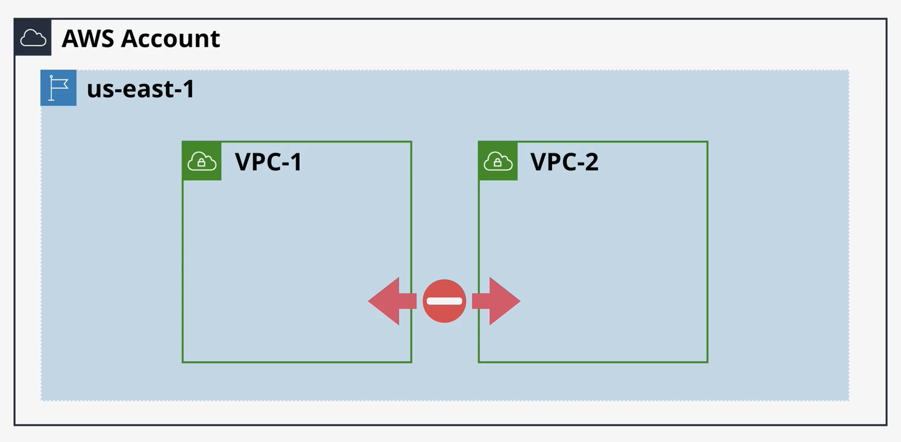
    
    1. Present in a single region (tied to specific account)
    2. Private and isolated by default (unless specified)
- What are the two types of VPCs? How many can be created?
    
    Default VPC ⇒ only one per region
    
    Custom VPC ⇒ as many as needed
    
- What is a VPC CIDR?
    
    It's the IP address range that you specify for your VPC when you create it.
    
- What does an instance refer in the context of EC2?
    
    It is meant to refer to virtual machine
    
- What is the resilience level of EC2? What does that resilience level mean in this context?
    
    **AZ resilient:** An instance is launched into a specific subnet and that subnet is part of a specific Availability Zone that makes EC2 AZ resilient by default. 
    
    **If AZ fails, your instance will become unavailable.**
    
- What does it mean when we say that EC2 is an IaaS service?
    
    It means that you as a consumer manage the Operating System (OS) and upwards while AWS manages the virtualization, physical hardware, networking, storage, and facilities.
    
- What would a EC2 consumer still pay for while the instance is in the “stopped” lifecycle?
    
    While you would not pay for CPU, memory, networking BUT you will still be billed for storage (e.g. EBS) as that is allocated to an instance independent of its current state. 
    
- What is the default PORT that SSH runs on?
    
    The default SSH port is 22.
    
- What is the resilience level of S3?
    
    Region resilience (data is replicated across AZs)
    
- What is the network zone of S3?
    
    AWS Public Zone
    
- What is S3 designed to do?
    
    Storage large amounts of data (e.g. movies, photos, large datasets). It should been seen as the default way to store information in AWS.
    
- What are the two main things that S3 delivers?
    
    Objects ⇒ data that S3 stores
    
    Buckets ⇒ containers for objects
    
- What are the components of an S3 Object?
    
    
    
    Key ⇒ the name of the object
    
    Value ⇒ the data being stored on that object
    
- What would you need to retrieve the picture of a cat you stored in S3?
    
    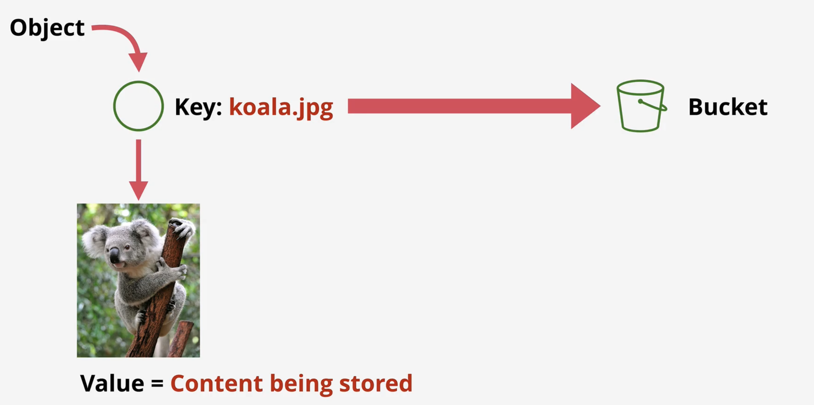
    
    1. IAM permission
    2. S3 Bucket name
    3. S3 Key identifier
- What is the range of the size that can be stored in S3?
    
    From 0 bytes all the way up to 5 terabytes
    
- What are three things to keep in mind about S3 Buckets?
    1. S3 Bucket names need to be unique across regions and across all other users in AWS.
    2. You can store an unlimited number of objects (each object storing up to 5tb of data)
    3. S3 Buckets have a flat structure (everything in the bucket is stored at the root level)
- If S3 buckets have a flat structure, how can it be that we see folders?
    
    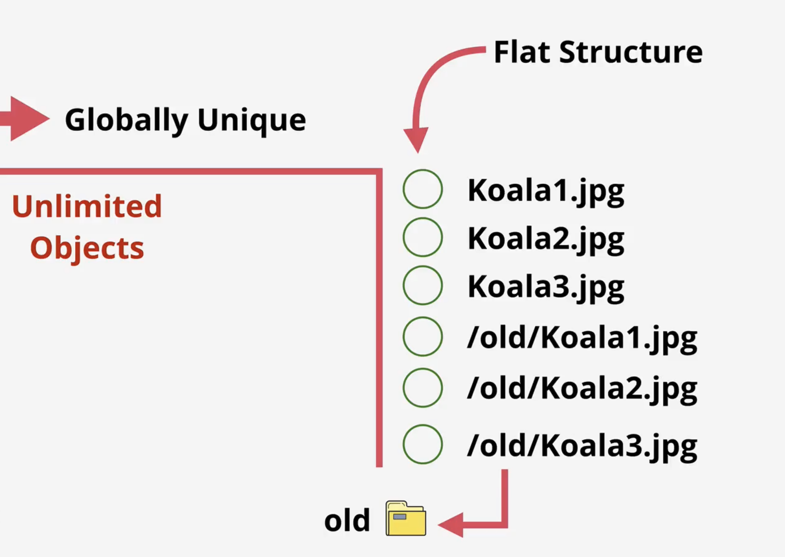
    
    The latter three S3 objects would show up under the folder called “old” but that is a visual representation that enhances the usability of the service. In reality, everything is stored at the root level.
    
- What are the limits to the number of S3 buckets you can create?
    
    Soft limit: 100
    
    Hard limit: 1000 (increased using support requests)
    
- What is the name of the technique you use in S3 buckets to create a folder like structure?
    
    They are called prefixes. In the example below that would “old” would be a prefix.
    
    
    
- What are the four requirements to creating a Bucket name?
    1. Bucket names are globally unique
    2. 3 - 63 characters, all lower case, no underscores
    3. Start with a lowercase letter or a number
    4. Can't be IP formatted e.g. 1.1.1.1
- What does it mean that S3 is an object store - not file or block?
    
    S3 is not suitable for a windows server that needs to access a network file system (File-Based storage) OR mount it to your virtual machine (that is called block storage — you can think of it as virtual hard disks e.g. EBS on a EC2 instance).
    
    S3 is suitable when you need to access the whole of an object (image, audio etc).
    
- What are the components of a ARN?
    1. Partition
    2. Service
    3. Region
    4. Account id
    5. Resource id
    
    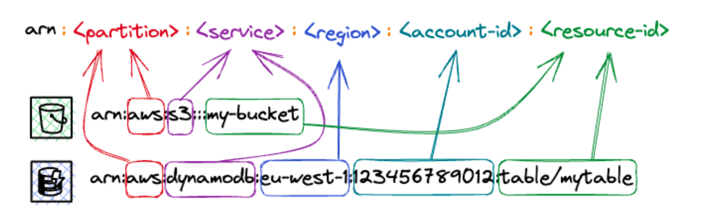
    
- Could you break down the components of this ARN `arn:aws:s3:::my-bucket`?
    
    s3 ⇒ service name
    
    my-bucket ⇒ resource id
    
- Could you break down the components of this ARN `arn:aws:ec2:eu-west-1: 123456789012:instance/i01234567890abcdef`?
    
    :ec2: ⇒ service name
    
    :eu-west-1: ⇒ region
    
    :123456789012: ⇒ account id
    
    :instance/i01234567890abcdef: ⇒ resource id
    
- What happens under the hood in S3 when we create a folder “archive” with the object name “image” inside?
    
    S3 has a flat architecture so we would intepret the object as “archive/image” instead of object “image” in folder “archive”.
    
- What should immediately follow AWSTemplateFormatVersion in our Cloudformation template?
    
    Description will ALWAYS be right after the AWSTemplateFormatVersion.
    
- At its core, what is the purpose of Cloudformation?
    
    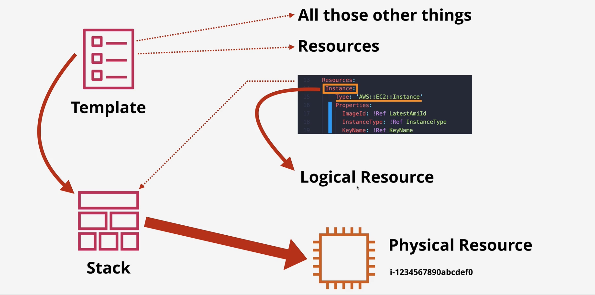
    
    It’s purpose is to keep logical resources in sync with the physical resources. 
    
    This is done by adding, updating, or removing AWS services from your own account based on the specifications you have in the Resources section of your Cloudformation template.
    
- What are metrics in the context of AWS Cloudwatch?
    
    Collection of related datapoints in a time ordered structure (e.g. CPU usage).
    
- What are the three types of alarms states you can have in Cloudwatch?
    
    Alarm state ⇒ passed a given threshold set by the user
    
    OK ⇒ within defined parameters
    
    Insufficient data
    
- At its core, what does the Shared Responsability Model try to say?
    
    The Shared Responsability Model dictates the responsabilities that both the customer and AWS have.
    
    AWS ⇒ responsibility for the security **OF** the cloud
    
    Customer ⇒ responsibility for the security **IN** the cloud
    
- What are the four things that AWS is responsable for in the Shared Responsability Model? Could you give examples for each?
    
    In the shared responsibility model, AWS is responsible for the security "of" the cloud, which includes the infrastructure, hardware, software, and facilities that run AWS services.
    
    Infrastructure ⇒ regions, AZ, edge locations
    
    Hardware ⇒ compute, storage, database, networking
    
    Software ⇒ hypervisors and virtualization software
    
    Facilities ⇒ data centers
    
- What are the four things that the customer is responsable for in the Shared Responsability Model?
    
    In the shared responsibility model, the customer is responsible for the security "in" the cloud, which includes securing their data, applications, identities, and configurations within the cloud environment.
    
- What does it entail that the customer is responsible for the configurations in the Shared Responsability Model? What are three examples?
    
    It means that the customer is responsible for the operating system, network and firewall configurations.
    
    Three examples of this are:
    
    - Client-side data, encryption, integrity and authentication
    - Server-side encryption (file system/data)
    - Networking traffic protection (encryption, integrity, identity)
- What does the acronym HA refer to?
    
    High-Availability
    
- What do we think about when we think of a high-availability service?
    
    A highly-available system is one designed to provide service by minimising any outages.
    
- What does high-availability maximize?
    
    It maximizes a system’s online time
    
- What is a high-availability system NOT about?
    
    It is not about preventing user disruption
    
- What does the acronym FT stand for?
    
    Fault-Tolerance
    
- What does Fault-Tolerance mean?
    
    A Fault-Tolerant system is one that can operate through various faults in its systems.
    
- How does fault-tolerance differ from high-availability?
    
    High-availability is all about maximizing uptime while fault-tolerance is concerned with designing a system that can operate through failure.
    
- What does the acronym DR refer to?
    
    Disaster Recovery
    
- What is the purpose of Disaster Recovery?
    
    The purpose is to provide a safety net of recovery in case that both fault-tolerance and high-availability were not enough.
    
- What is the resilience level of Route53? #Route53
    
    Global Resilience
    
- What are the first three things that happen when you use register a domain using Route53? #Route53 #DNS
    1. Route53 creates a Zonefile with information about that domain. 
    2. Based on that information it assigns 4 AWS managed Name Servers. 
    3. It coordinates with the TLD (.org in the case below) to ensure that is is able to point to the four authoritative NS for that particular domain.
    
    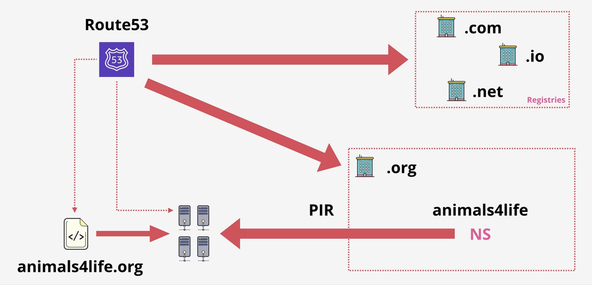
    
- What is the purpose of these Name servers in the Route53 console? #Route53 #DNS
    
    They are meant to display the name servers that Route53 will give to the .io top-level domain (TLD) as the authoritative NS for [animals4life.io](http://animals4life.io) as records
    
    
    
- How does amazon use name servers to host its [amazon.com](http://amazon.com) website? #DNS
    
    Amazon has name servers in the .com zone pointing to the [amazon.com](http://amazon.com) zone (Name Servers) that has records about that domain
    
    
    
- What do A and AAAA do in a given DNS zone? #DNS
    
    They help map host name to ip address.
    
    A records ⇒ IPv4 IP addresses
    
    AAAA records ⇒ IPv6 IP Addresses
    
- How would we gain the ability to interact with [hi@google.com](mailto:hi@google.com) from a DNS respective? #DNS
    
    Assuming that we’ve on the authoritative Google NS we can make an MX query. Here the DNS records chooses which MX record to return. Uses that information to connect to the Google mail server.
    
    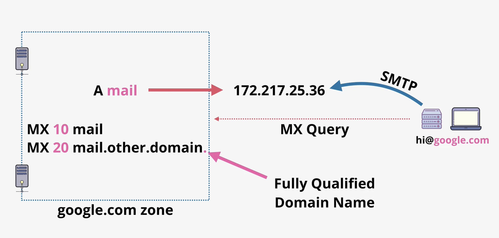
    
- What is the purpose of an MX record? #DNS
    
    MX record is how a server can find the mail server for a specific domain
    
- How does the client's mail server decide which MX record to use ?
    1. MX record with the lowest priority value is used first
    2. If multiple MX records have the same priority value, then one is randomly chosen
- Imagine you get back two MX records: Priority 10: [mail.example.com](http://mail.example.com) and Priority 20: backup.example.com. How  would we choose the mail server if mail.example.com becomes unavailable?
    
    Given the smaller priority value, [mail.example.com](http://mail.example.com) would first be chosen. 
    
    If that were to become unavailable, the client's mail server will then attempt to deliver the email to [`backup.example.com`](http://backup.example.com) (next lowest priority)
    
- Say you wanted to interact with hi@google.com. What would be the first thing you’d need to do?
    
    Use the DNS resolver to identify the authoritative name servers for [Google.com](http://Google.com) 
    
- What is the purpose of a TXT record? #DNS
    
    The purpose of an TXT record is to prove ownership of a specific domain.
    
- What does TTL help us with when trying to query for domains such as amazon.com? #DNS
    
    TTL help dictate how long a DNS record should be cached for on the DNS resolver.
    
    In the example below we walk the three to get the DNS record from the authoritative NS. That result will get cached on the resolver (non-authoritative) for performance for 3600 TTL (~ approximately 1 hour).
    
    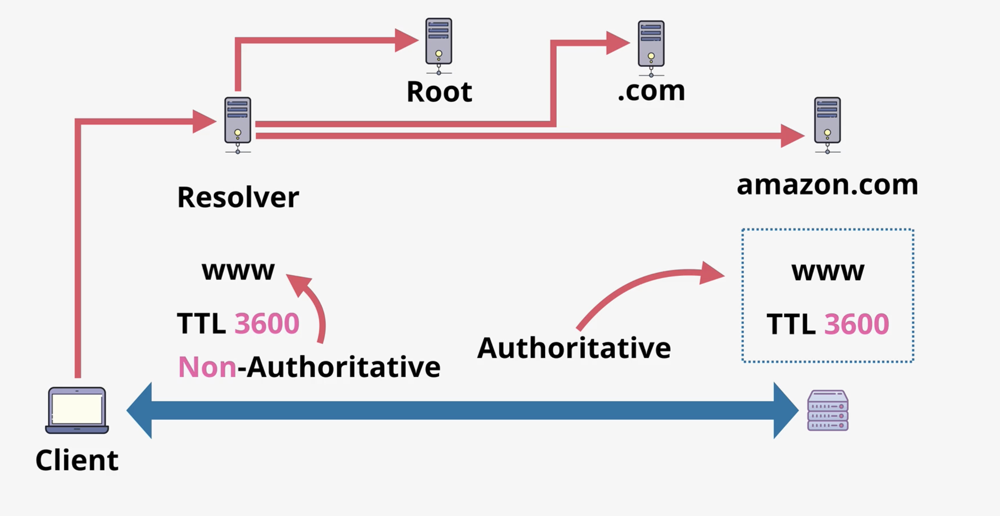
    
- What is one problem with a high TTL value when working with DNS? #DNS
    
    If you tend to play around with your DNS records AND have a high TTL you can quickly run into issues given that the DNS resolver have cache a different DNS record to the one on the authoritative NS
    
- What is the difference between a logical and physical resource when it comes to using CloudFormation? #CFN
    
    Logical resource refers to a resource defined in the CloudFormation Template while a physical resource refers to the physical resource created in your AWS account as a by-product of creating a CFN stack.
    
- How many DNS root servers exist? #DNS
    
    13
    
- Who manages the DNS Root Servers? #DNS
    
    Various organizations under the oversight of the Internet Corporation for Assigned Names and Numbers (ICANN)
    
- Who manages the DNS Root Zone? #DNS
    
    IANA
    
- Which type of organisation maintains the zones for a TLD (e.g .ORG) #DNS
    
    The zones for a top-level domain (TLD) such as .ORG are maintained by a **registry** operator.
    
- What is NOT stored in an AMI? #EC2
Boot Volumes; Data Volumes; AMI Permissions; Block Device Mapping; Instance Settings; Network Settings
    
    Instance and Network Settings
    
- What is the IP CIDR of a default VPC? #VPC
    
    172.31.0.0/16
    
- What is the Deny-Allow-Deny rule? #IAM
    
    Explicit deny will always override explicit allow.
    
    Explicit allow is needed to override the default deny.
    
    Default is to be denied access to a resource.
    
- What does the acronym ARN stand for in AWS? #AWS-IAM
    
    Amazon Resource Name
    
- What is the purpose of Amazon Resource Name? #AWS-IAM
    
    Its purpose is to uniquely identify resources within any AWS accounts
    
- How is the ARN `arn:aws:s3:::catgifs` different than `arn:aws:s3:::catgifs/*`? #AWS-IAM
    
    `arn:aws:s3:::catgifs` ⇒ allows access to the `catgifs` bucket BUT not the object in the bucket
    
    `arn:aws: s3:::catgifs/*` ⇒ allows access to all the objects in the `catgifs` bucket BUT not the bucket itself
    
- How many IAM users can you have per account?  #AWS-IAM
    
    5000
    
- What is the difference between inline policies and managed policies?  #AWS-IAM
    
    Inline policies are directly attached to a single IAM identity (user, group, or role) and are part of that identity's configuration. Managed policies are standalone policies that can be attached to multiple IAM identities.
    
- How should you think about IAM Groups? #AWS-IAM
    
    You should think about them as containers for IAM Users
    
- What are you allowed to have in a IAM groups?  #AWS-IAM
    
    In IAM Groups you’re only allowed to have IAM Users and have policies (inline or managed) attached to them.
    
- What is the maximum number of IAM groups you can have per account?  #AWS-IAM
    
    300 IAM groups per account. That can be increased with a support ticket
    
- What are the three thing you cannot do with IAM Groups?  #AWS-IAM
    1. You cannot log into them
    2. You cannot have nested groups (other groups inside an existing group)
    3. You cannot use an IAM Group as principal in a policy (IAM Groups are not a true identity)
- What is the rule of thumb you should use to determine whether to use IAM User vs IAM Role?  #AWS-IAM
    
    If you can determine a single principal then ideal identity would be an IAM User. If you are unsure about the number of principals that will assume that identity then IAM Roles are more suitable
    
- What is the benefit of IAM Roles?  #AWS-IAM
    
    They help you get rid of hardcoding permissions by passing that responsailibity onto AWS.
    
- How would IAM Roles work in the case of a Lambda application? #AWS-IAM
    
    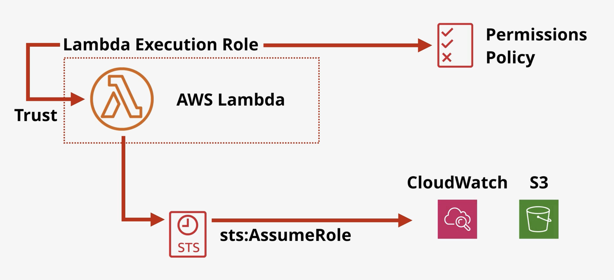
    
    1. We create a Lambda from scratch and thus need to give it access to other applications
    2. We create an IAM role called Lambda Execution Role. We do that using the Trust Policy that allows the Lambda to assume the IAM Role.
    3. The Lambda Execution Role has a permissions policy that grants access to AWS products and services
    4. The function runs and it uses the sts:AssumeRole operation that creates a temporary security credentials giving our Lambda access to AWS services such as S3, EC2 
- What does SCP acronym stand for? #AWS-Organization
    
    Service Control Policies
    
- What does OU acronym stand for ? #AWS-Organizations
    
    Organizational Units
    
- What does SCP do? #AWS-Organizations
    
    It is a policy document (JSON) that limits what an account can do BUT never grant permissions
    
- What is Allow list and Deny list in the context of SCPs? #AWS-Organizations
    
    Allow List ⇒ block by default and explicitly allow
    
    
    
    Deny List ⇒ allow by default and block explicitly
    
    
    
- What is the interaction between IAM policies and SCPs? #AWS-Organizations
    
    What you’ll actually be able to access is what is both provided by IAM policies and what is not denied by SCPs
    
    
    
- Most AWS services log data to the same region where that service is in. Where do global AWS services like IAM, STS, and CloudFront log their data?
    
    They log their data as Global Service Events under us-east-1 but a trail needs to be enabled to log that data.
    
- What is the main limitations of CloudTrail?
    
    It does not provide real time data 
    
- What are the different identity objects that IAM lets us create?
    
    IAM Users
    
    IAM Groups
    
    IAM Role
    
- What are IAM Users?
    
    It represent identities which represent humans or applications that needs access to your account.
    
- What are IAM Groups?
    
    It represents a way to manage all related users (eg. development team group)
    
- What are IAM Roles?
    
    They are a way to grant access to AWS services or external access to your account.
    
- When you should you IAM users?
    
    Use IAM users when you can identify with certainty the user or application that will access that IAM
    
- When should you use IAM Roles?
    
    When you want to grant access to an unknown number of parties (be it external accounts or EC2 instances)
    
- What are IAM policies?
    
    They are documents that allow or deny access to AWS services for a given IAM user/group/role
    
- What are the three main roles of IAM?
    
    They manage identities
    
    They authenticate requests (proving you are who you claim to be)
    
    They authorize requests (allow/deny access to resources based on the IAM policy of that user)
    
- Shared Responsability Model
    
    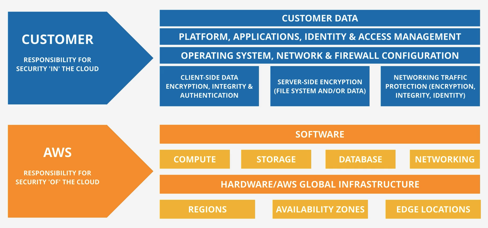
    

### AWS S3

- What’s one way to distinguish a Resource Policy from an Identity Policy?
    
    The presence of a “Principal” key in our policy.
    
    
    
- What would you use to grant access to world wide web users access to an item inside one of your S3 buckets?
    
    Bucket Policy
    
    
    
- How would you choose between using Identity and Resource Policy?
    
    Use identity policies:
    
    - Controlling different resources
    - You have a preference for IAM
    - Same account
    
    Use resource/bucket policies:
    
    - Managing permissions on a specific AWS product (e.g. just controlling S3)
    - Anonymous or Cross-Account
- What is the main difference between Identity and Resouce Policy?
    
    **Identity policy**
    
    - Dictates what that identity has access to
    - Attached to a IAM identity (User, Group, Role)
    
    **Resource policy**
    
    - Dictates who has access to that resource
    - Attached to a resource directly (e.g. S3)
    
- Where does S3’s feature of serving static files come in handy?
    
    Offloading content delivery and out-of-band (content delivery)
    
- What is Offloading Content Delivery? Could you offer an example.
    
    It’s when we move content delivery from a web server to Amazon S3.
    
    For example, we can move static assets (images, videos) from the server and host them on S3.
    
- What are two benefits of Offloading Content Delivery?
    - Scalability: S3 can handle large amounts of traffic
    - Cost-efficiency: S3 storage is cheaper than a storage on an EC2 (where our web server would typically live)
- What is Out-of-Band Content Delivery?
    
    It refers to the idea of serving content from a different place than our main application.
    
    For example, we serve static resources like documentation from a separate place like S3 that’s different than our web server’s location.
    
- What is the main benefit of using Out-of-Band Content Delivery?
    
    It ensures that even if our main server is down the static content remains available
    
- What are three lifecycles of S3 bucket versioning?
    1. Versioning starts of as disabled by default
    2. You can activate object versioning BUT can never turn it off
    3. You can suspend and resume as desired
    
    
    
- What happens when you delete an S3 object (e.g. picture of a cat) and it has versioning enabled?
    
    It simply create a new version of that object that features a delete marker. This effectivelly hides that object
    
    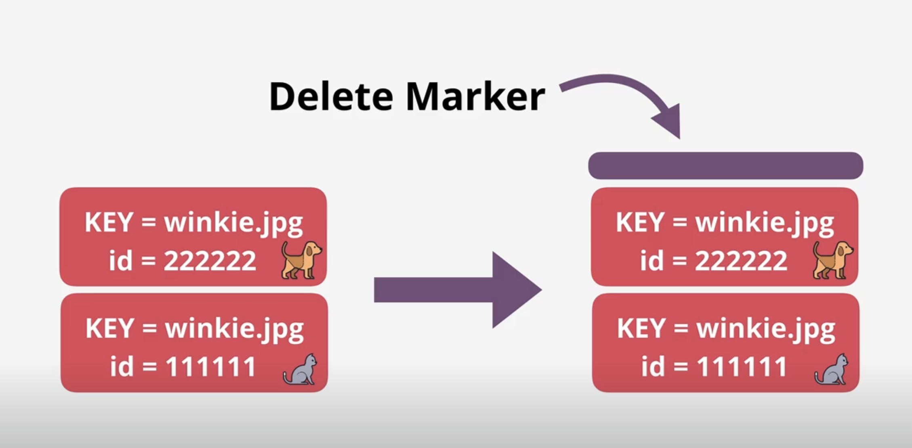
    
    ---
    
    It adds a delete marker which makes it appear that the object was deleted under “no versioning” view.
    
    
    
    If we enable show versions the console will now look like this:
    
    
    
- So if deleting an S3 object with versioning just adds a delete marker, how are you supposed to remove objects then?
    
    You should do it by deleting a specific version.
    
    e.g. you can delete version of [`winkie.jp](http://winkie.jp)g` with `id=222222` permanently and be left with just the `winkie.jpg` with `id=111111`
    
    
    
- What one thing to keep in mind when working with S3 object versioning?
    - It’s impossible to disable once turned on
    - It can lead you to incur huge costs as all versions of the objects you store in S3 occupy memory
- What is multipart upload?
    
    Instead of sending your entire data to S3 in one go you can break it into multiple parts each independent of each other.
    
    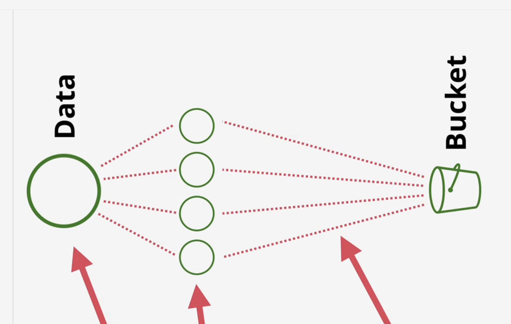
    
- Why is multipart upload better than using the S3 PutObject method?
    - Faster download speed
    - Better reliability as the probability that the entire upload fails is way lower
- What are the requirement for using multipart upload with S3?
    
    The object you send needs to be more than 100mb
    
- What is the maximum number of parts that a multipart upload can break you item down to? What will the size range be for each item?
    
    10,000 max parts
    
    5MB to 5GB
    
- What is the purpose of S3 Accelerated Transfer?
    
    It routes our S3 data from our current location to a specific AWS S3 bucket region using Amazon’s Network (instead of using the slower public network)
    
- Give us a breakdown of what how uploading an S3 object would look with Accelerated Transfer OFF and ON
    
    **S3 Accelerated Transfer: OFF** If we were to upload data to an S3 bucket in London from Australia we would use the public network and we would often take numerous and slow routes to get to our destination.
    
    
    
    **S3 Accelerated Transfer: ON** S3 accelerated transfer uses the Amazon network to route traffic from the closest Edge Location to the specified AWS region.
    
    
    
- What are the benefits of S3 Accelerated Transfer?
    - Faster speed → we’re using the private Amazon network for transferring (using Edge Locations)
    - More reliable → Amazon network is designed to transfer this kind of information which increases the likelihood of our data arriving at our intended destination without any data transfer problems
- What’s one important thing to keep in mind about how encryption works on S3?
    
    It happens at the object level, not the bucket level.
    
- What are the two paradigms of encryption (at rest) we face when working with S3?
    
    Client-side and server side encryption
    
- What is the difference between S3’s Server-side encryption) and Client-side encryption?
    
    Client-side Encryption ⇒ the S3 objects are encrypted before they ever leave the client
    
    
    
    Server-side Encryption ⇒ S3 objects leave the client in their original form and they get encrypted once they reach the S3 servers
    
    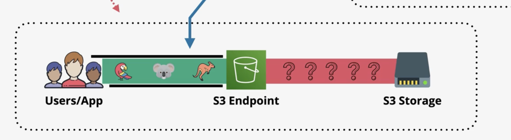
    
- What is the commonality between Server-side Encryption and Client-side Encryption?
    
    They both are encrypted at rest on the S3 storage disks.
    
    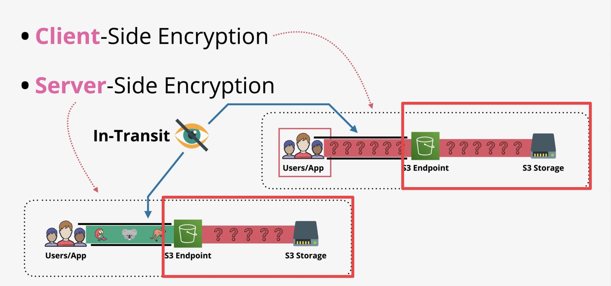
    
- What does client-side encryption for S3 objects mean?
    
    It means that you are responsible for the entire encryption/decryption process as you are the only person that has access to the plaintext.
    
- What does SSE in the context of S3 mean?
    
    Server-side Encryption
    
- What are the three types of S3 SSE?
    - SSE-C
    - SSE-S3
    - SSE-KMS
- How do all types of S3 SSE differ at a high-level?
    
    They dictate what part of the process of encryption management and encryption process we’re responsible for and what we outsource to S3 (and AWS implicitly)
    
- Say you want to use server-side encryption for you S3 objects. Wouldn’t someone on the outside be able to see the unecrypted data before it reaches Amazon’s servers for encryption?
    
    No, because the connection between the client and the AWS servers is encrypted in-transit using HTTPS so outside parties wouldn’t be able to see your unnecrypted data.
    
- What does SSE-C acronym stand for?
    
    Server-Side Encryption with Customer-Provided Keys
    
- What does SSE-S3 acronym stand for?
    
    Server-Side Encryption with Amazon S3-Managed Keys
    
- What does SSE-KMS acronym stand for?
    
    Server-Side Encryption with KMS KEYS Stored in AWS Key Management Service
    
- How does SSE-C work?
    1. Customer sends plaintext and key. 
    2. S3 uses the key to create the ciphertext along with a hash of the key.
    3. S3 discard that key and stores the data on AWS disks.
    
    
    
- How are SSE-C and Client-side S3 encryption similar? When would you use one over the other
    
    In both, the customer is responsible for the management of the keys.
    
    You would use SSE-C when you want to manage the keys BUT you want S3 to be responsible for the computation required for the encryption/decryption of your data.
    
- What are the downsides of SSE-S3?
    - You cannot control the encryption key
    - You cannot control the rotations of the keys
    - You cannot add role separation (i.e. have different permissions for key administrators and
- How does SSE-S3 work?
    1. Client sends plaintext (unencrypted data) to S3.
    2. S3 creates an Object Key and uses it to create ciphertext based on the customer’s S3 object.
    3. Amazon encrypts the Object Key using the S3 key and discards the unencrypted Object Key.
    4. The ciphertext along with the encrypyed Object Key is stored on S3’s disk.
    
    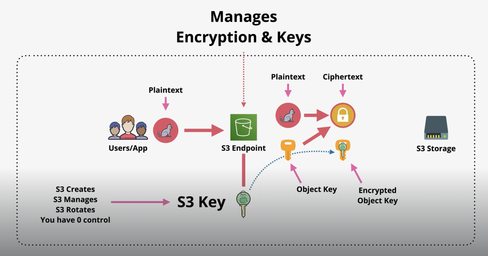
    
- Under SSE-C, who is responsible for key management and who is responsible for actual encryption and decryption computation?
    
    Key management responsability ⇒ customer
    
    Encryption and decryption computation responsability ⇒ S3 (Amazon)
    
- Under SSE-S3, who is responsible for key management and who is responsible for actual encryption and decryption computation?
    
    S3 is responsible for both key management and the computation for encrypting and decrypting data
    
- Under SSE-KMS, who is responsible for key management and who is responsible for actual encryption and decryption computation?
    
    Key management responsability ⇒ KMS
    
    Encryption and decryption computation responsability ⇒ S3 (Amazon)
    
- How is SSE-KMS different than SSE-S3?
    
    The difference boils down to who is in charge of generating the per S3 Object encryption keys.
    
    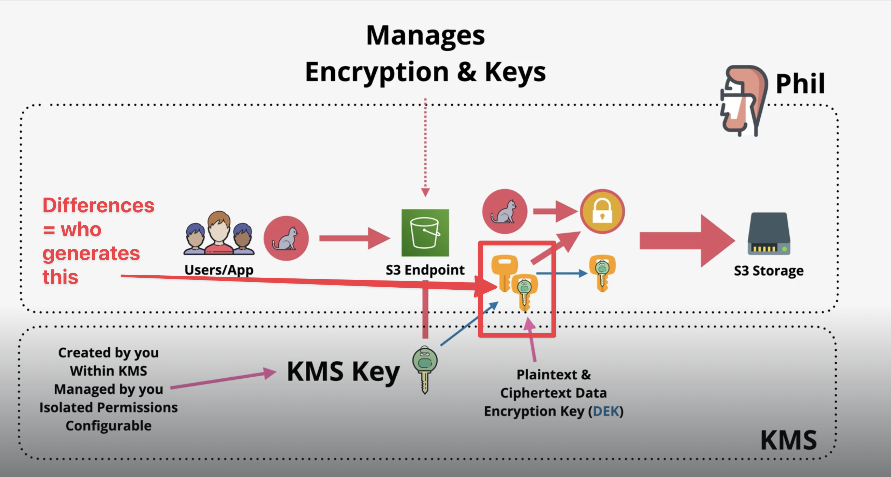
    
- What does SSE-KMS allow over alternatives such as SSE-S3?
    
    Role separation as you can separate the people who have access to manage your keys (system administrators) from the people who have access to encrypt and decrypt using that Encryption Key. Under SSE-S3, an administrator would be able to do both operations (manage keys AND encrypt/decrypt data).
    
    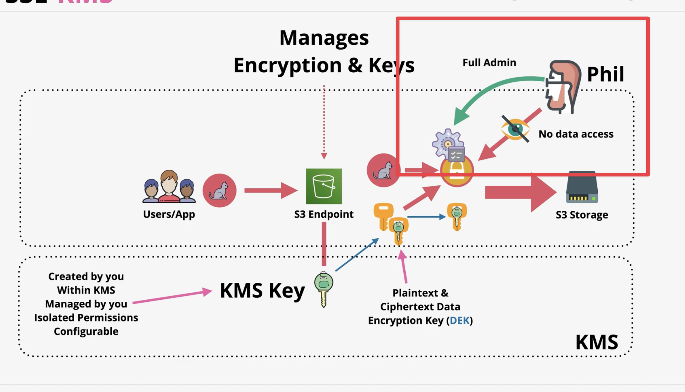
    
- What encryption algorithms does SSE-S3 use?
    
    AES 256
    
- Use image occlusion here
    
    
    
- What is one real-world scenario where you would use SSE-C?
    - **Overview:** You have strict compliance requirements that mandate you to manage and control your own encryption keys, ensuring that only your organization has access to them.
    - **Example Use Case:** A financial services company handling sensitive customer data needs to ensure that encryption keys are never stored by the cloud provider. The company provides its own encryption keys for every upload and download operation in S3.
- What is one real-world scenario where you would use SSE-S3?
    - **Overview:** You want to enable encryption at rest for your data stored in S3 but prefer to offload key management to Amazon S3 to simplify operations and reduce administrative overhead.
    - **Example Use Case:** A media company storing large volumes of non-sensitive data (like videos and images) wants to ensure data is encrypted without the hassle of managing encryption keys.
- What is one real-world scenario where you would use SSE-KMS?
    - **Overview:** You require advanced security features, including fine-grained control over access to encryption keys and detailed audit logs of key usage, for sensitive data.
    - **Example Use Case:** A healthcare organization storing patient records in S3 needs to comply with HIPAA regulations, requiring detailed access control and auditing capabilities provided by AWS KMS.
- For S3 Standard, across how many AZs is your object replicated?
    
    Across at least 3
    
    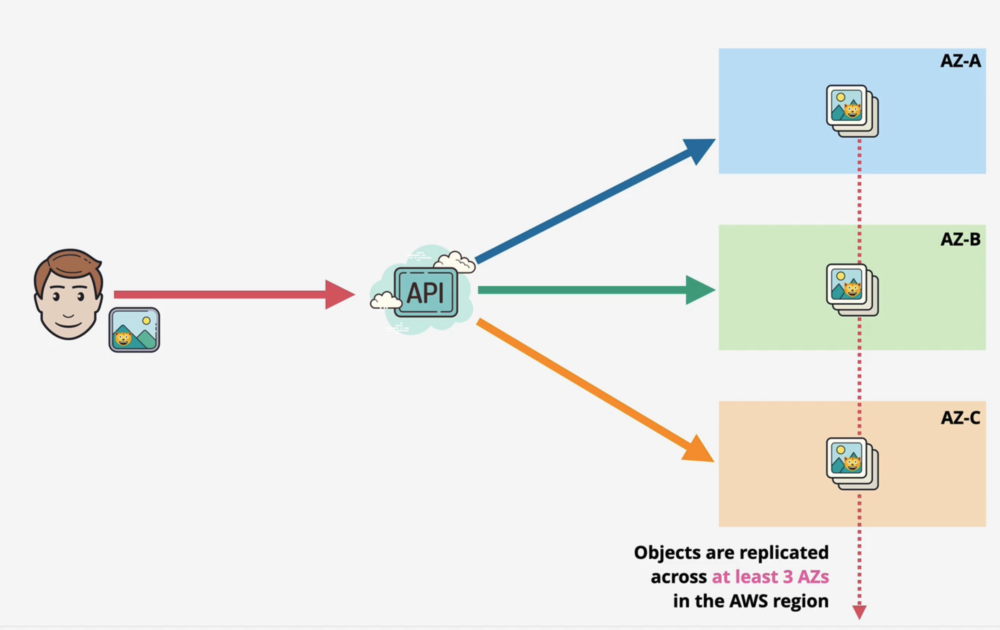
    
- Assume we store successfully an object in S3, what will the S3 API Endpoint return?
    
    A `HTTP/1.1 200` response
    
- What is the durability of all S3 storage classes? (hint: measured in time)
    
    11 9’s ⇒ 99,999999999%
    
- When should the S3 Standard storage class be used?
    - Frequently accessed data
    - Important
    - Non-replaceable
- When should the S3 Standard-IA storage class be used?
    - Long-lived data
    - Important
    - Access is infrequent
- When should the S3 One Zone-IA storage class be used?
    - Long-lived data
    - Non-critial & Replaceable
    - Access is infrequent
- How is S3 Glaciar Instant similar to S3 Standard-IA?
    
    S3 Glaciar Instant is like S3 Standard-IA BUT with cheaper storage, more expensive retrieval, longer minimum
    
- What does first-byte latency mean in the context of S3?
    
    Time it takes for you to retrieve your data
    
- How is S3 Glacier - Flexible different than most other S3 storage classes?
    
    Under S3 Glacier - Flexible, the objects are no longer made publicly available which means that to get your data back you need to go through a retrieval process that take anywhere from minutes to hours (first-byte latency)
    
- When should the S3 Glacier - Flexible storage class be used?
    - Need to store archival data
    - Frequent/realtime access is not required (e.g. yearly)
    - Retrieval can take anywhere from minutes to hours
- What is the difference between S3 Glacier Flexible and Deep Archive?
    
    For deep archive the retrieval process takes a longer time (at minimum 12 hours) compared to Flexible (for whom against a specified costs you can retrieve in minutes/hours).
    
- When should we use S3 Intelligent-Tiering?
    - Need to store long-lived data
    - The usage is changing or unknown
- In what case would you use S3 Deep Archive from the following? *Select all that apply.*
    - [ ]  Frequently accessed website images
    - [x]  Long-term storage of old legal documents for compliance
    - [ ]  Monthly sales reports for quick analysis
    - [ ]  Frequently accessed financial transactions
    - [x]  Digital preservation of historical archives
- What does S3 Lifecycle Configuration help with?
    
    Optimize costs over time by automating:
    
    - the deletion of objects or object versions
    - change the storage class of objects
- Say you upload an object in S3 Standard and are looking to transition it to S3 Standard-IA or One Zone-IA using S3 Lifecycle Configuration. What is one caveat to making this move?
    
    The objects needs to stay in S3 Standard for at least 30 days before moving onto the Infrequent Access storage options.
    
- Say you upload an object in S3 Standard and are looking to transition it to S3 Glacier store class using S3 Lifecycle Configuration. What is one caveat to making this move using **a single rule**?
    
    The objects need to stay in S3 Standard for 30 days.
    
    After arriving to S3 Standard-IA they will need to be held there for an additional 30 days before reaching the S3 Glacier storage.
    
    **NOTE: if you do the move from Standard to IA to Glacier using two or more rules this does not apply**
    
    
    
- What are the cost implications of moving many small objects (say 50KB each) from S3 Standard to S3 Standard-IA (using S3 Lifecycle Configuration)?
    
    You can have higher costs on S3 Standard-IA compared to S3 Standard.
    
    - **Minimum Size Requirement**: S3 Standard-IA has a minimum object size of 128 KB.
    - **Small Objects (e.g., 50 KB)**:
        - **In S3 Standard**: Charged based on actual size (50 KB).
        - **In S3 Standard-IA**: Charged as if each object is 128 KB.
        - **Result**: Higher costs compared to keeping them in S3 Standard.
- What are the two types of S3 replication?
    
    CRR ⇒ Cross region replication
    
    SRR ⇒ Same-region replication
    
    
    
- What type of S3 replication would you use for the following cases?
    1. Log Aggregation
    2. Global Resilience Improvements
    3. PROD and TEST Sync
    4. Resilience with strict sovereignty
    5. Latency Reduction
    
    - Log Aggregation ⇒ SRR
    - Global Resilience Improvements ⇒ CRR
    - PROD and TEST Sync ⇒ SRR
    - Resilience with strict sovereignty ⇒ SRR
    - Latency Reduction ⇒ CRR
- What does it mean that S3 replication is not retroactive by default?
    
    It means that if we turn on replication objects that currently in the bucket will not be replicated. Only moving forward will objects be replicated.
    
- Is S3 Replication retroactive by default?
    
    No, replication does not apply to existing objects by default. An extra setting is required to replicate existing objects.
    
- Is S3 Replication one-way by default?
    
    Yes, changes on the Destination are not reflected back to the Source by default. Two-way replication can be configured with an extra setting.
    
- What must be enabled on both Source and Destination buckets for S3 Replication to work?
    
    Versioning must be enabled on both Source and Destination buckets.
    
- What permissions are required for S3 Replication?
    
    S3 needs the permissions to replicate objects on your behalf.
    
- What needs happen to happen for replication to take place if source and destinations buckets aren’t owned by the same account?
    
    The owner of the destination bucket must grant the source bucket owner permissions to store the replicas.
    
- What does S3 Replication support out of the box and what needs extra-configuration?
* Encryption
* Glacier and Deep Archive support
* Lifecycle transitions
* Delete Markers
    
    **Out of the box**: Replication of any type (unencrypted + all types of Server-side encryptions).
    
    **Extra configuration:** Glacier/Deep Archive support, Lifecycle transitions, and Delete Markers
    
- Assume you’re looking to make a static page available to the public. What steps would you need to take to make sure that happens?
    1. Turn off the “Block Public Access” bucket setting
    2. Add a bucket policy ensuring that Unauthentificated users are able to access the contents of a bucket.
    
    
    
    
    
- What is the purpose of presigned URLs?
    
    Presigned URLs allow access to an object in a private S3 bucket with the access rights of the identity that generates them (e.g., the server from which you request a video).
    
- Why is it not advisable to create presigned URLs using IAM roles?
    
    IAM roles generate temporary security credentials that automatically rotate and expire. This can cause your presigned URL to stop working before its official expiration due to credential issues.
    
- Say you were given a presigned URL for an S3 object and you were able to access it yesterday but today it gives you access denied. Why would be the reason for this?
    
    When using presigned URLs, the permissions match the identity that generated them. If the permissions of the identity were revoked after the URL was generated, you would receive "access denied" even if the URL has not yet expired.
    
    Consider the following example: Let’s say that an IAM user named `admin` generated a presigned URL that would give anonymous user access to S3 objects in our private bucket. If we were to add a S3 deny policy to our `admin` IAM user, accessing the S3 objects using that presigned URL would return us an “Access Denied”.
    
- What is the rule of thumb whenever deciding what identities to use when creating presigned URLs?
    
    Always use long term identities (IAM user) over identities that use temporary credentials such as IAM roles.
    
- What is the main quirk of creating presigned URLs?
    
    You can create presigned URLs with an identity that does not have access over that S3 object.
    
    BUT given that your identity does not have access over that S3 object trying to access the presigned URL will still result in an `Access Denied`  error.
    
- What is the purpose of S3 Select and Glacier Select?
    - To decrease the retrieval speed and costs
    - Allow you to retrieve partial objects from S3 using SQL-like statements.
- From these two diagrams which one is normal S3 retrieval and which one is S3 Select retrieval? What is the difference at the core between the two?
    
    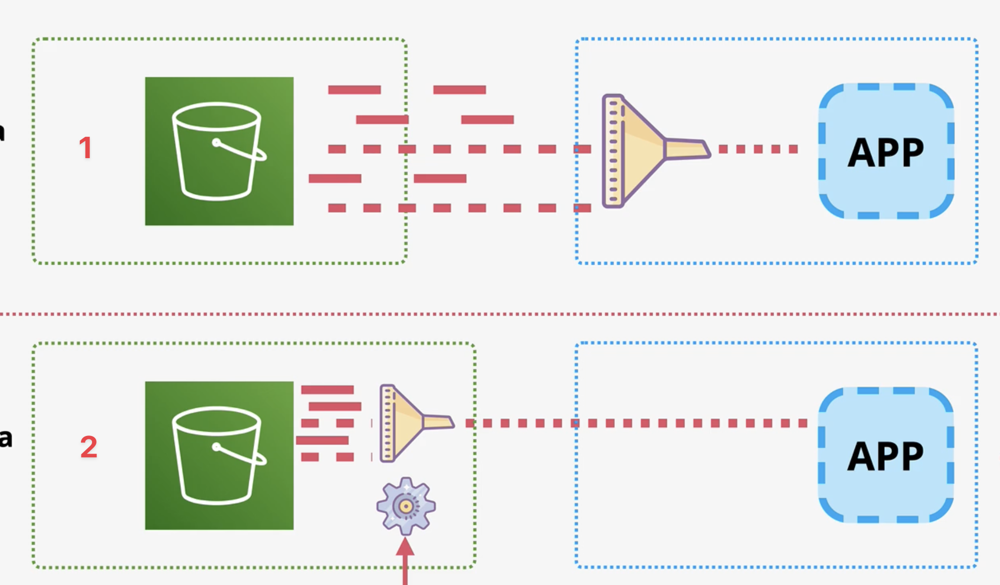
    
    this goes in the question
    
    The 2nd option is the one using S3 Select. 
    
- What is the difference between using S3 Select and NOT using it?
    
    With S3 Select ⇒ Filtering occurs on the service the data delivered by S3 is pre-filtered
    
    Without S3 Select ⇒ Filtering occurs in-app full amount retrieved and billed by S3
    
    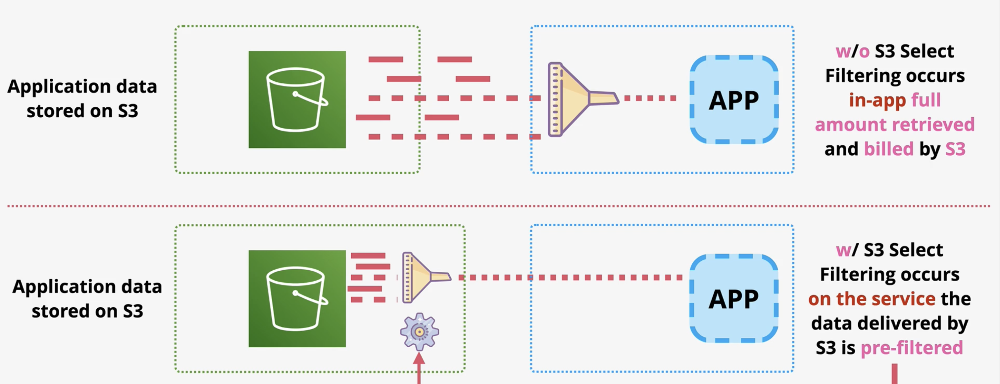
    
- What is the purpose of S3 Object Lock?
    
    It helps you prevent objects from being deleted or overwritten for a fixed amount of time or indefinitely
    
- What do you need to do Object Lock(ing) in S3?
    
    You need versioning enabled because the object lock will be placed on a specific version.
    
- What does the acronym WORM stand for?
    
    Write-Once-Read-Many
    
- What are the three types of S3 Object Lock we have available?
    - Legal Hold
    - Governance mode
    - Compliance mode
- How is Legal Hold different than Governance/Compliance mode?
    
    Legal Hold does not use retention periods, whereas Governance and Compliance modes do. Legal Hold is a binary status (`ON/OFF`) and can be applied or removed using the `s3:PutObjectLegalHold` permission. 
    
    
    
- How is Governance mode different than Compliance mode in S3 Object Lock?
    
    In Governance mode, a locked object can be updated or deleted if you have the appropriate permissions (`s3:BypassGovernanceRetention`) and pass the correct header (`X-amz-bypass-governance-retention:true`).
    
    In Compliance mode, once you’ve locked an object version and set a retention period, the object cannot be modified or deleted by anyone, including the root user of the account.
    
    
    
- How should you conceptually visualize S3 Access Points?
    
    Views on the bucket
    
- What problem do S3 Access Points help solve?
    - Helped solve the problem of managing a complicated Bucket policy for a large bucket
- What are S3 Access Points?
    - Help simplify the management of permissions for large buckets
    - Create multiple access points each with specific permissions (for different applications and users)
- How can we keep track of who is using a specific Access Point to access items in our S3 bucket?
    - Unique DNS address
    
    
    
- What is delegation in the content of S3 Access Points?
    - Bucket policy ⇒ grant wide open access via the Access Point (access is allowed as long as you are using that Access Point)
    - Access Point Policies ⇒ used to grant more granular permissions
    
    
    
- Which steps are required to allow an S3 bucket to operate as a website (choose all which apply):
* Install the HTTPD server files into the S3
* Upload web files
* Set index and error documents
* Enable static web hosting
* Enable versioning
* Disable block public access setting
* Add bucket policy
* Add identity policy
    
    * Upload web files
    * Set index and error documents
    * Enable static web hosting
    * Disable block public access setting
    * Add bucket policy
    
- What is the default limit of the number of S3 buckets in an AWS account
    
    100
    
- How large can an object in S3 be ? and what (if any) limits are there on the number of objects in a bucket
    
    Object Max = 5TB
    
    No Object bucket limit
    
- What feature can be used to grant external accounts access to an S3 bucket?
    
    Resource (bucket) policy
    

### AWS VPC

- What is the resilience level of a VPC subnet?
    
    AZ resilient (a VPC subnet is placed within 1 Availability Zone)
    
- In how many availability zones can we place a VPC subnet?
    
    A single one (it cannot be in more than one)
    
- What is the interaction between a VPC subnet and AZs?
    
    1 VPC subnet ⇒ 1 AZ
    
    1 AZ ⇒ 0 or many VPC subnets
    
    An AZ can have many subnets, a subnet is in one AZ
    
- What are the IP CIDR features of a VPC subnet?
    - The IPv4 CIDR needs to be a subset of the VPC CIDR
    - The IPv4 CIDR (of the subnet) cannot overlap with other subnets
- Can a VPC subnet communicate with other subnets within the VPC? Why?
    
    Yes. This is due to the fact that the network isolation (from the rest of the outside world) happens at the VPC. Communications within the VPC isn’t restricted.
    
- What is the rule of thumb to determine the number of available IP addresses within a VPC subnet?
    
    Size of the subnet - 5 addresses
    
- What is the number of reserved IP addresses that are featured in all VPCs?
    
    5 reserved IP addresses
    
- What do all of the 5 IP addresses within the reserved VPC subnet IPs do? Assume you’re working with a 10.16.16.0/20 subnet (more specifically: 10.16.16.0 > 10.16.31.255)
    - Network address ⇒ 10.16.16.0
    - Network + 1 (VPC Router) ⇒ 10.16.16.1
    - Network + 2 (DNS reserve) ⇒ 10.16.16.2
    - Network + 3 (Future use) ⇒ 10.16.16.3
    - Broadcast address (Last IP in the subnet) ⇒ 10.16.31.255
- What are the two things that the VPC router helps with?
    
    It is the logical network device that does two things:
    
    - move data between different VPC subnets
    - in/out of the VPC (if permitted)
- On which address can you find your VPC Router regardless of the specific VPC?
    
    The “network + 1” address
    
- Which address within any VPC is reserved for DNS?
    
    By default, Amazon reserves the second (network + 2) for DNS.
    
    ---
    
    Explanation: Assume you’re working with a 10.16.16.0/20 subnet (more specifically: 10.16.16.0 > 10.16.31.255)
    
    10.16.16.2 is reserved for DNS by default
    
- What does DHCP acronym stand for?
    
    Dynamic Host Configuration Protocol
    
- What does DHCP help with?
    
    It is how computing devices receive IP addresses automatically
    
- What does CIDR acronym stand for?
    
    Classless Inter-Domain Routing
    
- What are the two components of the CIDR notation?
    - IP Address: The base address of the network.
    - Suffix (Subnet Mask): Defines the number of bits used for the network address. For example, /16 means the first 16 bits are the network part, leaving the remaining bits for host addresses.
- What is the primary purpose of CIDR?
    
    Specifying IP address ranges
    
- How does CIDR specify IP address ranges?
    
    Using a combination of an IP address and a suffix
    
- How does CIDR help with network scalability?
    
    By providing a method to allocate IP addresses in a way that can easily scale up or down as needed
    
- What is the significance of the network prefix in CIDR notation? (i.e. 10.16.16.0/20)
    
    It determines the size of the network portion of the IP address
    
- How many Route Tables can be associated with a subnet in AWS VPC?
    
    One Route Table per subnet, but a Route Table can be shared by multiple subnets.
    
- How is the Route Table for a subnet chosen?
    
    Given that a Route Table is mandatory for a subnet, it is chosen based on the Route Table of the VPC or a custom one you have created.
    
- In AWS VPC Route Tables, which prefix takes precedence when determining where to send information?
    
    The higher (more specific) prefix takes precedence over lower (less specific) prefixes.
    
    
    
- Do you need an Internet Gateway for each Availability Zone in your VPC?
    
    No, a single Internet Gateway can serve the entire VPC across all Availability Zones.
    
- What is the resilience level of Amazon’s Internet Gateway?
    
    Region resilience.
    
    One Internet Gateway will cover all AZs in a given region.
    
- What is the interaction between the number of IGW and VPCs?
    
    1 VPC ⇒ 0 or 1 IGW
    
    1 IGW ⇒ 0 or 1 VPC
    
- What is a Route Table in AWS VPC?
    
    A set of rules, called routes, that are used to determine where network traffic is directed.
    
- What is a Subnet in AWS VPC?
    
    A range of IP addresses in the VPC. Subnets can be public or private.
    
- What does IGW acronym stand for?
    
    Internet Gateway
    
- What is the purpose of an Internet Gateway (IGW) in AWS VPC?
    
    To allow communication between instances in the VPC and the internet + AWS Public Zone services.
    
- Say you allocate a public IPv4 address to an EC2 instance. How is in charge of the private:public IP address mapping?
    
    It is the responsability of the IGW to link the EC2 instance’s private IP to its allocated IP address.
    
- What will you see inside of the OS when you create an EC2 instance and allocate it a public IPv4 address to it?
    
    The OS of the EC2 instance only sees the private IP addresses.
    
    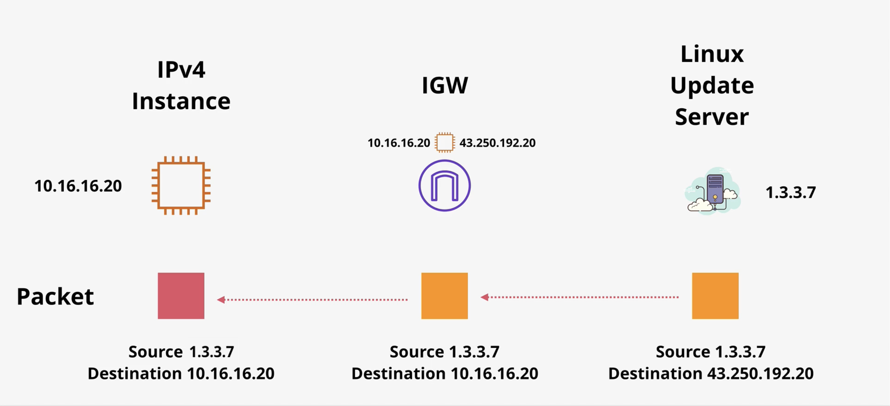
    
    ---
    
    Further explanation: Inside the operating system EC2 instance will only be able to see the private IP address. **IGW** is in charge of managing the private to public records but the instance never sees that.
    
- What are Jumpboxes/Bastion hosts used for?
    
    They are used as the only entry point into a VPC that has no public access, allowing secure administrative access to instances in private subnets.
    
- Say you’ve just created the a VPC with 3 subnets (web A, web B, web C) in 3 different AZs. What are the six steps to ensure that those VPC subnets would be publicly available?
    
    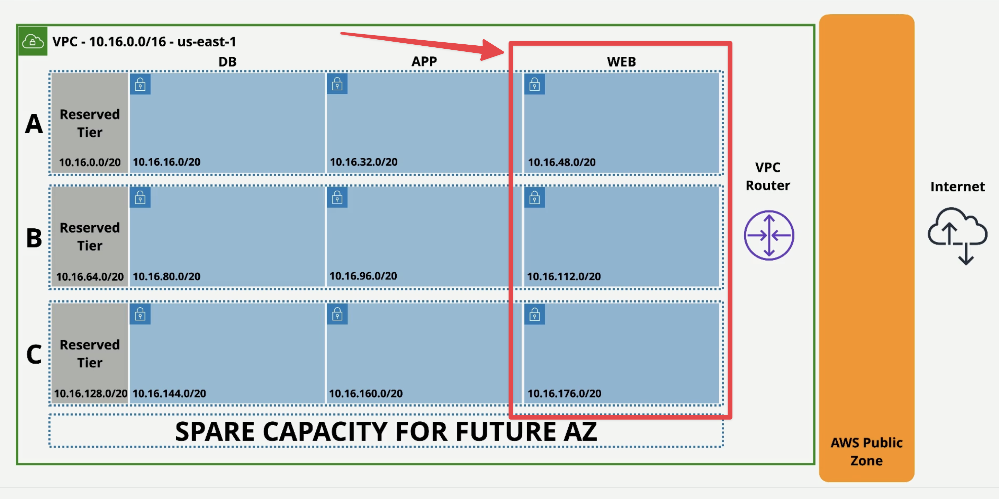
    
    put this in the question card
    
    1. Create an Internet Gateway (IGW).
    2. Attach the Internet Gateway (IGW) to the VPC.
    3. Create a custom Route Table (RT).
    4. Associate the custom Route Table (RT) with each subnet (web A, web B, web C).
    5. Add a default route in the Route Table (RT) that directs all traffic (0.0.0.0/0) to the Internet Gateway (IGW).
    6. Allocate public IPv4 addresses to instances within each subnet (web A, web B, web C).
- What does the NACL acronym stand for?
    
    Network Access Control Lists
    
- At what level do NACLs operate in an AWS VPC?
    
    Subnet level
    
- Are NACLs stateful or stateless?
    
    Stateless
    
- What does it mean that NACLs are stateless?
    
    Each request and response are evaluated separately, and NACLs do not automatically allow responses to be sent back to the requester.
    
- Can a subnet be associated with multiple NACLs?
    
    No, a subnet can only be associated with one NACL at a time.
    
- What types of rules can you define in a NACL?
    
    Allow and deny rules for both inbound and outbound traffic
    
    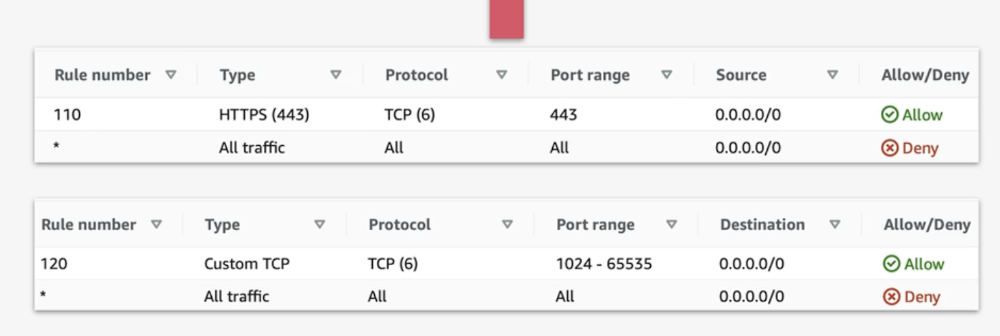
    
- How are rules evaluated in a NACL?
    
    Rules are evaluated in order, starting from the lowest numbered rule.
    
- What happens if no rules in a NACL apply to a packet?
    
    The packet is denied by default.
    
- Do NACLs apply to all instances within the associated subnet?
    
    Yes, NACLs apply to all instances within the associated subnet.
    
- Do NACLs have an impact between two EC2 instances in the same subnet?
    
    No, as connections within a subnet aren’t impacted by NACLs.
    
    
    
- What is the default behavior of a newly created NACL?
    
    It allows all inbound and outbound traffic by default.
    
    
    
- What is a rule pair in the context of AWS NACLs?
    
    A combination of an inbound rule and an outbound rule that manage traffic to and from an application.
    
- What types of rule-pairs are needed on each NACL for communication?
    
    Application port and ephemeral ports.
    
    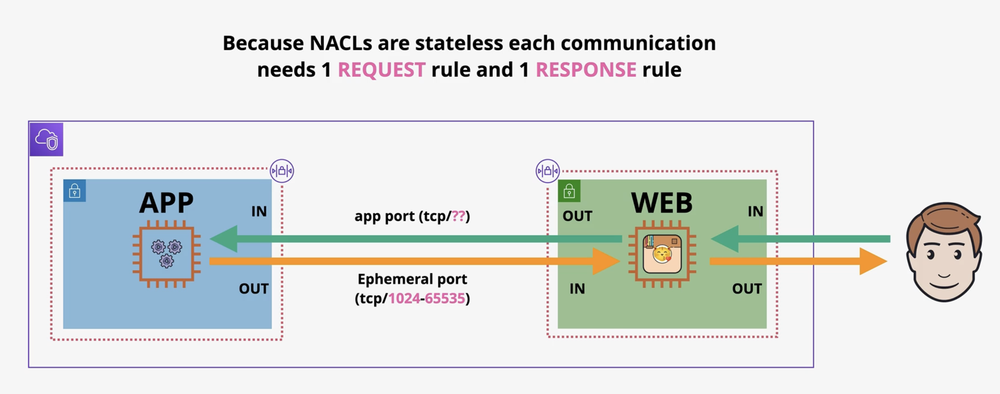
    
- For which (three) types of communication are these rule-pairs needed on each NACL?
    
    Communication 1) within a VPC, 2) TO a VPC, and 3) FROM a VPC.
    
- Why are both application port and ephemeral port rule-pairs needed on NACLs?
    
    To ensure proper handling of all communication types.
    
- What is an application port in the context of NACL rules?
    
    The port used by the application for communication (e.g., port 80 for HTTP).
    
- What are ephemeral ports in the context of NACL rules?
    
    Temporary ports typically used for client-side communication.
    
- What impact do NACLs have in an AWS VPC?
    
    NACLs only impact data crossing subnet boundaries.
    
- What types of actions can NACLs perform on traffic?
    
    NACLs can explicitly allow and deny traffic.
    
- Can NACLs be assigned directly to AWS resources?
    
    No, NACLs can only be assigned to subnets.
    
- How can NACLs be used together with Security Groups?
    
    NACLs can be used together with Security Groups to add explicit deny rules for bad IPs or networks.
    
- How many NACLs can a subnet have?
    
    Each subnet can have one NACL, either the default or a custom NACL.
    
- Can a NACL be associated with multiple subnets?
    
    Yes, a NACL can be associated with many subnets.
    
- What does SG acronym stand for in the context of AWS?
    
    Security Group
    
- Can Security Groups explicitly deny traffic?
    
    No, Security Groups can only allow traffic or implicitly deny it.
    
    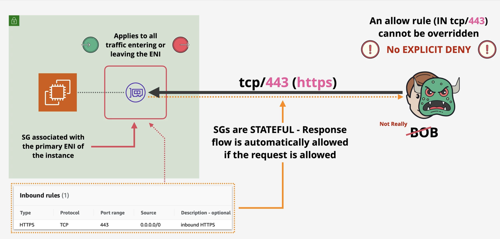
    
- Can Security Groups block specific bad actors?
    
    No, Security Groups cannot explicitly block specific bad actors.
    
- If you cannot explicitly denies with Security Groups, what can we do to block bad actors?
    
    The solution would be to add NACLs (explicit deny) in conjuction with the existing Security Groups.
    
- To what are Security Groups attached?
    
    Security Groups are attached to Elastic Network Interfaces (ENIs), not instances directly (even if the UI shows it this way).
    
- What does this Security Group Inbound Rule do?
    
    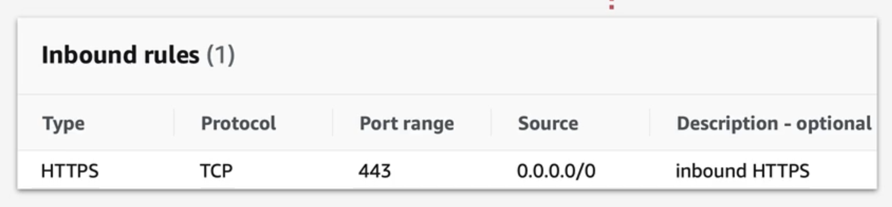
    
    put this in the question
    
    It enables anyone (source: 0.0.0.0/0) to access our application on port 443. This means that anyone accesing our application on HTTPS will be allowed
    
- What logical resources can Security Groups reference?
    
    Security Groups can reference:
    
    - Other Security Groups
    - Self-referecing
    
    ---
    
    Further explanation: “APP” SG is refering “WEB” SG in order for “APP” to allow incoming traffic from “WEB”
    
    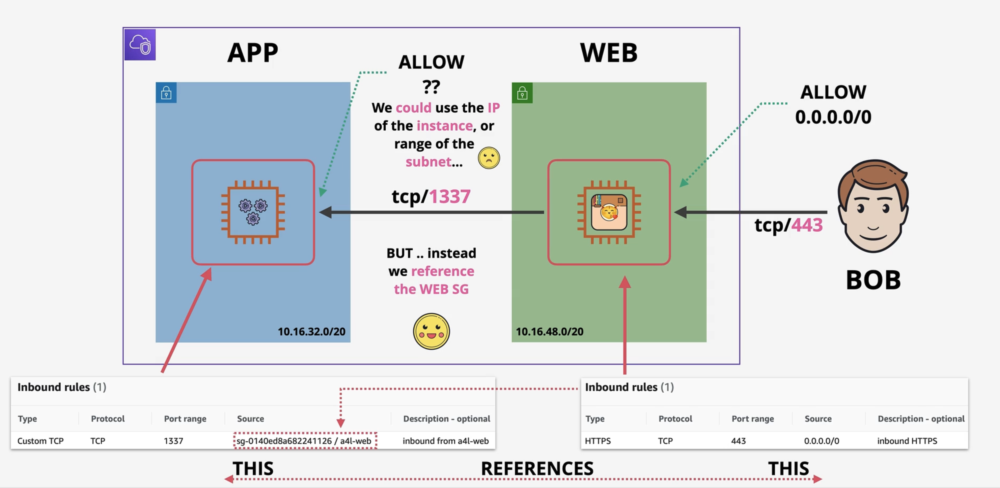
    
- Why does the ability to reference Security Groups decrease administrative overhead costs?
    
    Because it allows for easier management and updating of access rules. Instead of modifying individual rules for each instance, you can update the security group once and it applies to all associated resources, reducing complexity and effort.
    
    ---
    
    Further explanation: Logical referencing scales .. any new instances which use the webSG are allowed to communicate with any instances using the APP SG.
    
    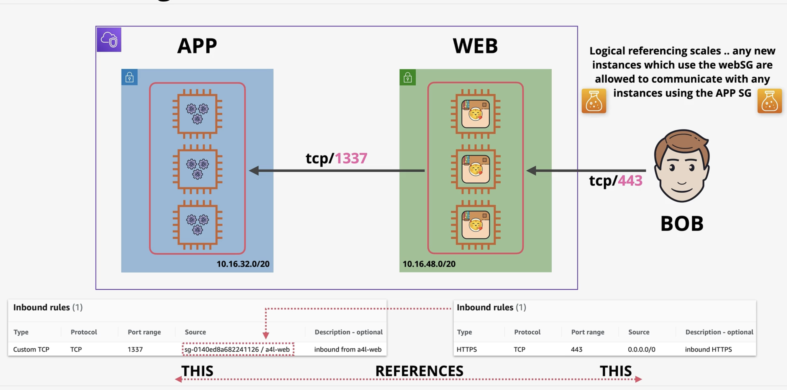
    
- What are the two benefits of using logical references within Security Groups?
    
    Simplifies management by allowing dynamic association of rules
    
    Enables easier updates by modifying a single Security Group rather than multiple instances
    
- What is the benefit of using a self-referencing Security Group?
    
    If you create an SG that references itself and attach it to your instances within a VPC, those instances will be able to freely communicate with each other. This setup scales with adds and removes from the SG.
    
    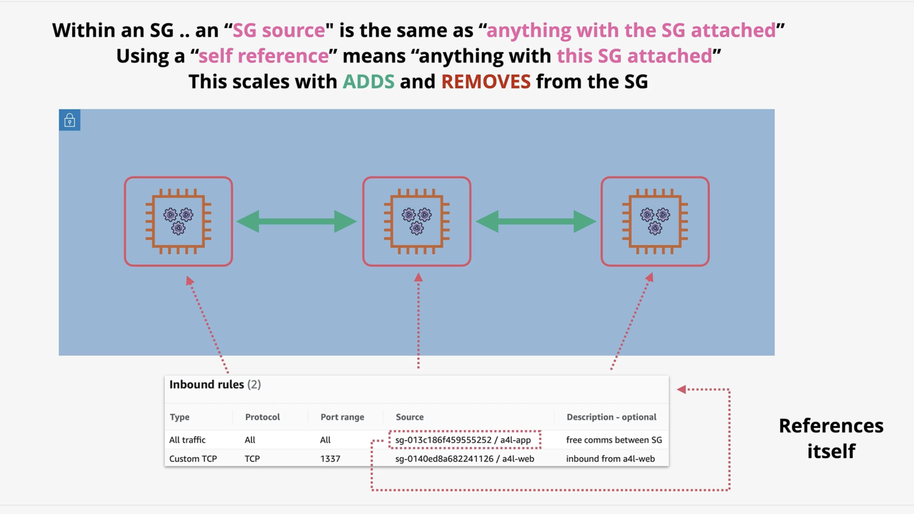
    
- At a high level, in what scenario would you use ACLs and SGs?
    
    ACLs ⇒ explicitly block bad actors
    
    SGs ⇒ allow traffic to your VPC based resources
    
- What is the purpose of IP masquerading in the context of NAT?
    
    IP masquerading is when we allow multiple private IP addresses to be translated into a single one.
    
- What benefit does NAT provide for private CIDR ranges?
    
    It gives private CIDR ranges **outgoing** internet access.
    
- What does it mean that NAT provides “outgoing-only” access?
    
    Private IP devices can initiate outgoing connections to the internet (or AWS public zone services) and receive response data. **But you cannot initiate connections from the public internet** to these private IP addresses when NAT is used.
    
- What is one example where you would need to give internet access to an instance in a private VPC?
    
    If that instance would need to do software updates
    
- What does it mean when we refer to private instances?
    
    We are meant to highlight that those instances live within a private subnet of a VPC
    
- How do you give internet access to multiple private EC2 instances?
    
    Assuming a CIDR range of 10.16.32.0/20 for the APP block, you need:
    
    1. A default route (0.0.0.0/0) on the APP VPC that points traffic to the NAT Gateway in a **public** subnet
    2. The NAT Gateway stores the information (source+destination IP and ports) in the Translation Table and adjust the packets’ source destionation to its own IP address
    3. The NAT Gateway is within the public “WEB” subnet which means it has a default route that points to the Internet Gateway. The VPC Router is in charge of moving the packet from the NAT Gateway to the Internet Gateway.
    4. IGW receives the packet from the NAT Gateway and modifies the packet’s source to match the NAT Gateway’s publicly available IP address.
    
    
    
- What do you need to give internet/AWS Public Zone access to a private instance vs a public one?
    
    Public instance ⇒ provide an Internet Gateway
    
    Private Instance ⇒ provide a NAT Gateway AND an Internet Gateway
    
    
    
- What type of subnet does a NAT Gateway run from?
    
    Runs from a public subnet.
    
- What type of IP addresses does a NAT Gateway use?
    
    Uses Elastic IPs (Static IPv4 Public).
    
- What is the service resilience of NATGW?
    
    It is an AZ-resilient service, providing high availability within that AZ.
    
- How do you achieve region resilience for a NAT Gateway?
    
    Deploy a NAT Gateway in each AZ and configure the route table in each AZ with the respective NAT Gateway as the target.
    
- What is a key feature of the NAT Gateway in terms of management and scalability?
    
    It is a managed service that scales automatically up to 45 Gbps.
    
- What is the billing structure of NAT Gateways?
    
    It has a base charge while the NAT Gateway is running plus a charge based on the amount of data it processes.
    
- How would you design a region-resilient NAT Gateway?
    
    You would have to deploy a NATGW in each AZ you use
    
    For example: in the below example we deploy NATGW in three availability zones (A, B, C) each with its own NATGW and Private Route Table
    
- What option would you need to change to ensure that you can use your EC2 instance as a NAT Instance?
    
    Disable Source/Destination Checks
    
- What is the difference between a NAT Instance and a NAT Gateway in AWS?
    - NAT Instance is an EC2 instance acting as a NAT device, requires manual scaling and management.
    - NAT Gateway is a managed service
- Assume you’re trying to design a highly available system. How would you design your NAT Gateways to respect this requirement?
    
    For maximum availability, use a NAT gateway in every AZ you use.
    
- Why are you not able to do bastion hosts and port forwarding from your NAT Gateway?
    
    Because you cannot connect to the operating system (it is a service that managed and controlled by AWS).
    
- How does controlling traffic differ between NAT instance and NAT Gateway?
    - NAT Instance:
        - support NACL on the subnet the instance is in
        - support Security Groups directly associated with that instance
    - NAT Gateways
        - supports NACLs
        - do not support Security Groups
- Why is NAT not required for IPv6 in AWS?
    
    NAT Gateways are not required since IPv6 addresses are inherently publicly routable.
    
- How do NAT Gateways and IPv6 IP work together?
    
    NAT Gateways do not work with IPv6 IP addresses
    
- What are the valid sizes of a VPC in AWS?
    
    The valid sizes of a VPC in AWS range from /16 (maximum) to /28 (minimum)
    
- Can you default VPC be recreated?
    
    Yes they can be recreated without the need for a support ticket.
    
- How do you calculate the number of available addresses in a VPC based on the prefix?
    - Subtract the prefix size from 32 (for IPv4) to get the number of host bits.
    - Calculate 2 raised to the power of the number of host bits, then subtract 5 for AWS reserved addresses.
- What is the number of available addresses for the “/28” prefix?
    
    A /28 prefix gives 2^{32-28} - 5 = 11 available addresses.
    
- What is the Minimum and Maximum Size of a VPC Subnet?
    
    Min /28 & Max /16
    
    - Explanation
        
        
        
- What is the interaction between Route Tables and VPC Subnets?
    - A subnet can have one Route table attached
    - A route table can be associated with multiple subnets
- What values can ephemeral ports **not** take?
    
    Ephemeral ports cannot be less than 1024.
    

### AWS EC2

- What are EC2 instances?
    
    Virtual Machines that have an OS and resources allocated (virtual CPU, memory,  etc.)
    
- What do EC2 instances run on?
    
    EC2 Hosts
    
- What are EC2 hosts?
    
    Physical servers/hardware
    
- What are the types of EC2 Hosts?
    
    Shared hosts
    
    Dedicated Hosts
    
- What does shared hosts mean?
    
    Hosts that are shared across multiple different AWS customers
    
- How does getting a dedicated host over a shared host change the pricing structure?
    
    Shared Host ⇒ pay for the instance
    
    Dedicated Host ⇒ pay for the entire host
    
- What are the two benefits that dedicated hosts brings?
    - You don’t pay for instances
    - You don’t share the host with other AWS customers
- What is the resilience level of EC2?
    
    Availability-Zone resilient
    
- Why is EC2 considered an AZ resilient service?
    - Hosts = 1 AZ
    - AZ Fails, Host Fails, Instances Fail
- What is Instance Store in EC2?
    
    Temporary block-level storage for an EC2 instance.
    
- What is Instance Store in EC2 useful for?
    
    Useful for data that changes frequently
    
- What does it mean that data is ephemeral in Instance Store?
    
    Data is lost when the instance is stopped or terminated.
    
- What are the two types of networking available in an EC2 Host?
    
    Storage and data networking
    
- What happens when you provision an instance in a subnet?
    
    ENI is provisioned in that subnet that maps to the physical hardware on the EC2 host
    
    
    
- What is the purpose Network Interface EC2?
    
    Enables instances to connect to a VPC network
    
- How can you have multiple network interfaces in different subnets?
    
    The instances need to be in the same Availability Zone
    
    In the photo you have two instance connecting to the same 
    
    
    
- How does EC2 take advantage of remote storage?
    
    By connecting to the Elastic Block Store
    
- What does EBS acronym stand for?
    
    Elastic Block Store
    
- What is the resilience level of Elastic Block Store?
    
    AZ resilient
    
- What does EBS allow you to do?
    
    Allocate volumes to instances in the same Availability Zone
    
- What are volumes?
    
    Portions of persistent storage
    
- What are two scenario where the instance will be realocated to another host?
    1. Host fails or is taken down for maintance by AWS
    2. Instance being stopped and restarted
- Which of these two options causes the instance to be realocated another host?
1. Instance being restarted
2. Instance being stopped and started
    
    Instance being stopped and started
    
- Say your current host is taken for down maintenance and you get realocated another host. What is one thing to keep in mind about the reallocated host?
    
    It is going to be in the same availability zone as the other host
    
- What does it mean that EC2 is a AZ service?
    
    It cannot natively move between Availability Zones
    
    Everything about instances (hardware, networking, storage) is tied to a specific AZ.
    
    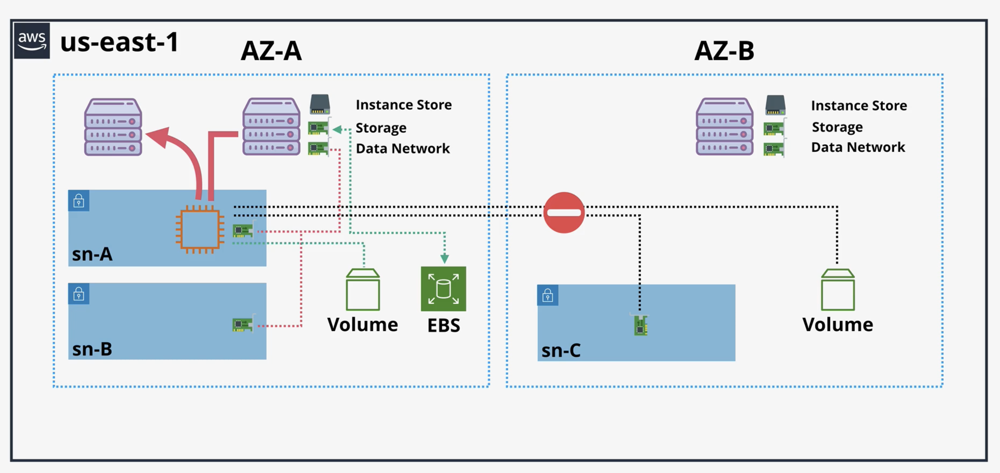
    
- What is the implication of EC2 being an AZ resilient when thinking about network interface cards or EBS storage?
    
    Connecting to a network interface card or EBS storage in another AZ is NOT permitted
    
- What are the cases where EC2 should be the default option? **(USE CLOZE FOR BOLDED WORDS)**
    - Traditional **OS+Application** style workloads (application that needs to run on a certain OS with a certain runtime, with a certain configuration)
    - **Long-running Compute** (great for applications running 24/7 365 days per year)
    - **Server** style applications (server waiting for incoming connections)
    - **Burst** requirements OR **steady-state** requirements
    - **Monolithic** application stacks
    - **Migrated** application workloads or **Disaster Recovery**
    
    (just knowing these bolded words is enough for this)
    
- What is the purpose of General Purpose EC2 instance category?
    
    Default choice for diverse workloads with an equal resource ratio of CPU, memory, and networking.
    
- How should you select an EC2 category?
    
    Select the General Purpose (Default) EC2 instance category.
    
    Only move away from that if you have a specific workload requirement
    
- What workloads are Compute Optimized EC2 instances best suited for (at least 3)?
    
    Ideal for media processing, high-performance computing (HPC), scientific modeling, gaming, and machine learning
    
- What resource is dominant in the Compute Optimized EC2 instance category?
    
    CPU > memory (for a given price point)
    
- What workloads are Memory Optimized EC2 instances designed for?
    
    Designed for processing large in-memory datasets and some database workloads.
    
- What is the primary use case for Accelerated Computing EC2 instances?
    
    Used for workloads requiring hardware GPUs (high scale parallel processing) and field-programmable gate arrays (FPGAs)
    
- What types of workloads are Storage Optimized EC2 instances suited for?
    
    Sequential and random I/O operations, scale-out transactional databases, data warehousing, Elasticsearch, and analytics workloads.
    
- What does Storage Optimized EC2 category offer at a high-level?
    
    Large amounts of super fast local storage
    
- What are the 5 things you can influence when you decide to pick an Instance type over another?
    - Raw resources: CPU, memory, local storage capacity & type
    - Resource ratios (skewed towards a particular resource. i.e. compute optimized instance will give you more CPU compared to memory)
    - Storage and Data (Network) Bandwidth
    - System architecture / Vendor (e.g. ARM vs x86 architecture)
    - Additional Features and Capabilities (e.g. GPU, FPGA)
- What are the components of the naming that AWS uses for its instance type? Use  `R5dn.8xlarge` **as an example.
    
    R ⇒ Instance Family
    
    5 ⇒ Instance Generation
    
    dn ⇒ Additional Capabilities
    
    8xlarge ⇒ Instance Size
    
- Image occlusion on the notes of this image
    
    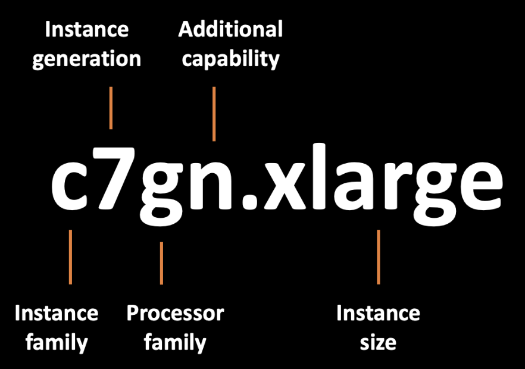
    
- Experiment with image occlusion to learn all the acronyms that can come up within an EC2 instance. Namely:
    
    [https://docs.aws.amazon.com/ec2/latest/instancetypes/instance-type-names.html](https://docs.aws.amazon.com/ec2/latest/instancetypes/instance-type-names.html)
    
    
    
- What is Direct/Local attached Storage?
    
    Storage on the EC2 host.
    
- What is Network attached Storage?
    
    Volumes delivered over the network (EBS).
    
- What is Ephemeral Storage?
    
    Temporary storage that is deleted when the instance is terminated.
    
- What is Persistent Storage?
    
    Permanent storage that remains available even after the instance is terminated.
    
- What is an example of Ephemeral Storage?
    
    Instance Store (physical storage that is attached to an EC2 host)
    
- What is an example of Persistent Storage?
    
    Network attached storage delivered by EBS
    
- What are the three types of storage?
    
    Block storage
    
    File storage
    
    Object storage
    
- What are the components of block storage?
    
    Volume
    
    Blocks
    
    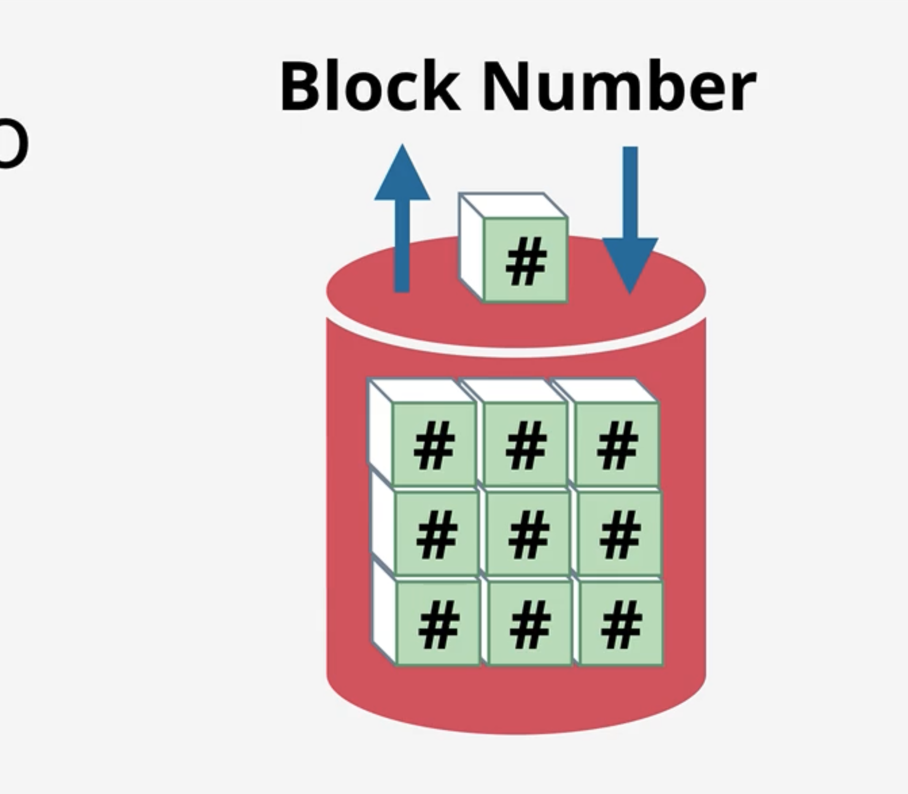
    
- What does the size of the volume dictate?
    
    The number of addressable blocks within your volume
    
    
    
- What is block storage?
    
    A collection of addressable blocks presented as a volume OR blank physical hard drive
    
- In block storage what do you need to write/read?
    
    The block number on that number
    
    
    
- What is needed on top of block storage for a volume to be mounted (to the root volume in Linux for example)?
    
    A file system (created by the OS)
    
- What is block storage backed by?
    
    Physical hard disks or SSD
    
- What does boot volume help with?
    - Boot the instance
    - Start up the OS
    - Store the OS on disk
- How is block storage presented?
    
    Volumes are presented to the OS as a collection of blocks
    
- How is file storage presented?
    
    As file share
    
- Why can’t you boot off of file storage?
    
    The operating system doesn’t have low level access to the storage
    
- Which of the following types of storage is structured: block storage, file storage
    
    Block storage ⇒ unstructured
    
    File storage ⇒ structured
    
    Object storage ⇒ flat
    
- Among the various types of storage: block, file and object storage which can be mounted and booted?
    
    Block storage ⇒ mountable + bootable
    
    File storage ⇒ mountable + not bootable
    
    Object storage ⇒ not mountable + not bootable
    
- What is the difference between block and file storage?
    
    Instead of accessing tiny blocks and being able to create your own file system as the OS wants, with file storage you’re given access to a file system 
    
- What type of storage would you need to boot up your instance in AWS?
    
    Block storage
    
- What type of storage would you need to utilize high performance storage inside an OS?
    
    Block storage
    
- What type of storage would you use if you want to share a file system across multiple servers or clients?
    
    File storage
    
- What type of storage would you use if you need large access to reads and writes object data at scale?
    
    Block storage
    
- What are the three metrics to measure storage performance?
    - IO (block) size
    - IOPS
    - Throughput
    
    
    
- What does IOPS acronym stand for when thinking of storage performance?
    
    Input-output operations per second
    
- What is throughput mean in the context of storage performance?
    
    Amount of data that can be transferred in a given second.
    
- Imagine we’re using a race car metaphor. How should you think of IOPS in this context?
    
    Speed at which the engine of a car runs
    
- Imagine we’re using a race car metaphor. How should you think of IO size in the context?
    
    Size of the wheels of the car
    
- Imagine we’re using a race car metaphor. How should you think of throughput in the context?
    
    The end speed of the car
    
- What is another name for the IO size?
    
    Block size
    
- How do we calculate the throughput in the context of storage performance?
    
    `IO size * IOPS = Throughput`
    
    
    
- How is IO size speed measured?
    
    Kilobytes or megabytes
    
- How is throughput speed measured?
    
    Megabytes per second
    
- What is IO size?
    
    It is the size of the blocks of data that you are writing to the disk
    
- What is IOPS?
    
    Helps measure how many reads/writes a storage system can accomodate in a second.
    
- What is throughput?
    
    Rate of data a storage system can storage on a piece of storage
    
- Assume you’re trying to calculate the throughput. Complete this cloze:
`16KB * 100 IOPS = 1.6MB/s`
    
    create 3 different cards where one piece of the equation is hidden
    
    
    
- Say we’re trying to increase throughput. What would be two cases that would prevent us from maximizing throughput assuming we are increasing the IO size and IOPS?
    - A system throughput cap
    - Block size increase ⇒ decrease in IOPS speed
- What is the resilience level of EBS?
    
    AZ resilient
    
- Where is EBS storage provisioned in?
    
    One AZ
    
- What type of storage does EBS provide?
    
    Block storage
    
- How can EBS volumes be secured?
    
    EBS volumes can be encrypted using AWS KMS.
    
- How do instances interact with EBS volumes?
    
    Instances see EBS volumes as block devices and can create file systems on them (e.g., ext3, ext4, xfs).
    
- Are EBS volumes persistent?
    
    Yes, EBS volumes are persistent and are not lifecycle-linked to a single instance.
    
- How can you back up an EBS volume?
    
    You can take a snapshot (backup) of an EBS volume into S3.
    
- How can you migrate an EBS volume between Availability Zones (AZs)?
    
    Create a new volume from the snapshot to migrate between AZs (or even regions).
    
    
    
- How is EBS storage billed?
    
    EBS storage is billed based on GB-month, and in some cases, based on performance.
    
- How many instances can an EBS volume be attached to at a time?
    
    Can be attached to one EC2 instance at a time
    
- We know that EBS is an AZ resilient service. Knowing this information what are we not allowed to do when trying to attach EBS volumes to EC2 instances?
    
    Attach an EBS volume to an instance in another AZ
    
    
    
- How does EBS handle replication?
    
    EBS automatically duplicates the volume data across multiple storage devices within that AZ
    
- What are the the two types of General Purpose SSD volumes available in EBS?
    - gp2
    - gp3
- What is the baseline IOPS and throughput per volume for gp3?
    
    3,000 IOPS and 125 MB/s throughput.
    
- What is the maximum IOPS and throughput per volume for gp3?
    
    16,000 IOPS and 1,000 MB/s throughput (independent of storage capacity)
    
- What is volume size range for gp3 volumes?
    
    1GB ⇒ 16TB
    
- What kind of workloads are ideal for gp3 volumes (at least 2)?
    - Virtual desktops
    - Medium-sized databases
    - Development and test environments.
- What do you need to do to get to the gp3 maximum volume performance?
    
    Pay extra
    
- Can you easily switch an EBS gp2 volume to a gp3 volume?
    
    Yes. Safely swap gp2 to gp3 volumes at any point
    
- How does gp2 differ from gp3 in terms of performance scaling?
    
    gp2 volumes ⇒ performance (IOPS) scales with storage capacity
    
    gp3 volumes ⇒ can scale independently of the storage capacity
    
- What are the three types of Provisioned IOPS SSD volumes available in EBS?
    1. io1
    2. io2
    3. io Block Express
- What is the main selling point of io1/2, and io Block Express?
    
    IOPS can be adjusted independently of volume size
    
- What are the volume size ranges for io1 and io2?
    
    4GB to 16TB
    
- What are the volume size ranges for io Block Express?
    
    4GB to 64TB
    
- When would you need to use Provisioned IOPS SSD (io1/2, io Block Express)? Could you provide an example.
    
    high performance + consistent low latency.
    
    ---
    
    Example: I/O intensive NoSQL & relational databases
    
- What is the maximum IOPS and throughput per volume for io1/2?
    
    Up to 64,000 IOPS and 1,000 MB/s throughput
    
- What is the maximum IOPS and throughput per volume for io2 Block Express?
    
    Up to 256,000 IOPS and 4,000 MB/s throughput
    
- What is the per instance performance (max IOPS and throughput) for io1?
    
    260,000 IOPS & 7,500MB/s
    
- What is the per instance performance (max IOPS and throughput) for io2?
    
    160,000 IOPS & 4,750MB/s
    
- What is the per instance performance (max IOPS and throughput) for io2 Block Express?
    
    260,000 IOPS & 7,500MB/s
    
- So we know that the maximum per instance performance for io1 is 260,000 IOPS and 7,500 throughput. What does this imply?
    
    It implies that we can use multiple io1 volumes within a single EC2 instance.
    
    ---
    
    Further details: maximum volume performance for io1 is 64,000 IOPS and 1,000 MB/s throughput which means that we can fit multiple volumes to satisfy the maximum requirements of the per instance performance (almost 4 io1 volumes per instance to reach the per instance performance caps).
    
    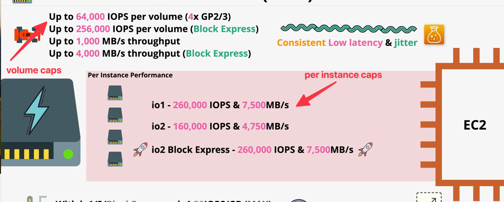
    
- What is the per instance performance (max IOPS and throughput) for gp2 and gp3?
    
    260,000 IOPS and 7,000 MB/s
    
- What are the two types of SSD-backed volume types that AWS features in its EBS product?
    - General Purpose SSD (gp2, gp3)
    - Provisioned IOPS SSD (io1, io2, io2 Block Express)
- What does HDD-based mean?
    
    Slower storage because of moving bits (platters that spin)
    
- What are the two HDD volume types in EBS?
    - Throughput Optimized HDD (st1)
    - Cold HDD (sc1)
- What is the main selling point of HDD volumes types?
    
    Cheaper than SDD volumes.
    
- What does HDD based volumes struggle with? (what does that entail)
    
    Random acess
    
- Given that we know that HDD is not suitable for random access, how should data be written/read from a HDD?
    
    In a sequential way
    
- When you choose a HDD based volume over an SSD one what does that imply?
    
    Cost / Throughput > IOPS / Extreme performance
    
- What type of volume is st1?
    
    Throughput Optimized HDD
    
- What type of volume is sc1?
    
    Cold HDD
    
- What is the volume range size for st1 and sc1 HDD based volumes?
    
    125GB to 16TB
    
- When should you use st1?
    - Cost is a concern
    - You need frequent acess storage
    - Throughput is intensive
    - Workload is sequential
- When should you use sc1?
    - Cheapest way to store a lot of data
    - Don’t care about performance
    - Infrequent access storage
- Assume you have a particular IOPS requirement, what type of EBS volume type would you choose?
    
    Anything that SSD based such as gp2/3 and io1/2
    
- What type of storage devices are instance stores?
    
    Block storage devices
    
- How are instance stores physically connected in AWS?
    
    Physically connected to one EC2 host
    
- Which instances can access instance stores?
    
    Instances on the same host
    
- What is the benefit of Instance Store over EBS from a performance perspective?
    
    More IOPS and Throughput than EBS
    
- Is the cost of Instance Stores included in the instance price?
    
    Yes
    
- When are instance stores attached to an EC2 instance?
    
    Instance stores are attached at launch and cannot be dettached
    
- Can you add a new instance store volume after instance launch?
    
    No
    
- When can you attach a new instance store volume?
    
    Instance store volumes are attached only at instance launch
    
- How does volume attaching differ between Instance Store and EBS?
    
    Instance Store volumes ⇒ attached at launch and cannot be added or removed after the instance is running. 
    
    EBS volumes ⇒ can be attached, detached, and reattached at any time while the instance is running.
    
- What is the key difference in how EBS and Instance Store are connected to EC2 instances?
    
    EBS volumes ⇒ connected over the network
    
    Instance Store volumes ⇒ physically attached to the host machine
    
- What happens to the instance store if an instance moves between hosts?
    
    The data on the old Host is lost. (EC2 Host A + ephemeral0 Instance Store)
    
    The moved instance then gets a blank Instance Store. (EC2 Host B + new and empty ephemeral0 Instance Store)
    
    
    
- What does it mean that a volume is ephemeral?
    
    Volumes that store data temporary
    
- What’s an example of an ephemeral volume?
    
    Instance Store
    
- What are the three scenarios where we would lose the data we have in the Instance Store tied to an EC2 instance?
    - Instance moves
    - Instance gets resized
    - Host (instance) failure
    - Specific volume failure
- What is the main selling point of Instance Store?
    
    It provides the highest performance (IOPS + throughput) that’s available in AWS
    
- Say in the exam you need to use EBS and the main concern is cost, what volume types should you use?
    
    st1 or sc1 (HDD volume types — which are cheaper than the SSD based EBS)
    
- Say in the exam, you get a question that says you need to use EBS and the emphasis is on throughput/streaming, what volume type should you use?
    
    st1
    
- Can you use HDD EBS volume types to boot an instance in AWS?
    
    No, HDD EBS volume types (sc1 and st1) cannot be used to boot an instance; only SSD volume types (gp2, gp3, io1, io2) can be used for boot volumes.
    
- What’s the maximum IOPS value for both gp2 and gp3 volume types?
    
    16,000 IOPS
    
- Say you need IOPS to be 30,000. What volume type would you choose? Please provide a breakdown of how you decided which volume type you’ve chosen.
    
    gp2/3 caps at 16,000 IOPS so it’s not viable.
    
    io1/2 can go up to 64,000 IOPS so that’s a viable volume type for our need
    
- What is the max IOPS that io1/2 can scale up to?
    
    up to 64,000 IOPS
    
- Say you’re trying to reach the maximum performance of an io2 Block Express volume type that can scale up to 256,000 IOPS. What do you need to make sure happens?
    
    You need to make sure you pair the EBS volume with a larger EC2 instance that is capable of delivering those levels of performance
    
- How can you achieve more than 260,000 IOPS per instance in AWS, and what is a key consideration?
    
    To achieve more than 260,000 IOPS per instance, you need to use Instance Store volumes. However, keep in mind that the data on Instance Store volumes is not persistent and will be lost if the instance is stopped or terminated.
    
- How can you achieve the maximum performance per instance cap of 260,000 IOPS using EBS volumes in AWS?
    
    Attach multiple volumes to a single instance (within the max performance cap)
    
- What technology allows you to use multiple EBS volumes to aggregate their performance on a given instance?
    
    RAID 0 array
    
- How can we improve the resilience level of EBS?
    
    Using EBS snapshots which puts our data in S3.
    
- What happens to the resilience level of EBS if we use snapshots?
    
    It moves from AZ resilience (EBS) to region resilience (EBS snapshots with S3)
    
- What does the first EBS snapshot contain?
    
    Full copy of the data on the volume.
    
- How are subsequent EBS snapshots stored? (assuming you have an initial EBS snapshot)
    
    Incremental, only capturing the changes made since the last snapshot.
    
- What happens if you delete an incremental EBS snapshot?
    
    If you delete an incremental EBS snapshot, only the data unique to that snapshot is removed. The data referenced by other snapshots remains intact, ensuring no loss of data from other snapshots.
    
- What are the three things that EBS snapshots help us with?
    
    They enable: 
    
    - Data recovery
    - Volume cloning
    - Migration of volumes across regions and AZs
- How should you think about how volume data is being stored in EBS Snapshots?
    
    1st Snapshot size ⇒ Volume data used
    
    2nd+ is only data change.
    
    ---
    
    Further explanation: State 1, you are billed for the full 10 GB snapshot because it is the first one. In State 2, you are billed for the 4 GB because this is the only thing that changed. State 3: you are billed for the 2 GB that changed because Snap C is referecing Snap A for the first 6 GB and Snap B for the next 4 GB.
    
    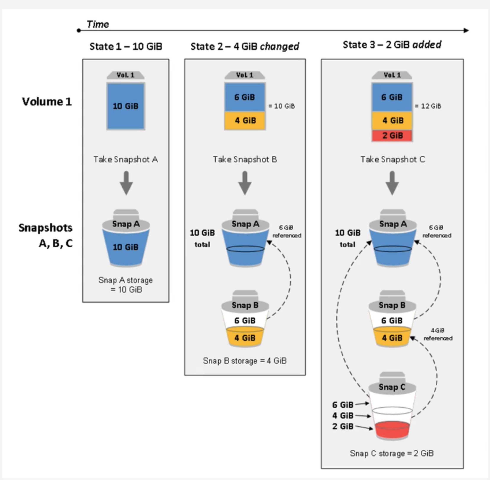
    
- What is the performance of a new EBS volume?
    
    A new EBS volume provides full performance immediately.
    
- How do EBS snapshots restore data?
    
    Restore data lazily, fetching data gradually as needed.
    
- Assume you attempt to read data that hasn’t been restored. What happens when specific blocks (of data) are requested from an EBS snapshot?
    
    Requested blocks are fetched immediately (pulling it from S3)
    
- How can you force a read of all data from an EBS snapshot immediately?
    - Force read of all data immediately (done in the OS with `dd` command)
    - Using Fast Snapshot Restore (FSR)
- What is the purpose Fast Snapshot Restore?
    
    FSR allows immediate restore of up to 50 snapshots per region, set on the snapshot and Availability Zone (AZ).
    
- What does FSR acronym stand for?
    
    Fast Snapshot Restore
    
- What is a downside of using Fast Snapshot Restore (FSR) in AWS?
    
    FSR incurs **additional** **costs** for enabling immediate restoration of snapshots.
    
- How can you force a read on every block of an EBS volume manually without using FSR?
    
    You can use the `dd` command inside the instance itself to read all data blocks manually.
    
- How is EBS snapshot storage billed in AWS?
    
    EBS snapshot storage is billed based on gigabyte-months.
    
- What determines the storage costs for EBS snapshots?
    
    Storage costs for EBS snapshots are based on used data, not allocated data.
    
- What Linux command would we need to use to get this output?
    
    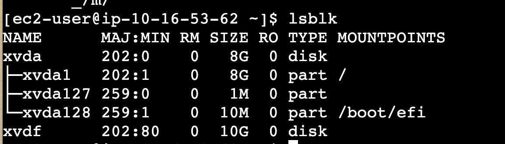
    
    imagine occlusion on the lsblk part
    
- What is the boot volume and what is the EBS volume we attached when we do a List Block Device command in the CLI?
    
    
    
    add this to the question
    
    xvda ⇒ root device (used to boot the instance; contains the OS)
    
    xvdf ⇒ EBS volume we attached manually to the instance
    
- What Linux command would we need to use to list all block devices on an EC2 instance?
    
    `lsblk`
    
- What Linux command would we need to use to check if there is a file system on top of a block device already?
    
    `sudo file -s [block device]` (e.g. `sudo file -s /dev/xvdf`)
    
- What are the 4 steps to prepare and attach a newly created EBS volume to an EC2 instance?
    
    1.	**Create and Attach the EBS Volume**: Create an EBS volume in the AWS Management Console and attach it to your EC2 instance.
    
    2.	**Verify the Block Device**: Check if the newly attached EBS volume (`/dev/xvdf`, for example) has an existing file system using `file -s /dev/xvdf`
    
    3.	**Create a File System**: If no file system exists, use `mkfs -t xfs /dev/xvdf` to format the volume.
    
    4.	**Mount the File System**: Mount the formatted EBS volume to a directory (mount point) using `mount /dev/xvdf /mnt/myfolder`.
    
- Assume you’ve used `sudo file -s /dev/xvdf` to see if there is a file system attached to your EBS volume (block device). What would `data` indicate in this case?
    
    
    
    in the question
    
    There is no file system on top of the raw block device called `/dev/xvdf`
    
- How do you call a newly created EBS volume when it is first attached to an EC2 instance?
    
    Raw block device
    
- What does the command `mkfs -t xfs /dev/xvdf` do?
    
    Formats the specified block device (`/dev/xvdf`) with the XFS file system.
    
- What does the `-t xfs` option specify in the `mkfs -t xfs /dev/xvdf` command?
    
    Specifies that the XFS file system should be used.
    
- What’s one UNIX command can you use to create a file system on a block device?
    
    `mkfs` command followed by the -t option and the desired file system type (e.g., `mkfs -t ext4 /dev/xvdf` for ext4 or `mkfs -t xfs /dev/xvdf` for XFS) to create a file system on a block device.
    
- What does this indicate?
    
    ```bash
    [ec2-user@ip-10-16-53-62 ~]$ sudo file -s /dev/xvdf                            sudo file -s /dev/xvdf
    /dev/xvdf: SGI XFS filesystem data (blksz 4096, inosz 512, v2 dirs)
    ```
    
    That there is a File system attached to the `/dev/xvdf` EBS block device
    
- What is a mount point?
    
    A directory
    
- What Unix command would you use to check where an EBS volume with a Filesystem is mounted?
    
    `df -k`
    
    ---
    
    Further explanation:
    
    ```bash
    [ec2-user@ip-10-16-53-62 ~]$ df -k
    Filesystem     1K-blocks    Used Available Use% Mounted on
    devtmpfs            4096       0      4096   0% /dev
    tmpfs             486168       0    486168   0% /dev/shm
    tmpfs             194468    2868    191600   2% /run
    /dev/xvda1       8310764 1581704   6729060  20% /
    tmpfs             486172       0    486172   0% /tmp
    /dev/xvda128       10202    1310      8892  13% /boot/efi
    tmpfs              97232       0     97232   0% /run/user/1000
    /dev/xvdf       10420224  105704  10314520   2% /ebstest
    ```
    
    `/dev/xvdf` is a Filesystem we created from a raw EBS block device. We mounted that to the `/ebstest` mount point
    
- What do you need to do to ensure your volume remains mounted after a reboot of the instance?
    
    To ensure your volume remains mounted after a reboot, you need to add an entry for the volume in the `/etc/fstab` file with the appropriate mount point and file system type.
    
    ---
    
    Further explanation: here we’re adding our EBS volume to the `/etc/fstab` file
    
    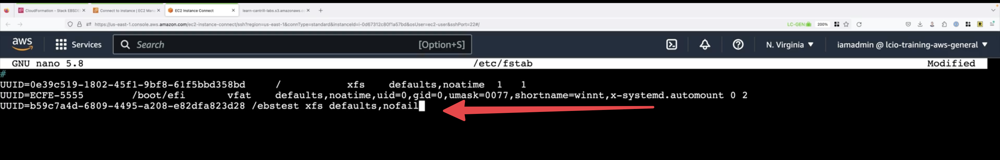
    

- What is the `df -k` command helpful?
    
    It helps us check where our volumes (with filesystems on top of the block device) are mounted.
    
    ---
    
    From this we can see that `/dev/nvme1n1` (instance store volume) is mounted to `/instancestore` directory (or mount point to use proper naming)
    
    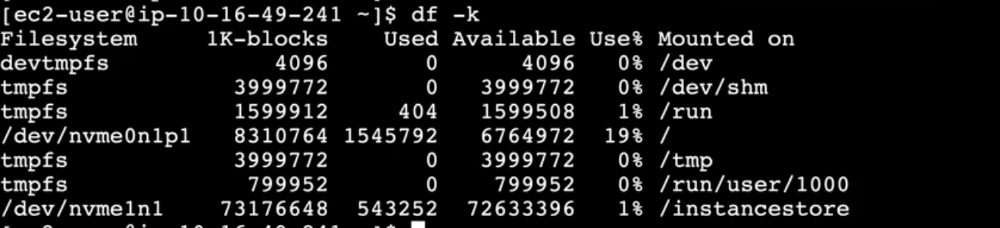
    
- How does rebooting vs start/stop an EC2 instance affect instance store volumes?
    
    Rebooting an EC2 instance does not affect the data on instance store volumes, as the instance remains on the same physical host. 
    
    However, stopping and then starting the instance will result in the loss of all data on instance store volumes, as the instance may be moved to a different physical host.
    
- How is EBS encryption managed in AWS?
    
    EBS encryption is managed using AWS Key Management Service (KMS).
    
- What aspects of EBS are encrypted when using EBS encryption?
    
    EBS encryption encrypts data at rest, data in transit between the volume and the instance, all snapshots created from the volume, and all volumes created from those snapshots.
    
- What is a Data Encryption Key (DEK) in the context of EBS and KMS?
    
    A Data Encryption Key (DEK) is the key used to encrypt and decrypt the data on an EBS volume.
    
    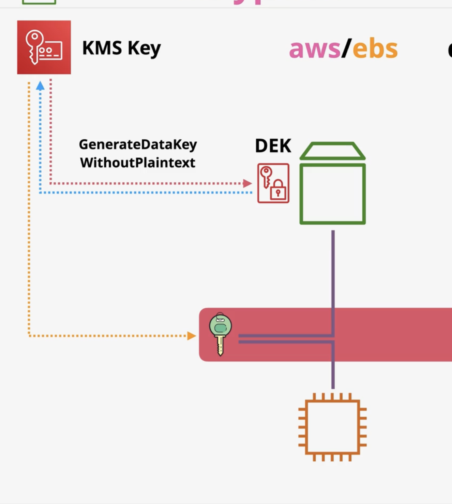
    
- How is the DEK used when an EBS volume is attached to an instance?
    
    The DEK is encrypted and stored with the volume’s metadata. When the volume is attached to an instance, the DEK is decrypted by KMS and placed on the host for use in encrypting and decrypting data.
    
    
    
- What happens to the DEK when an EBS volume is moved to a different host?
    - The unencrypted DEK on the EC2 host gets discarded
    - The volume is moved and mounted to the new host.
    - The volume requests DEK to be decrypted and it gets placed on the new host.
    
    
    
- What happens each time the EBS volume is detached and reattached?
    
    DEK is re-decrypted by KMS and placed on the new host to maintain the encryption of data.
    
    
    
- What happens when we create a snapshot of an EBS volume that is encrypted?
    
    That snapshot is also encrypted receiving the same encrypted DEK
    
    
    
- Are there any additional costs associated with EBS encryption?
    
    No additional charges, there may be costs associated with using KMS keys.
    
- What are the two options you have when it comes to encrypting EBS volumes?
    - Encrypt by default using the default KMS key
    - Encrypt using a specific (custom) KMS key
- How is a KMS key used in the encryption process for EBS volumes?
    
    The KMS key isn’t directly used to encrypt or decrypt the volume; instead, it is used to generate and encrypt a Data Encryption Key (DEK) for each volume.
    
- What happens to the DEK when you create snapshots or new volumes from snapshots? (hint: think of the encryption key)
    
    It will have the same DEK encrypted key as the original volume.
    
    
    
- What happens when you create a volume from scratch that also happens to be encrypted using KMS?
    
    That newly created volume gets an newly created and unique encrypted DEK from KMS
    
- Where does the EBS volume encryption happen?
    
    Between the EC2 host and volume
    
- What is the implication of the fact that the EBS volume encryption only happens between the EC2 host and volume?
    
    The OS only sees plaintext and thus there is no performance loss
    
- Can you change an encrypted EBS volume to be unencrypted?
    
    No, once a volume is encrypted, it cannot be changed to be unencrypted.
    
- Is there any performance loss when using EBS encryption?
    
    No, there is no performance loss when using EBS encryption because the OS is not aware of the encryption.
    
- What does ENI acronym stand for?
    
    Elastic Network Interface 
    
- What are the two types of ENIs in AWS?
    
    Primary ENI and Secondary ENI.
    
    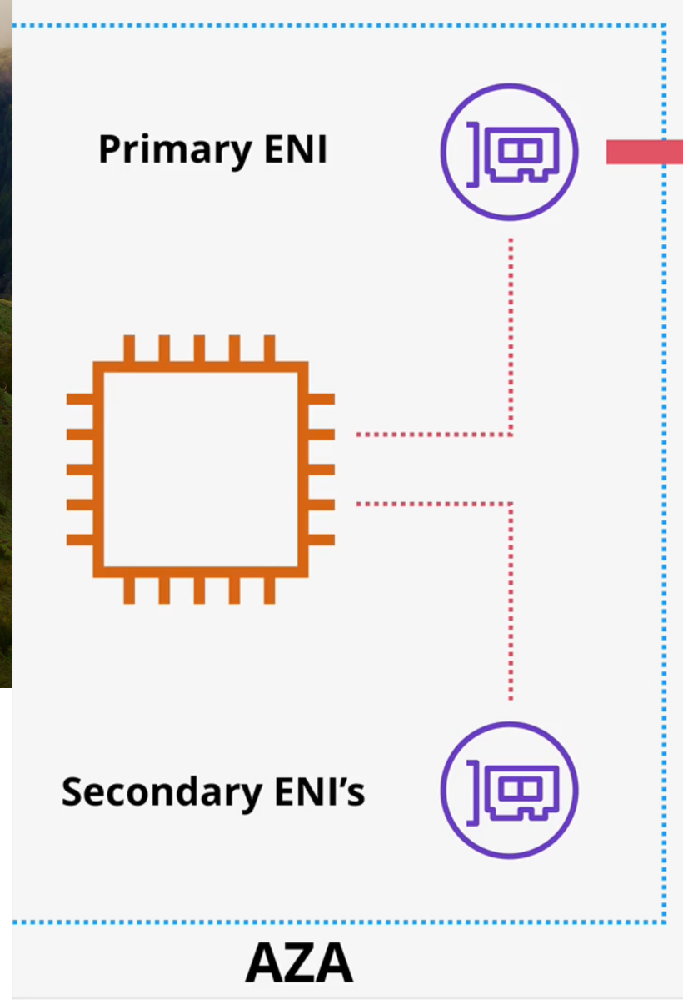
    
- What is an ENI in the context of EC2?
    
    An ENI (Elastic Network Interface) is a virtual network interface that can be attached to an instance in an AWS VPC.
    
- Can you detach a primary ENI from an instance?
    
    No, the primary ENI cannot be detached from the instance, whereas secondary ENIs can be detached and reattached.
    
- What types of IP addresses can be associated with an ENI?
    - Primary IPv4 private IP
    - Zero or more secondary IPv4 private IPs
    - Zero or one public IPv4 address
    - 1 or more elastic IP per private IPv4 address
    - Zero or more IPv6 addresses.
- What security feature is commonly associated with ENIs?
    
    Security Groups
    
- What check is performed by default on an ENI to ensure network traffic integrity?
    
    Source/Destination Check
    
- What does Source/Destionation check on an EC2 instance (more specifically the ENI of that instance) entail?
    
    They verify that the instance is the intended destination or origin of the traffic.
    
- What are Elastic IP addresses?
    
    Elastic IP addresses are static, public IPv4 addresses
    
- Say we apply a Security Groups to a specific EC2 instance. What do we apply the Security Group to?
    
    We attach the SG to the ENI of that instance
    
- What is the main similarity + difference between Secondary ENI and Primary ENI?
    - They both hold the same information
    - Secondary ENI can be **detached** from one EC2 instance and **moved** to another
- What happens to the (normal) public IPv4 address of an EC2 instance when you reboot vs. start and stop the instance?
    
    When you reboot an EC2 instance, the public IPv4 address remains the same. However, when you stop and start the instance, the public IPv4 address is released and a new one is assigned upon starting the instance again.
    
- How does the public IPv4 DNS name resolve within and outside a VPC in AWS?
    
    The public IPv4 DNS name resolves to the private IP address when accessed from within the VPC and resolves to the public IPv4 address when accessed from outside the VPC.
    
    
    
- If an instance has a non elastic public IP, and you assign an elastic IP then remove it: is there any way to get that original public IP address back?
    
    No, there’s not
    
    ---
    
    Further explanation: 
    
    - When you assign an elastic IP it loses that original dynamic public IPv4 address.
    - If you remove that elastic IP, it gets a new one but it will be different than the original dynamic public IPv4 address
- What happens to your public IPv4 address when you attach an Elastic IP to an EC2 instance in AWS?
    
    When you attach an Elastic IP to an EC2 instance, the instance’s existing public IPv4 address is removed and replaced with the Elastic IP.
    
- Why would using a secondary ENI be when working with (legacy) licenses?
    
    Legacy licenses are often attached to a mac address
    
    Attaching the license to the mac address of a secondary ENI ensures the license remains valid regardless of the instance it’s attached to.
    
- What does multi-homed mean?
    
    Multi-homed means an instance **has multiple network interfaces connected to different subnets** for management and data traffic separation.
    
- What does a multi-homed look like in practice?
    
    An instance with an ENI in two different subnets
    
- What should you do if you need different rules for different IPs for our instance?
    
    Multiple ENIs attached to your instance with different SGs
    
- How do you get around the fact that normal public IPv4 addresses are dynamic?
    
    By allocating an Elastic IP address
    
    ---
    
    - dynamic === start/stop will force you to lose that IP address
    
- How does the public IPv4 DNS of an AWS instance resolve to different IP addresses based on whether it is accessed from within or outside of the VPC?
    
    Public DNS resolves:
    
    - To the (primary) private IPv4 address when accessed within the VPC
    - To the public IPv4 address when accessed outside of the VPC
    
    
    
- Why does the Public IPv4 DNS of an instance resolving to the private IPv4 address be helpful?
    
    Makes sure that instance-to-instance communication stays within the VPC (avoid needing to use IGW)
    
    
    
- Why is `systemctl` useful?
    
    It allows us to start and stop system processed
    
- What are these command useful for?
    
    
    
    in the question
    
    Means both processed will start automatically every time the instance is rebooted
    
- What does AMI acronym stand for?
    
    Amazon Machine Image
    
- What are AMIs?
    - Create a template of an instance configuration
    - Use that template to create many instances from that configuration
- What do AMIs enable?
    
    Enable you to launch EC2 instances
    
- What are the two types of AMIs?
    - AWS-Provided AMIs
    - Community-Provided AMIs
    - AWS Marketplace AMIs
- What are the three unique characteristic of an AMI?
    - AMIs are regional
    - AMIs have a unique ID (e.g., ami-0a887e401f7654935)
    - Can only be used in the region where it was created
- What are the three types of permissions you can set for an AMI in AWS?
    
    The three types of permissions for an AMI are Public, Your Account, and Specific Accounts.
    
- What are the 4 steps within the AMI Lifecycle?
    - Launch
    - Configure
    - Create Image
    - Launch
    
    
    
- What happens within the Launch step of the AMI Lifecycle?
    - You use an AMI to launch an instance
    - You can attach EBS volumes for boot and data (EBS volumes with device ids: `/dev/xvda` and `/dev/xvdf`)
    
    
    
- What happens within the Configure step of the AMI Lifecycle?
    - You can take the instance (+ EBS volume) you provisioned within the Launch phase
    - Apply customizations to either the instance or the EBS volumes (think OS with certain application)
    
    
    
- What happen during the Create Image step of the AMI lifecycle?
    - Create an AMI based on the instance + EBS volume + extra configuration (from Configure step)
    - Add permissions to your AMI (public, your account, specific accounts) restricting who can use that image
    - For any EBS volume attached, EBS Snapshots are created from those volumes. These snapshots are then referenced within the newly created AMI using Block Device Mapping
    
    
    
- Let’s assume you create a custom AMI based on a instance + EBS volumes + extra configuration. How will the EBS volume data be presented in that custom AMI?
    
    The EBS data will not live in the custom AMI. Instead EBS creates snapshots of those volumes and the AMI will references those snapshots using block device mapping
    
    
    
- What are the most important contents of the block device mapping when creating a custom AMI?
    - Snapshot ID
    - Device ID (e.g. `/dev/xvda` for the boot volume — Block device of the original volume)
- What happens during the Launch step of the AMI Lifecycle?
    - When you launch a new instance based on an AMI, this instance will have the same EBS volume configuration as the original (presented in Create Image step)
    - Snapshots are used to create new EBS volumes in the AZ where you launch the new instance in. Those volumes are then attached to that instance using the same Device ID
    
    
    
- In how many regions does an AMI work?
    
    Works in only one region; it is regional.
    
- What is AMI baking?
    
    Process of creating an AMI from a configured instance along with its applications.
    
- Can an AMI be edited?
    
    No, an AMI cannot be edited. To update an AMI, you must launch an instance from the AMI, update the configuration, and create a new AMI.
    
- Can an AMI be copied between regions?
    
    Yes, an AMI can be copied between regions, and the copy includes its associated snapshots.
    
- What is the default permission setting for an AMI?
    
    The default permission setting for an AMI is that it is available only to your account.
    
- If an AMI cannot be edited, how can you update an AMI?
    
    To update an AMI, you must launch an instance from the AMI, update the configuration, and create a new AMI.
    
- What one thing to keep in mind about AMI billing?
    
    An AMI that contains EBS snapshots will incur charges for the storage capacity used by those snapshots.
    
- In what state should your instance be if you’re trying to create a custom AMI from that specific instance?
    
    The instance should be in Stopped state to avoid dealing with consistency issues
    
- If we copy a custom AMI from one region to another, will the two AMIs be the same or completely different?
    
    Two different AMI IDs (AMI regional service)
    
    ---
    
    Further explanation: In the AWS console we’ll be able to see the differences by looking the AMI ID and the region
    
    
    
    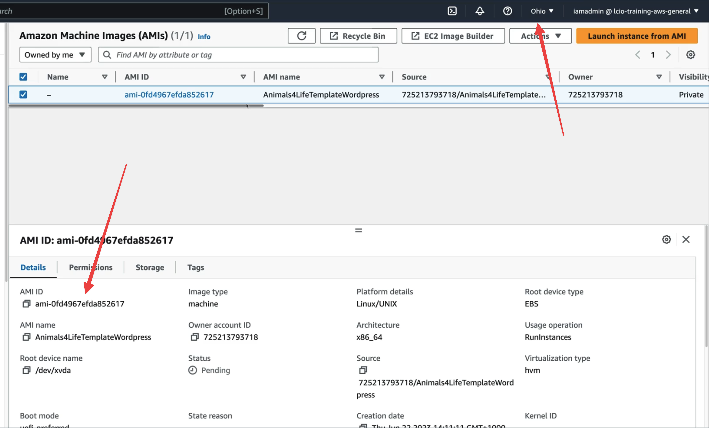
    
- What’s another named used for EC2 Purchase Options?
    
    Launch Type
    
- What are the 6 types of EC2 Purchase Options available?
    
    On-Demand Instances
    
    Spot Instances
    
    Reserved Instances
    
    Savings Plans
    
    Dedicated Hosts
    
    Dedicated Instances
    
- What is the On-Demand EC2 purchase option?
    
    Allows you to pay for compute capacity by second with no long-term commitments or upfront payments.
    
- How is pricing determined for On-Demand EC2 instances?
    
    Per-second rate
    
- What is a characteristic of On-Demand EC2 instances regarding hardware isolation?
    
    Instance is isolated but hardware is shared
    
    
    
- What is the default EC2 purchase option?
    
    On-Demand instances.
    
- What is a key characteristic of On-Demand EC2 instances regarding interruptions?
    
    No interruptions.
    
- Do On-Demand EC2 instances offer capacity reservation?
    
    No capacity reservation.
    
- How is the pricing for On-Demand EC2 instances?
    
    Predictable pricing.
    
- Do On-Demand EC2 instances require any upfront cost?
    
    No upfront costs
    
- Do On-Demand EC2 instances offer any discounts?
    
    No discounts
    
- For what type of workloads are On-Demand EC2 instances ideal?
    
    Short-term workloads.
    
- When should you use On-Demand EC2 instances regarding workload predictability?
    
    Unknown or unpredictable workloads.
    
- What type of applications benefit from On-Demand EC2 instances?
    
    Apps that cannot be interrupted
    
- What is the rule of thumb for deciding on the Purchase option for your EC2 Instance?
    
    On-demand = default
    
    Move away **only** if you can justify the alternative purchase
    
- When could the lack of capacity reservation for On-Demand instances be problematic?
    
    The lack of capacity reservation for On-Demand instances can be problematic during major failures when priority access to remaining capacity is not guaranteed.
    
- What is the Spot pricing option for EC2 instances?
    
    Spot pricing allows you to bid on spare AWS compute capacity at significantly reduced rates compared to On-Demand pricing.
    
- How are Spot instance prices determined?
    
    Spot instance prices are determined by the **current** **supply and demand for unused EC2 capacity**
    
- What is a key advantage of using Spot instances?
    
    Spot instances is the potential for significant cost savings, often up to 90% off On-Demand prices.
    
- What is a major risk associated with Spot instances?
    
    A major risk of Spot instances is that they can be interrupted by AWS with little notice when the capacity is needed for On-Demand instances.
    
- When should you avoid using Spot instances for your workloads?
    
    Never use Spot instances for workloads that cannot tolerate interruptions.
    
- When are Spot instances appropriate in terms of time sensitivity?
    
    Spot instances are appropriate for non-time-critical workloads.
    
- What type of workloads are suitable for Spot instances in terms of rerun capability?
    
    Spot instances are suitable for workloads that can be rerun.
    
- How do bursty capacity needs relate to Spot instance usage?
    
    Spot instances are ideal for bursty capacity needs.
    
- What type of workloads benefit most from the cost savings of Spot instances?
    
    Cost-sensitive workloads benefit most from the cost savings of Spot instances.
    
- Are stateless workloads appropriate for Spot instances?
    
    Yes, stateless workloads are appropriate for Spot instances.
    
- What is the high-level idea behind EC2 reservation?
    
    Commit to AWS that you will use resources for a length of time.
    
    In exchange, you get those resources cheaper
    
- What is a key advantage of using Reserved Instances over On-demand?
    
    Cost savings over On-Demand pricing
    
- What happens if you use an EC2 instance larger than your Reserved Instance?
    
    Cost savings are only partial, as you will pay On-Demand rates for the additional capacity beyond the reserved size.
    
    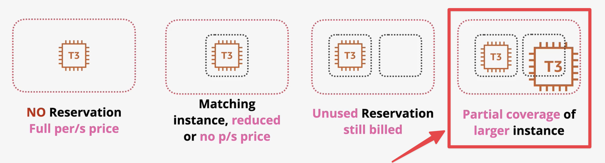
    
- What is a key billing consideration for Reserved Instances in AWS?
    
    Billed for the reservation even if you do not use the reserved capacity.
    
    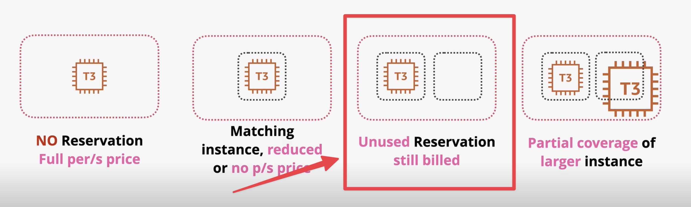
    
- What aspects can you lock in using Reserved Pricing in AWS?
    - Instance type
    - Region
    - Availability Zone
    - Duration (of the reservation term)
- What’s one thing to keep in mind about locking in a specific AZ with Reserved Instances?
    
    Reservation is tied to that particular AZ
    
- What are the three types of payment options available for Reserved Instances?
    - No Upfront
    - Partial Upfront
    - All Upfront
    
    
    
- What is the pricing structure of No Upfront for your Reserved Instance?
    
    Slightly reduced cost per second
    
    
    
- What is the pricing structure of Partial Upfront for your Reserved Instance?
    
    Partial Upfront + Reduce cost per second
    
    
    
- What is the pricing structure of All Upfront for your Reserved Instance?
    
    All Upfront (no per second fee)
    
    
    
- What is the main reason you would need to purchase a Dedicated EC2 Host?
    
    Software that is licensed based on amount of physical machine resources (sockets/cores)
    
- What is the purpose of Host Affinity?
    
    Way to link instances to hosts.
    
    So you can start/stop instances it remains on the same host.
    
- How can you think of Dedicated Instances from a high-level?
    
    Similar to to shared instance (i.e. on-demand) BUT you have servers dedicated to a single customer providing hardware isolation
    
    
    
- How do Dedicated Instances differ from Dedicated Hosts?
    
    Dedicated Instances ⇒ isolation at hardware level, no control over the physical host
    
    Dedicated Hosts ⇒ provide control over the physical server and its instance placement.
    
    
    
- What is the billing structure of the Dedicated Instances option?
    - Hourly per instance usage fee
    - Dedicated per region fee (paid once per hour regardless of how many Dedicated Instances you're running)
- When would you need to use Dedicated Instance?
    
    Required not to share hardware but don’t want to host it yourself
    
- When is Scheduled Reserved Purchase Option ideal?
    
    Long term usage that doesn’t run constantly
    
- What is the difference between Scheduled Reserved and Standard Reserved?
    
    Scheduled Reserved ⇒ reserved in advanced for a specific time period (e.g. 5 hours every day during 12:00 to 17:00) 
    
    Standard Reserved ⇒ continuous reservation for one or three years
    
- What is a limitation regarding instance types and regions for Scheduled Reserved Instances?
    
    Do not support all instance types or regions.
    
- What is the minimum usage requirement for Scheduled Reserved Instances?
    
    1200 hours per year
    
- What is the minimum term length for Scheduled Reserved Instances?
    
    One year
    
- What is Capacity Reservation?
    
    Guaranteed physical capacity for EC2 instances in a specific Availability Zone
    
- What would trigger AWS to start prioritizing EC2 capacity through Capacity Reservation?
    
    In the case of a major failure that could cause a region/AZ to not have enough capacity
    
- What is the order in which AWS handles Capacity Reservation?
    1. Capacity Reservation
    2. On-Demand Instance requests
    3. Spot Instances
- Assume you have an instance that can’t tolerate interruptions. What should you ensure you have purchased to ensure continuity?
    
    Capacity reservation
    
- Between Capacity Reservation and Reserved Instance, which focuses on capacity and which on billing?
    
    Capacity Reservation ⇒ reserve physical capacity in a specified Availability Zone
    
    Reserved Instance ⇒ billing discount mechanism
    
- How can Capacity Reservations and Reserved Instances be used?
    
    Can be used in combination or individually
    
- What does a Regional Reservation provide?
    
    A billing discount for valid instances launched in any AZ in that region
    
- What is a limitation of Regional Reservations?
    
    They don't reserve capacity within an AZ, which can be risky during major faults when capacity is limited
    
- What do Zonal reservations offer?
    
    Billing discounts and capacity reservation in a specific AZ
    
- How many AZs does a Zonal reservation apply to?
    
    Only one AZ
    
- What is the main difference between Regional and Zonal reservations in terms of capacity?
    - Regional reservations ⇒ don't guarantee capacity
    - Zonal reservations ⇒ guarantee capacity in a specific AZ
- What are On-Demand Capacity Reservations?
    
    Reservations that ensure access to capacity in an AZ when needed, but at full on-demand price
    
- What is the main benefit of On-Demand Capacity Reservations?
    
    They guarantee access to capacity in an AZ when you need it
    
- What is the pricing model for On-Demand Capacity Reservations?
    
    Full on-demand price, regardless of whether the capacity is consumed
    
- What is unique about the term limits of On-Demand Capacity Reservations?
    
    There are no term limits
    
- What is a potential drawback of On-Demand Capacity Reservations?
    
    You pay for the reserved capacity whether you use it or not
    
- What is the billing benefit to On-Demand Capacity Reservation?
    
    No cost savings
    
- What are the term options for EC2 Savings Plan?
    
    1 year or 3 year terms
    
- What type of commitment does EC2 Savings Plan require?
    
    A hourly commitment
    
- What's an example of a general compute dollar amount reservation using the EC2 savings plan?
    
    $20 per hour for 3 years
    
- What flexibility does a specific EC2 Savings Plan offer?
    
    Flexibility on size & OS
    
- Which compute products are currently covered by EC2 Savings Plan?
    
    EC2, Fargate & Lambda
    
- What are the two types of rates for products under EC2 Savings Plan?
    
    On-demand rate and savings plan rate
    
- What happens when usage goes beyond your savings plan commitment?
    
    On-demand pricing is used
    
- What are the two types of Instance Status Checks you will see on a EC2 instance?
    
    System Status
    
    Instance Status
    
- What does System Status refer to in the context EC2 Instance Status Checks?
    
    Health of the physical host where your instance is running
    
- What does Instance Status refer to in the context EC2 Instance Status Checks?
    
    Health of the EC2 instance itself
    
- Does Instance Termination Protection prevent an instance from being stopped or rebooted?
    
    No, only prevents termination.
    
- Is Instance Termination Protection enabled by default?
    
    No, Instance Termination Protection is not enabled by default; it must be manually enabled.
    
- What is Instance Termination Protection?
    
    Feature that prevents an instance from being accidentally terminated
    
- What happens if you try to terminate an instance with Instance Termination Protection enabled?
    
    You cannot without disabling termination protection first
    
- How does Instance Termination Protection enable role separation?
    
    System admins ⇒ enable / disable termination protection
    
    Normal admins ⇒ terminate instance (when protection is off)
    
- What type of instances must have Instance Termination Protection on?
    
    Instances that are critical to a business
    
- Failed to terminate an instance: The instance 'i-068b2e3ba2f2a2fbd' may not be terminated. Modify its {{'disableApiTermination'}} instance attribute and try again. ⇒ ADD CLOZE TO DISABLE API TERMINATION
- What do horizontal and vertical scaling have in common?
    
    They’re both ways that a system can scale to handle increasing/decreasing load placed on a system
    
- What is vertical scaling?
    
    Changing the instance size to increase or decrease resources
    
    
    
- What does “resources” refer when talking about EC2 instances?
    - CPU
    - Memory (RAM)
    - Storage
    - Network capacity
- What is a major drawback of resizing in vertical scaling?
    
    Each resize requires a reboot, causing disruption
    
- What is a cost consideration for larger instances in vertical scaling?
    
    Larger instances often carry a price premium
    
- What is a limitation of vertical scaling in terms of performance?
    
    Upper cap on performance based on instance size.
    
- Do you need to modify your application for vertical scaling?
    
    No
    
- What types of applications does vertical scaling work for?
    
    Vertical scaling works for all applications, including monoliths.
    
- What is the difference between vertical and horizontal scaling in EC2?
    
    Vertical scaling ⇒ resize instance up or down
    
    Horizontal scaling ⇒ add more instances to distribute load
    
- What are the 4 things you need to set up when using horizontal scaling in EC2?
    - Application support for distributed computing
    - Off-host session management
    - Proper Loading balancing
    - Configured auto-scaling policies
- What does off-host sessions do?
    
    Move and centralize session data from an EC2 host to an external system
    
    e.g. database or distributed cache
    
- What is the implication of off-host sessions?
    
    Your servers become stateless allowing them to handle requests interchangeably.
    
- What is the benefit of horizontal scaling?
    
    No disruption when scaling
    
- What is a key advantage of horizontal scaling in terms of limits?
    
    No real limits to scaling
    
- How does the cost of horizontal scaling compare to vertical scaling?
    
    Often less expensive as it avoids the large premium on instances
    
- What is a benefit of horizontal scaling in terms of scalability?
    
    More granular as you can adjust resources more precisely
    
    ---
    
    Further thoughts: if you use vertical scaling and move from large to 2xl instance you double the amount of power. With horizontal scaling you can have 5 micro instances and adding another will only be a 20% increase in productivity.
    
- What types of scaling paradigms do we see in this picture?
    
    
    
    add this to the question
    
- What is Instance Metadata?
    
    Data about an EC2 instance that can be used to configure or manage the instance
    
- How can you access instance metadata?
    
    From within the instance by querying a special URL
    
- Can instance metadata be accessed from outside the instance?
    
    No, only from within the instance.
    
- What is the full URL to access Instance Metadata?
    
    http://169.254.169.254/latest/meta-data/
    
- http://{{169.254.169.254}}/latest/meta-data/
- http://169.254.169.254/latest/{{meta-data}}/
- Where is Instance Metadata accessible?
    
    Inside ALL instances
    
- List four types of information available in Instance Metadata.
    
    Environment
    
    Networking
    
    Authentication
    
    User-Data
    
- Is Instance Metadata authenticated or encrypted?
    
    Not Authenticated
    
    Not Encrypted
    
- What is a common use case for instance metadata when it comes to authentication?
    
    Applications on the instance use Metadata to gain access to temporary credentials generated by assuming the instance’s IAM role
    
    ---
    
    Further explanation: By assuming those temporary credentials the applications are able to interact with various other AWS services
    
- What does it entail that the instance metadata is not encrypted?
    
    Anyone who can connect to an instance and gain access to the Linux command line  can by default access the instance Metadata
    
- What does Virtualization enable?
    
    The process of running more than one OS on a piece of physical hardware or server.
    
- In a normal piece of hardware, what is the only technology that’s able to interact with the physical resources?
    
    The kernel through the Operating system
    
    
    
- What enables the OS to be able to manipulate the physical resources?
    
    Privilege Mode
    
- In what mode do OS and Applications run?
    
    OS ⇒ Privilege mode
    
    Applications ⇒ User Mode
    
- What does it mean that applications run in “User Mode”?
    
    They are not able to modify the physical resources directly
    
- What are the two main operating modes in a Linux system?
    
    User Mode and Privileged Mode
    
    
    
- What sits between applications and the hardware in a Linux system?
    
    The Operating System (Linux)
    
- How do applications typically interact with the kernel?
    
    Through System Calls
    
- What's the core component of the operating system that manages hardware resources?
    
    The Kernel
    
- What's the purpose of the "User Mode"?
    
    To run user applications with limited privileges for system safety
    
- What's the main difference between User Mode and Privileged Mode?
    
    Privileged Mode has direct access to hardware and full system control, while User Mode is restricted
    
- What happens when applications try to change physical resources directly?
    
    Blocked. Applications must use system calls, which the kernel executes in privileged mode.
    
- What was virtualization designed to solve?
    
    Multiple OS running in privileged mode on the same host (physical resources)
    
    
    
- What is emulated virtualization?
    
    The most basic virtualization where we allow multiple VMs (Host OS) to run on a single host using a Hypervisor
    
    
    
- What manages the virtual machines in emulated virtualization?
    
    The Host Operating System / Hypervisor
    
- What are the new components that were added once Emulated Virtualization was introduced when compared to how a normal physical piece of hardware works?
    
    It introduced a Host/Guest Operating System architecture
    
    
    
- What is the main downsides of emulated virtualization?
    - It is slow
- What was the main issue with having Guest and Host OS under Emulated Virtualization?
    - Guest OS are not aware of the virtualization.
    - They make calls as a Host OS would make potentially break the system
    - Binary Translation was introduced to avoid system failures but this translation is slow
    
    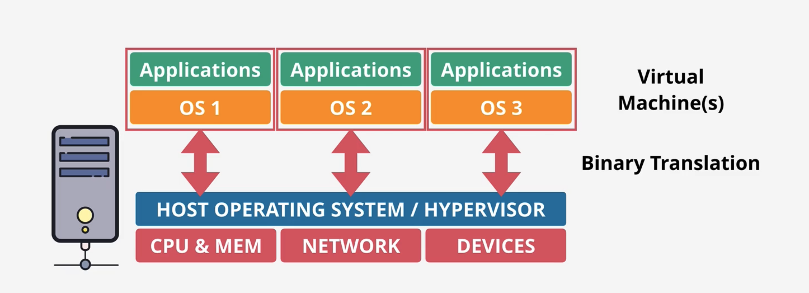
    
- What does Para-Virtualization expect from the get-go?
    
    That you can modify the OS
    
- How does Para-Virtualization work when compared to Emulated Virtualization?
    - Para-Virtualization ⇒ Guest OS is aware of the hypervisor and makes system calls directly to it
    - Emulated Virtualization ⇒ Guest OS is not aware of the hypervisor and makes privileged calls to the physical hardware. The hypervisor intercepts and translates these hardware calls to the actual hardware.
    
    
    
    
    
- What’s another name for Host Operating System within the context of Virtualization?
    
    Hypervisor
    
- What’s another name for Hypervisor?
    
    Host Operating System
    
- What is Paravirtualization?
    
    Virtualization technique where the Guest OS is modified to interact directly with the hypervisor
    
    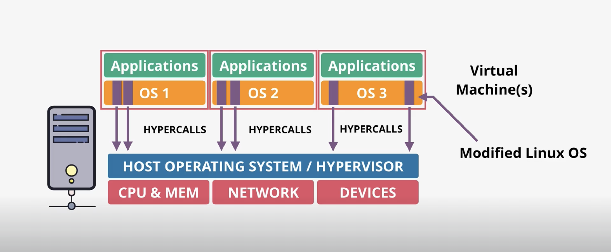
    
- Which one is faster between Para-virtualization and Emulated Virtualization?
    
    Para-virtualization 
    
- Why is Para-virtualization faster than Emulated Virtualization?
    
    No need to intercept and translate privilege commands like Emulated Virtualization
    
- How does Para-virtualization differ from Emulated Virtualization?
    
    Para-virtualization ⇒ required modifications of the guest OS (to be aware of the hypervisor)
    
    Emulated ⇒ no modifications required
    
- What is one advantage of Hardware Assisted Virtualization over Paravirtualization?
    
    It does not require modifications to the guest OS (compatible with wider range of OS)
    
- How does Hardware Assisted Virtualization work at a fundamental level?
    - CPU is aware of virtualization
    - Guest OS run privileged instruction to the CPU which knows to expect them
    - CPU redirects these instructions to the Hypervisor, which will handle how these instructions are executed
    
    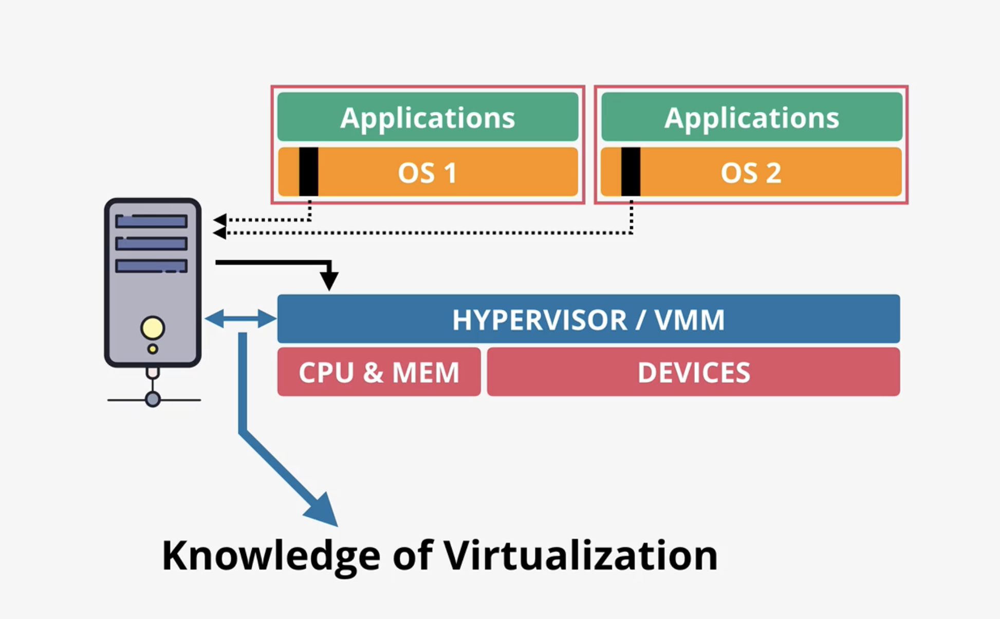
    
- What is a key feature of CPUs that support Hardware Assisted Virtualization?
    
    The CPU is aware of virtualization and can manage virtual machine operations natively.
    
- What happens when a Guest OS runs a privileged instruction on a CPU with Hardware Assisted Virtualization?
    
    The CPU redirects these instructions to the Hypervisor, which handles how these instructions are executed.
    
- What does SR-IOV do differently than other Virtualization offers?
    - Physical networking cards are virtualization aware
    - No Hypervisor translation is required
    - The Guest OS can directly use its physical networking card
    - Physical networking cards handle the process of running commands end to end
    
    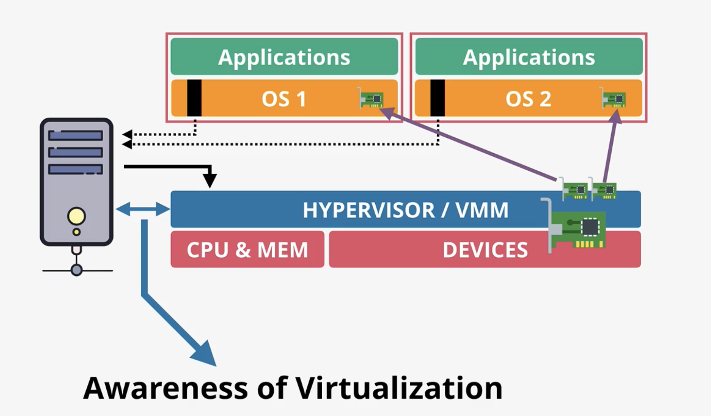
    

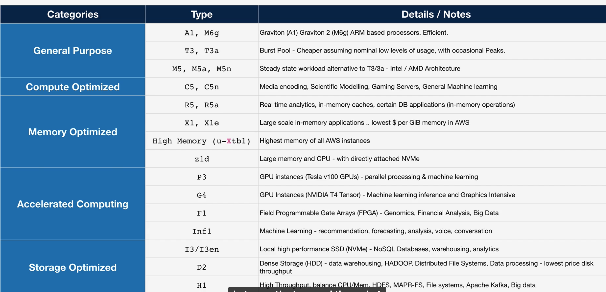

- What is the measure that tracks how quickly an instance becomes ready for service once you launch it?
    
    Boot-Time-To-Service-Time
    
- What is boostrapping in the context of EC2?
    
    It is the process of automatically setting up and configuring an instance when it is first launched. 
    
    
    
- What is the best practice for ensuring an optimal Boot-Time-To-Service-Time?
    
    By combining AMI baking and Bootstrapping
    
    
    
- Say we combine both AMI baking and Bootstrapping to ensure an optimal Boot-Time-To-Service-Time. What type of workload should we use for AMI baking and Bootstrapping?
    
    AMI Baking ⇒ time intensive (i.e. installation)
    
    Bootstrapping ⇒ configuration
    
    ---
    
    Think about a 90% installation, 10% configuration Instance. You would use AMI baking for the 90% installation and Bootstrapping for the remaining 10% of configuration.
    
- What enables EC2 Bootstrapping?
    
    User Data - Accessed via the meta-data IP
    
- How do you access the User Data of an EC2 instance?
    
    Accessed via the meta-data IP — http://169.254.169.254/latest/user-data
    
- What happens to the data you pass in the User Data of an EC2 instance?
    
    It is executed by the instance OS
    
- Say we place some configuration in the User Data using Bootstrapping. When does that configuration get run by the OS?
    
    Only at launch time
    
- Say you update the Instance User Data and restart the instance, will the OS run the User Data?
    
    No. As the execution only happens at launch time.
    
- How would boostrapping work in the real world?
    
    
    
    1. You create an EC2 Instance based on that AMI (volume attached using the Block Device Mapping)
    2. EC2 service passes the desired configuration onto the EC2 Instance User Data
    3. Software on the EC2 Instance OS knows to look for any data within the User Data
    4. If there is data within the User Data, the EC2 instance executes the content of the User Data on launch time 
    5. If the scripts within the User data run successfully, the instance goes into a Running (Ready for Service). If that’s not the case then the Instance will enter a Bad Config state.
- Facts about bootstrapping:

User Data is {{opaque}} to EC2, they either run {{successfully or fail}}
User Data is not {{secure}} — anyone who can {{access the instance OS}} can access User Data
User data is limited to {{16 KB}} in size
- How do you get around the fact that User Data has a 16KB size cap?
    
    You need to pass in a script that which will download that larger data.
    
- What is SSM Parameter Store used for?
    
    Manage configuration and secrets across multiple AWS services
    
- What are the three types of SSM Parameter Store parameters you can use?
    - String
    - StringList
    - SecureString
- What would you use to store the following information on an EC2 instance: License codes, Database Strings, Full Configs & Passwords?
    
    SSM Parameter Store
    
- What is the purpose of EC2 Placement Groups?
    
    It is a way to influence how instances are arranged on physical hardware
    
- What are the three types of EC2 Placement Groups?
    
    Cluster
    
    Spread
    
    Partition
    
- When would you use the following EC2 Placement Group types: Cluster and Spread.
    
    Cluster ⇒ you seek maximum performance and can tolerate instance risk failure
    
    Spread ⇒ you seek maximum availability and resilience for an application
    
- What does Cluster EC2 Placement Group do?
    
    Pack instances close together
    
- What does Spread EC2 Placement Group do?
    
    Keep instances separated
    
- What does Partition EC2 Placement Group do?
    
    Groups of instances spread apart
    
- What is the benefit of the Cluster EC2 Placement Group type?
    
    You can achieve faster data transfer between instances within the Cluster
    
    
    
- Why is transferring data between Instances within the same Cluster Placement Group faster than normal?
    
    There is a direct, physical connection between each other.
    
- What tools should you use to ensure that you have lowest latency and the maximum packets per second for transferring data between multiple instances?
    
    Cluster Placement Group
    
- Which type of instance do we assume you’re using when trying to use the lowest latency and maximum packets per second rate for transferring data between multiple instances?
    
    Instances with high networking performance + use enhanced networking on all instances
    
- Cover these facts about Cluster EC2 Placement Group type:

Can't span {{AZs, one AZ only,}} locked when launching first instance
Can span {{VPC peers}} - but impacts performance
Requires a {{supported instance type}}
Use the same type of instance {{(not mandatory)}}
Launch at the same time {{(not mandatory ... very recommended)}}
{{10Gbps single stream}} performance
Use cases: {{Performance, fast speeds, low latency}}
- What is the hard limit of Spread Placement Groups?
    
    7 Instances per AZ
    
- What physically happens when you use the Spread Placement Groups to launch your instances?
    - Each instance runs from a different rack
    - Each rack has its own network and power source
    
    
    
- What types of instances can’t you use with Spread Placement Groups?
    - Dedicated Instances
    - Dedicated Hosts
- What’s the use case for using Spread Placement Groups?
    
    **Small number** of **critical instances** that need to be **kept separated** from each other
    
- What is the difference between Spread and Partition Placement Groups?
    
    Spread ⇒ partition placement (where your instance is placed) is done by AWS, 7 instances per AZ limit
    
    Partition ⇒ you can have as many instances as you like (per AZ) but you have to administer the partition placement
    
    
    
- Complete these facts about Partition Placement Groups:

Hard limit: {{7 Partitions per AZ}}
Instances can be placed in a {{specific partition or auto placed}}
Great for {{topology aware}} applications ...HDFS, HBase, and Cassandra
Use case: {{Contain the impact of failure to part of an application}}
- Complete these facts about Enhanced Networking feature in EC2:

Uses {{SR-IOV}} - Network Interface Card (NIC) is virtualization aware
{{No charge}} - available on most EC2 Types
Higher {{I/O}}
Lower {{Host CPU Usage}}
High {{throughput}}
Higher {{packets-per-second (PPS)}}
Consistent lower {{latency}}
- Complete these facts about EBS Optimized feature in EC2:

EBS = {{Block storage}} over {{the network}}
Historically network was shared between {{data and EBS}}
EBS Optimized means {{dedicated capacity for EBS}}
Most instances support and {{have enabled by default}}
Some older instances support, but {{enabling costs extra}}
- What does EBS Optimized feature do?
    
    It means adding dedicated capacity for storage networking to an EC2 instance
    
- How can permissions be provided to an application running in EC2 using best practices?
    
    Using Instance Profile & IAM Role
    
- Which feature of EC2 allows you to provide commands that the instance will run at startup?
    
    User-Data
    
- When do commands specified in user-data get executed?
    
    Once when the instance is provisioned
    

### AWS ECS

- What is the main problem of virtualization?
*Context: think of the problem that containers seek to solve*
    
    The Guest OS often take a large % of the resources allocated leaving little for runtime and applications running within the virtual machines
    
    
    
- What is the similarity between Virtual Machines and Containers?
    
    They both provide an isolated environment to run your applications
    
- What are the differences between VMs and Containers?
    
    VMs ⇒ **run the whole isolated** OS on top of the Hypervisor
    
    
    
    Containers ⇒ **run as a process** within the host operating system itself
    
- Could you draw how an EC2 Virtual Machine with Nitro would look like?
    
    
    
- Could you draw how an Containerized application would look like?
    
    
    
- Why are containers much lighter than Virtual Machines?
    
    Because we do not need to run a full operating system for each application 
    
    
    
- What does containers being much lighter than Virtual Machines enable us to do?
    
    Run more application on the same piece of hardware (when compared to VMs)
    
    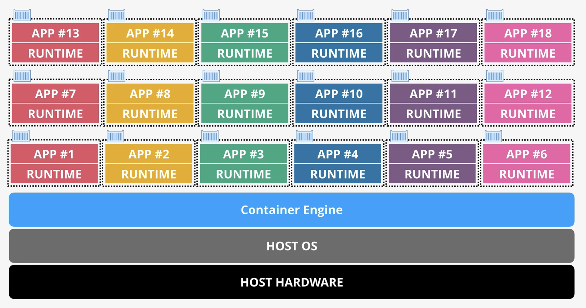
    
- What is the difference between a Docker Image and a Docker Container?
    
    Docker Container has an additiona Read/Write FS layer on top (of the image)
    
    
    
- What is the similarity between a Docker Image and a Docker Container?
    
    Docker Container is a **running** copy of a Docker Image
    
    
    
- What is the state of all file FS layer within a Docker Image?
    
    Read-only
    
- What does it mean that the layer within a Docker Image are read-only?
    
    They never change after they’ve been created
    
- What does it mean that each layer within a Docker image is differential?
    
    Each layer stores only the changes made against from the layers below
    
- What enables two separate containers running off of the same Docker image to be isolated?
    
    The Read/Write Layer in each Container
    
    
    
- Why is this picture an example of why Docker containers tend to be lighter?
    
    There is **no duplication** of the shared FS layers (green, blue, red) because it is reusing the same docker image
    
    
    
- What is a Docker Host?
    
    Server running a container engine
    
- Docker Host can run {{many containers}} based on {{one or more images}}.
- {{A single image}} can be used to generate containers on {{many different Docker hosts}}
- What are Dockerfiles used for?
    
    build Docker images
    
- Why are Docker images considered portable?
    
    They are self-contained and always run as expected, regardless of the environment.
    
- How do Docker containers remain lightweight?
    
    They use the parent OS and share filesystem layers.
    
- What does a Docker container run?
    
    Only the application and its environment.
    
- What is the purpose of Container definition?
    
    Defines the image and the ports that will be used for the container
    
    ---
    
    It basically points at a container image that's stored on a container registry and it defines which ports are exposed from that container.
    
- How many containers can you have in a Task definition?
    
    One container or many
    
- What is the purpose of Task definition?
    
    Where you specify the 
    
    - Task Role (Security)
    - Containers used
    - Resources that your task will consume
- What is a task role?
    
    It is an IAM role that a task can assume to gain temporary credentials to interact with AWS resources
    
- What is the best practice to giving containers within ECS permissions access to AWS resources?
    
    Task roles
    
- What is the interaction between containers and tasks?
    
    A task can include one or more containers
    
- What would you need to ensure you’ve set up for your ECS task so that it’s highly available and able to scale?
    
    Set up the ECS service through a Service definition
    
- What are the basic components of working with ECS?
    
    Create a cluster
    
    Deploy tasks or services within that cluster
    
    
    
- In simple terms, what do you specify through Service definition?
    
    How many copies of a task you want to run
    
- In which scenario would you use ensure you’ve set up a Service definition for your Task?
    
    When working with a business critical task that needs to cope with substantial incoming load
    
- What are the two cluster modes you can use when running containers within ECS?
    - EC2 Mode
    - Fargate Mode
- What do each of the two cluster modes (EC2 and Fargate mode) dictate?
    
    What parts you’re responsible for managing versus what you outsource to AWS when it comes to container host admin overhead
    
- When should you use ECS with EC2 mode?
    
    When you want to use containers in your infrastructure but you need to manage the container host capacity and availability
    
- Under Fargate model, where do our task and services run from?
    
    Fargate Shared Infrastructure
    
    
    
- What is the process behind the scene that takes place for you to be able to access your ECS Farget Mode cluster?
    
    Tasks and services in Fargate are given an Elastic Network Interface (ENI) within the VPC, enabling access to your ECS cluster.
    
    
    
- What is the payment structure for Fargate?
    
    You pay for the container resources you consume
    
- What does it mean that you use EC2 natively to deploy your application?
    
    Deploying an application as a virtual machine
    
- What does it mean that you use ECS (EC2 mode) to deploy your application?
    
    Containerized application running in ECS using a EC2 based cluster
    
- What does it mean that you use ECS (Fargate mode) to deploy your application?
    
    Containerized application running in ECS using a Fargate based cluster
    
- Complete the sentences covering when you would use EC2 vs ECS

If you use containers, use {{ECS}}
Large workload and your business is price-conscious, use {{ECS with EC2 mode}}
Large workload and your business is overhead, use {{ECS with Fargate mode}}
Small/Burst workloads, use {{ECS with Fargate mode}}
Batch/Periodic workloads, use {{ECS with Fargate mode}}
- At a high-level, when would you choose Container based architecture over Virtualization based architecture?
    
    Containers make sense when wanting to isolate applications 
    
    low-usage levels, applications using the same OS, applications where you don’t need the overhead of virtualization
    
- Why is Fargate ideal for small or burst type workloads?
    
    You only pay for what you consume
    
- What does ECS acronym stand for?
    
    Elastic Container Service
    
- What does ECR acronym stand for?
    
    Elastic Container Registry
    
- What is ECR?
    
    Managed Container image registry service
    
- How should you think of ECR at a very high-level?
    
    Like Docker Hub for AWS
    
- Complete these facts about ECR.

Each AWS account has a {{public and private}} registry
Each registry can have {{many repositories}}
Each repository can contain {{many images}}
Images can have {{several tags}}
- What are the benefits of using the ECR service?
    - Integrated with IAM
    - Image security scanning
    - Near real-time metrics (integrated with Cloudwatch)
    - Allows for cross-region and cross-account replication

### #AWS-Route53

- Complete the facts about Route 53:

A {{Route 53 Hosted Zone}} is a DNS DB for a domain e.g. [animals4life.org](http://animals4life.org/)
{{Globally resilient}} (multiple DNS Servers)
Created with {{domain registration via R53}} - can be created separately
Host {{DNS Records}} (e.g. A, AAAA, MX, NS, TXT ...)
Hosted Zones are what the DNS system references - {{Authoritative}} for a domain e.g. [Animals4life.org](http://animals4life.org/)
- Complete these facts about Public Hosted Zones

{{DNS Database}} (zone file) hosted by R53 (Public Name Servers)
Accessible from the {{public internet & VPCs}}
Hosted on {{"4" R53 Name servers (NS)}} specific for the zone
You can use {{"NS records"}} to point at these NS (connect to global DNS)
Resource Records (RR) are created within the Hosted Zone
{{Externally registered domains}} can point at R53 Public Zone
- What enables Route 53 to communicate with VPC based resources?
    
    Route 53 Resolver
    
- What is the name of this?
    
    
    
    in the question
    
    **Resource Records**
    
- Where can you find Resource Records?
    
    Inside of Public Hosted Zones
    
- What is the pricing structure of Public Route 53 Hosted Zone?
    - Monthly cost for hosting the Public R53 Hosted Zone
    - Tiny charge for queries made against it
- Break down the communication between Public Internet Zone and Public Hosted Zone.
    
    
    
    Use image occlusion on both the Internet Zone and Public Hosted Zone
    
- Break down the components of that appear within a Public 53 Hosted Zone.
    
    
    
    Use image occlusion on Public Hosted Zone
    
- Break down the communication between a VPC and Public Hosted Zone.
    
    
    
    Use image occlusion on both the VPC and Public Hosted Zone
    
- Complete these facts about Private Hosted Zones

Work similarly to Public Hosted Zone but they {{aren’t public}}
They are associated with {{VPCs}}
{{Only accessible}} within associated VPCs
- What does Split-View (Split-Horizon) in DNS allow you to do?
    
    Allows for overlapping Public and Private Hosted Zones of the same name
    
- What does Split-view (Split-Horizon) enable?
    
    You can have a different variant of a zone for private users versus public users
    
- When would you need to use Private Hosted Zones?
    
    You need to provide records using DNS but maybe they’re sensitive and need to be accessible only from internal VPCs.
    
- What do you need to access a Private Hosted Zone?
    - Service needs to be running inside of a VPC
    - That VPC needs to be associated with that Private Hosted Zone
- What is the common architecture for working with DNS Split-View (Split-Horizon)?
    
    Make the private zone a superset (of the public) containing more sensitive records
    
    
    
- What is the purpose of CNAME?
    
    It’s a way to create an alternative name for something within DNS
    
    ex. www.catagram.io => catagram.io
    
    ---
    
    CNAME maps a NAME to another NAME
    
- Can you use CNAMEs for the apex of a domain?
    
    No. I.e. so you couldn’t have a CNAME record for catagram.io pointing at something else
    
- What is the apex of a domain? www.catagram.io
    
    The naked domain i.e. catagram.io
    
- What is the problem that DNS Aliases help solve?
    
    They allow you to create an alternative name for the domain apex (naked)
    
- Complete this fact sheet covering the problems with CNAME:
"A" maps a {{NAME to an IP Address (... [catagram.io](http://catagram.io/) => 1.3.3.7)}}
CNAME maps a {{NAME to another NAME (... [www.catagram.io](http://www.catagram.io/) => [catagram.io](http://catagram.io/))}}
CNAME is {{invalid for naked/apex ([catagram.io](http://catagram.io/))}}
Many AWS services use a {{DNS Name (ELBs)}}
With just CNAME - [catagram.io](http://catagram.io/) => {{ELB would be invalid}}
- When shoud you use ALIAS records?
    
    When you want to point to AWS resources (Elastic Load Balancer for example)
    
- What does it mean that: Alias should be the same "Type" as what the record is pointing at?

hint: think about working with DNS and ELB
    
    With Elastic Load Balancer you are given an A record for the ELB (name pointing to an IP).
    
    This mean that you have to create an **A record ALIAS** if you want to point at the DNS name provided by the ELB
    
- If a resource provides is an A record then you need to use an {{A record ALIAS}}
- Complete this fact sheet covering DNS ALIAS:

ALIAS records map a {{NAME to an AWS resource}}
Can be used both for {{naked/apex and normal records}}
For non apex/naked - functions like {{CNAME}}
There is {{no charge}} for ALIAS requests pointing at AWS resources
For AWS Services - default to picking {{ALIAS}}
Should be the same {{"Type" as what the record is pointing at}}
- How can you use DNS aliases?
    
    Only if Route 53 is hosting your domains
    
- Are ALIAS part of the DNS standard?
    
    No, they’re a feature implemented by AWS
    
- What should you use Simple Routing?
    
    When you want to **route requests towards one service** such as a web server
    
- What is the main downside of Simple Routing?
    
    **Doesn't support health checks** - all values are returned for a record when queried
    
- How does Simple Routing work?
    1. We assume you have a Hosted Zone with 1 record per name (e.g. www.animals4life.org A record type)
    2. Each record using Simple Routing can have multiple values
    3. Client makes a request to resolve www
    4. All of the values are returned in the same query in a random order
    5. Client chooses 1 value and connects to that server using that value (e.g. server with IP 1.2.3.4)
    
    
    
- Health check are {{separate from}}, but are {{used by}} records
- Health checkers located {{globally}}
    
    
    
- How does Failover Routing work?
    
    If Primary Record is Healthy, return it. Otherwise use the Secondary record.
    
    
    
- What is the common architecture for Failover Routing? Please provide a visual example of how that would work.
    
    "Out-of-band" failure architecture ⇒ where your secondary record points to another resource (i.e. primary record points to an EC2 and secondary record points to an S3 bucket)
    
- When should you use Failover Routing?
    
    Use when you want to **configure active passive failover**
    
- Cover these facts about Multi Value Routing:

- Supports {{multiple records}} with the same name
- {{Each record}} is independent and can have an associated {{health check}}
- Any records which fail health checks {{won't be returned}} when queried
- Multi Value improves {{availability}} but it is not a replacement for {{load balancing}}
    
    
    
- In what cases would you use simple routing, failover routing, and multi value routing?
    - Simple Routing ⇒ used for a **single resources** (e.g. web server)
    - Failover Routing ⇒ used for active **backup architecture** (S3 bucket as backup)
    - Multi Value Routing ⇒ when you have **many resources** which can all service requests and you want **all of them with health checked** and **returned at random**
- What is the method that Multi Value Routing uses to return healthy records?
    - Up to 8 'healthy' records are returned.
    - If more exist, 8 are randomly selected.
- What are the two cases when you would want to use Weighted Routing?
    - Simple load balancing
    - Test new versions of software
- How does Weighted Routing decide how to return records?
    
    Each record is returned based on its record weight vs total weight
    
    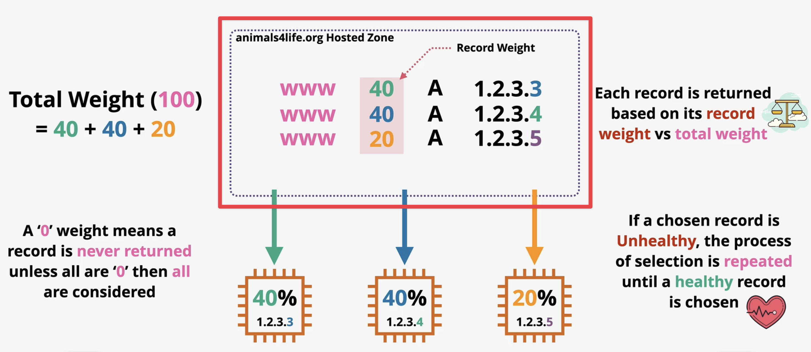
    
- Say you want to have 5% of resolution requests go to a particular server running a new version of your application. What type of routing would you need to use in this case?
    
    Weighted Routing
    
- When is Weighted Routing useful?
    
    When you have a **group of records with the same name** and want to **control the amount a time a specific record is returned**
    
- When should you use Latency Based Routing?
    
    When you want to optimize **performance** and **user experience**
    
- Complete facts about Latency Based Routing: 

- Latency-Based routing supports {{one record}} with the same name in each {{AWS Region}}
- AWS maintains a database of {{latency}} between the users {{general location and the regions}} tagged in records
- The record returned is the one which offers the {{lowest estimated latency}} & {{is healthy}}
    
    
    
- What are the three cases where you should use Geolocation Routing?
    - Regional restrictions
    - Language specific content
    - Load balancing across regional endpoints
- Geolocation (Routing) doesn't return {{"closest" records}}, only {{relevant (location) records}}
- How does R53 check records for Geolocation Routing type?
    - Check state
    - Check country
    - Check continent
    - Optionally: default record
- When should you use Geolocation Routing type?
    
    If you want to route traffic based on the location of your customer 
    
- Complete these facts about Geoproximity Routing type:

- Routing is {{distance}} based including {{bias}}
- {{Plus or minus}} bias can be added to the rules. {{Plus bias}} increases region size while {{minus bias}} decreases it
- Records can be tagged with an {{AWS region}} or {{latitude and longitude}} coordinates
    
    
    
- What is bias in the context of R53 Geoproximity Routing type?
    
    Expands or shrinks the size of a geographical region that is used for traffic to be routed to.
    
    ---
    
    Example: we can increase the bias for the East Asia Pacific region to allow it to service records for calls made from the Middle East
    
    
    
- What are the two jobs that Route 53 does?
    - Domain registrar
    - Domain hosting
- What does Route 53 do as part of its Domain Registrar part?
    - Collect the domain registration fee
    - Wait for the Domain Hosting part (allocationg of 4 NS + zone file)
    - Communicates with the registry of the TLD and sets the NS records for the domain to the NS from the domain hosting part
- What does Route 53 do when it’s responsible for both the Domain Registrar and Domain Hosting parts?
    - Register a domain and **pay the fee** required to **register the domain**
    - R53 Domain Registrar communicates with R53 Domain hosting **create public hosted zone**
    - R53 Domain hosting creates a Zone File and allocates 4 Name Servers which are returned to the R53 Registrar
    - R53 Registrar takes the 4 NS and passes this information to the TLD registry
    - Entries are added in the TLD pointing at the 4 NS we received from R53 domain hosting role
    
    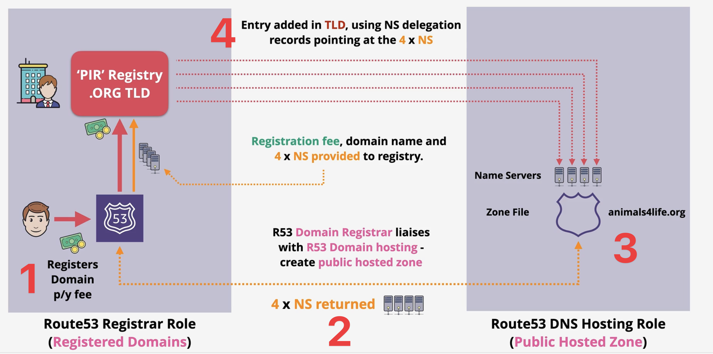
    
- What do you pay when you use Route 53 for both the Domain Registrar and Domain Hosting parts?
    - Yearly fee to register the domain
    - Monthly fee to host the domain
- Complete these facts about Route 53 Interoperability:

- R53 normally has 2 jobs - {{Domain registrar}} and {{Domain Hosting}}
- R53 can do BOTH, or either {{Domain Registrar or Domain Hosting}}
- R53 Accepts your money ({{Domain Registrar}})
- R53 allocates 4 Name Servers (NS) ({{Domain Hosting}})
- R53 Creates a zone file ({{Domain Hosting}}) on the above NS
- R53 communicates with the registry of the TLD ({{Domain Registrar}}) sets the NS records for the domain to point at the 4 NS above

### AWS RDS

- What does the SQL acronym stand for?
    
    Structured Querying Language
    
- Say the examen talks about in-memory caching. What type of databse architecture should you use?
    
    NoSQL Key-value
    
- What does OLTP acronym stand for?
    
    Online Transaction Processing
    
- When is Row store ideal?
    
    Ideal if you are operating with rows adding, updating, deleting
    
    
    
- When is Column Store ideal?
    
    Ideal for **reporting**, **analytics**, and when **all values for a specific attribute** (size) are required.
    
    
    
- What does CAP Theorem acronym stand for?
    
    Consistency
    
    Availability
    
    Partition Tolerance (resilience)
    
- What does Consistency mean in the context of CAP Theorem?
    
    Every read to a database will receive the most recent write or it will get an error
    
- What does Availability mean in the context of CAP Theorem?
    
    Every request will receive a non error response but without the guarantee that it contains the most recent write
    
- What does Partition Tolerance mean in the context of CAP Theorem?
    
    System can be made of multiple network partitions and the system continues to operate even if there are a number of dropped messages or errors
    
- What does the CAP Theorem say?
    
    Consistency, Availability, Partition Tolerant (resilience) - Choose 2
    
- In the exam, when you see ACID database what AWS service and limitations will you usually encounter?
    
    RDS + limits db scaling
    
- Cover these facts about ACID:

- Atomicity means that {{ALL or NO components}} of a transaction SUCCEEDS or FAILS
- Consistency means that transactions move the database from {{one valid state to another}} - nothing {{in-between}} is allowed
- Isolated means that if multiple transactions occur at once, they {{don't interfere with each other}}. Each executes as if it's the {{only one}}
- {{Once committed}}, transactions are durable. Stored on non-volatile memory, resilient to {{power outages or system crashes}}.
- Why does ACID limit scalability?
    
    Because it implements a very rigid form of managing data and transactions on that data
    
- Complete these facts about the BASE database model:

- Basically Available: READ and WRITE operations are available {{as much as
possible}} but without any {{consistency guarantees}}
- Soft State: The database doesn’t {{enforce consistency}}, the responsability is being delegated to {{developers and application}}
- Eventually Consistent: If we {{wait long enough}}, reads from the system will be {{consistent}}
- What do Soft State databases imply?
    
    Your application needs to deal with the possibility that the data you’re reading isn’t the same data that was written moments ago
    
- What should you think about when you see noSQL or DynamoDB together with ACID?
    
    DynamoDB Transactions
    
- What are some of the reasons why you might want to run your database on an EC2 instance?

- Access to the {{DB Instance OS}}
- Advanced DB Option tuning that required {{root access}}
- Run a {{database OR database version that AWS doesn’t provide}}
- Specific {{OS/DB combination}} that AWS doesn’t provide
- Specific AWS architecture {{replication/resilience}} that AWS doesn’t provide
- Decision makers who just {{want it}}
- What are the 5 reasons why you shouldn’t run your database directly on EC2?
    - Admin overhead — managing EC2 and DBHost
    - Backups & Disaster Recovery Management
    - Your database runs on 1 AZ
    - Missing features (present in AWS’ managed services)
    - No easy way to scale
- What is AWS RDS?
    
    Is an AWS managed database server
    
- Do we have access to the OS/SSH with a product like RDS?
    
    No as the product is managed by AWS
    
- Where does RDS run from: VPC or AWS Public Zone?
    
    VPC subnet
    
- What is the RDS Subnet Group?
    
    Lists of subnets that RDS can use for a given database instance(s)
    
    
    
- How many databases can we have on a RDS instance?
    
    1+ Databases
    
    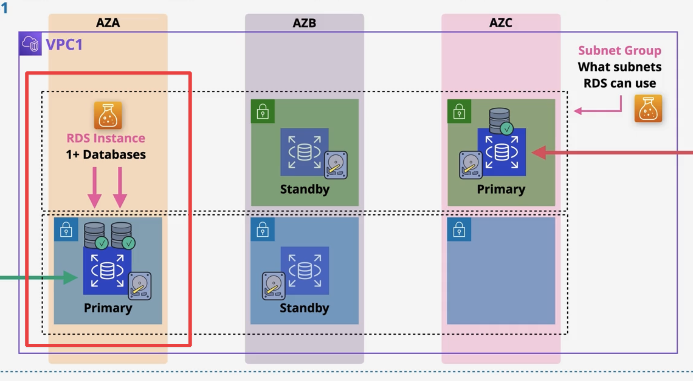
    
- How does RDS handle storage?
    
    Each RDS instance gets assigned a dedicated EBS volume
    
- How does AWS handle storage between primary and standby when working a Multi-AZ architecture for your RDS?
    
    Primary replicates EBS volume data to the Standby instance using **Synchronous Replication**
    
    
    
- What is Read Replication?
    
    Asychronous replication used in RDS architecture
    
- What are two cases when you would use Read Replicas?
    - Scale read load
    - Increase resilience (e.g. recovering in another region)
- Where do backups of RDS instances go to?
    
    AWS managed S3 buckets
    
- What does a Multi-AZ RDS architecture feature?
    
    Primary and Standy RDS instances
    
    
    
- What are the x factors that make up the billing structure of RDS?
    - Instance size and Type
    - Multi-AZ or not
    - Storage type & Amount
    - Data transfer costs
    - Backups & Snapshots
    - Licensing (for using commercial DB engine types)
- What does data transfer costs refer to?
    
    Data for transferring data:
    
    - In and out of the DB instance
    - From/to the Internet
    - From/to other AWS regions
- What does RDS acronym stand for?
    
    Relational Database Service
    
- Cover these facts about RDS’ Multi-AZ Instance feature:

- The data gets sent to a {{Primary and Standby}} databases
- The data from the Primary to the Standby in a {{synchronous}} manner
- There is {{one}} standby replica which can't {{be used for reads or writes}}
- It can take anywhere from {{60 to 120 seconds}} for the failover to occur
- Backups are taken from the {{standby replica}} to improve performance
    
    
    
- Cover these facts about RDS’ Multi-AZ Cluster feature:

- {{1 Writer and 2 Reader}} DB instances (different AZs)
- Much faster hardware, Graviton + local {{NVME SSD Storage}}
- Fast writes to {{local storage}} => {{flushed to EBS}}
- {{Readers can be used to scale read}} operations against the database
- Replication is done via {{transaction logs}} which is more efficient
- Failover is faster {{~35s + transaction log}} apply
- Writes are “commited” when {{1 readers has confirmed}}
    
    
    
- What is the Cluster Endpint for RDS’ Multi-AZ Cluster feature?
    
    It is an endpoint that points to the writer. Used for reads, writes and administration
    
- What is the Reader Endpoint for RDS’ Multi-AZ Cluster feature?
    
    It is an endpoint that directs any reads at an available reader instance
    
- What is the Instance Endpoint for RDS’ Multi-AZ Cluster feature?
    
    Point at a specific instance
    
- What is the Instance Endpoint generally used for (RDS’ Multi-AZ Cluster)?
    
    Testing and fault finding
    
- What are transactions logs within the context of RDS?
    
    Store the actual operations which change the data on the database
    
- What is the retention policy of Manual Snapshots of a RDS instance?
    
    Forever unless removed explicitly from the particular S3 bucket
    
- What is the retention policy of Automated Backups of a RDS instance?
    
    0 to 35 days
    
- Cover these facts about RDS restores:

- Restores creates a {{new RDS instance with a new address}}
- Snapshots = {{single point in time}}, creation time
- Automated = {{any 5 minute point in time}}
- Backup is {{restored and transaction logs are 'replayed'}} to bring DB to desired point in time (GOOD RPO)
- Restores {{aren't fast}}
- How does asynchronous and synchronous replication work within the context of RDS?
    - Synchronous replication ⇒ write to the primary and standby databases at the same time
    - Asynchronous replication ⇒ data is written to the primary first, at which point it's viewed as committed when it's replicated to the read replicas.
- For the exam, what should you think of when you hear synchronous and asynchronous replication in RDS question?
    - Sync ⇒ multi-AZ
    - Async ⇒ Read Replicas
- Complete these facts about Read Replicas Performance Improvements:

- {{5 x direct read-replicas}} per DB instance
- Each providing an additional instance of {{read performance}}
- Read-Replicas can have {{read-replicas - but lag starts to be a problem.}}
- Offers {{global performance}} improvements
- What do Snapshots & Backups help improve in RDS?
    
    RPO as it limits the amount of data lost
    
- Why are Snapshots and Backups in RDS not the best at RTO?
    
    Because restoring snapshots/backups can take a long time (esp for large databases)
    
- What’s the benefit of Read Replicas in RDS for improving Data Recovery resilience of our systems?
    
    Offers near zero RPO and low RTO (way better in both regards when compared with Snapshots and Backups)
    
- When should you use Read Replicas for Data recovery?
    
    Only when trying to recover from failure but not for data corruption
    
- What happens when you promote a Read Replica?
    
    You’re able to use it as a normal RDS instance (read + write)
    
- What does Read Replicas allow us to do in term of resilience?
    
    Achieve global resilience 
    
- How would we create a globally resilience RDS instance using Read Replicas?
    
    By creating a **cross-region read replica** in another AWS **region**
    
- Cover these facts about particular encryptions available in RDS:

- RDS MSSQL and RDS Oracle Support {{TDE — Transparent Data Encryption}} (Encryption handled within the DB engine)
- RDS Oracle supports integration with {{CloudHSM}} (Much stronger key controls (even from AWS)
- How is TDE different than KMS when it comes to encryption of database data
    - Data is encrypted before leaving the instance by the Host
    
    
    
- Say we want to use IAM with RDS, how would that look?
    
    Local DB User (IAM provide and AWS Authentication Token
    
    
    
- How does IAM integrate with RDS?
    
    You have IAM creating local db users that map to different IAM identities
    
- If you do not use DB User Password for your IAM generated Local DB Users, how do you pass your secret?
    - IAM identities run an operation (generate-db-auth)
    - AWS Authentication Token is used in place of a DB User password
- What do we use for Authentication and Authorization when working with RDS?
    - Authentication: IAM
    - Authorization: DB Engine
- Is IAM used for Authentication and Authorization within RDS?
    
    No, as RDS is responsible with Authorization. IAM is only focused on Authentication
    
- What do you need to do integrate IAM with your RDS instance?
    
    Enable it on the RDS instance
    
- Present the types of databases you can have based on what you outsource, manage, or share responsability with AWS.
    
    
    
    add image occlusion on on-premises, rds, rds custom, ec2
    
- What does DMS stand for?
    
    Database Migration Service
    
- Complete these facts about DMS:

- It is a {{managed database migration service}}
- Runs using a {{replication instance}}
- Source and Destination Endpoints point at {{Source and Target Databases}}
- One endpoint {{MUST be on AWS}}
- What does DMS use to migrate databases?
    
    Replication instance (EC2 instance with migration software and the ability to communicate with the DMS service) 
    
- {{Replication instance}} performs the migration between Source and Destination {{endpoints}} which store {{connection information}} for source and target databases
    
    
    
- What are the types of jobs that DMS can run?
    - Full load ⇒ migrate all data in one go
    - Full load + CDC ⇒ full load migration + capture any changes occuring on the source
    - CDC only ⇒ replicate data changes only
- When should you use CDC only for the DMS migration job type?
    
    If you need to bulk transfer the data in some way outside of DMS (i.e. Oracle db native import/export)
    
- Complete these facts about Schema Conversion Tool (SCT):

- SCT is used when converting {{one database engine to another}}
- SCT is not used when {{migrating between DB's of the same type}}

### AWS Aurora

- What does Aurora use to provision databases?
    
    Cluster
    
- What can we find inside of an Aurora cluster?
    
    1 Primary database + 0 or more Replicas
    
- How are the Replicas in Aurora different than RDS?
    - They can be used for failover AND can be used for read operations (improving resilience and availability).
    - In RDS, Standby replica cannot be used for read operations
- How does storage on Aurora differ from RDS?
    
    Aurora ⇒ shared cluster volumes
    
    RDS ⇒ local storage
    
- How does Aurora differ from RDS when it comes to the number of primary and replicas we can have for a given instance?
    
    Aurora ⇒ 1 Primary + up to 15 Replicas
    
    RDS ⇒ 1 Primary + 1 Standby Replica
    
- Cover these facts about Storage Architecture for Aurora:

- All SSD Based - {{high IOPS, low latency}}
- Storage is billed based on {{what's used}}
- {{High water mark}} - billed for the most used (Storage which is freed up can be re-used)
- Replicas can be added and removed without requiring {{storage provisioning}}
- How are Endpoints used in Aurora?
    - Cluster Endpoint ⇒ points to the Primary database
    - Read Endpoint ⇒ load balancing between the multiple Read Replicas
- How do you connect to an Aurora cluster?
    
    Using a DNS address
    
- What included in the price of the Aurora cluster when it comes to backups?
    
    Backups that are up to 100% of the database size of the cluster
    
- What happens when you restore backups using Aurora?
    
    A new cluster is created
    
- What is ACU acronym stand for in the context of Aurora Serverless?
    
    Aurora Capacity Units
    
- What are Aurora Capacity Units?
    
    Represent a certain amount of compute and a corresponding amount of memory
    
- Complete these facts about Aurora Serverless:

- Uses scalable {{ACU - Aurora Capacity Units}}
- Aurora Serverless cluster has a {{MIN & MAX ACU}}
- Cluster adjusts based on {{load}}
- Consumption billing {{per-second}} basis
- Same resilience as Aurora {{(6 copies across AZs)}}
- Complete this fact about Multi-Master Aurora:

- Default Aurora mode is {{Single-Master}} 
- That means that we have {{One R/W}} and {{0+ Read Only Replicas}}
- {{Cluster Endpoint}} is used to write, {{read endpoint}} is used for load balanced reads
- Failover takes {{time as replicas need to be promoted to R/W}}
- In Multi-Master mode all instances are {{R/W}} — so there isn’t a {{failover}} process
- There’s no {{endpoint connection}} process. You {{connect directly}} to the instances
- What do you need to build a Fault Tolerant application using Aurora?
    
    Multi-Master
    
- How does Aurora Multi-Master achieve Fault Tolerance?
    
    Your application can connect to multiple Read/Write instances within an Aurora cluster.
    
    **Traffic can be switched** from one db instance to another within the cluster without **any downtime** (as is the case with Single Master) making the application Fault Tolerant
    
- How do we add a AWS Public Zone service (think Lambda) to our VPC?
    
    By adding an Elastic Network Interface to a subnet within our VPC
    
    
    
- What’s the purpose of a proxy when talking about database connection?
    
    Without a proxy we would need to initiate separate connection every time we needed data from a database.
    
    With a proxy, the application connects to a proxy and the proxy maintains a pool of connections to the database (which are open for the long-term).
    
- What is the type of connection of a proxy and a database?
    
    Long Term Connection
    
- Where does a RDS Proxy run from?
    
    From within a VPC and is available in all AZs
    
    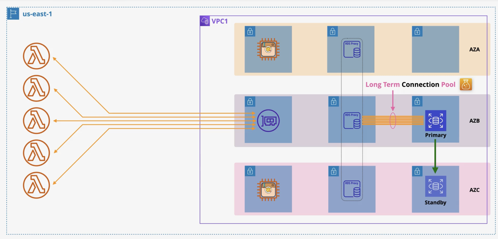
    
- Which is quicker to establish a connection to the database: directly or through a proxy?
    
    Through a proxy
    
- How does a Proxy handle Primary database failure?
    
    The client stays connected to the proxy while the proxy itself establishes a new connection in case of a failover (moving from the primary to the standby).
    
    
    
- When should you use RDS Proxy?
    - {{Too many connection}} errors
    - When using {{smaller/burstable db instance}} (T2/T3)
    - When using AWS {{Lambda}}
    - {{Long running apps}} where low latency is required
    - Where {{resilience}} to database failure is a priority…
    - RDS proxy can reduce the {{time for failover}} and make it {{transparent to the application}}
- How does connecting to a RDS Proxy differ than a normal RDS instance connection DURING a failover event?
    
    RDS Proxy ⇒ application connects a single RDS Proxy Endpoint, during a failover RDS Proxy minimizes downtime
    
    Direct RDS connection ⇒ direct connection through a CNAME, during a failover you have to wait for the CNAME of the database to change (DNS of the instance) from the primary to the standby
    
- Cover these facts about RDS Proxy:

- {{Fully Managed DB Proxy}} for RDS/Aurora
- Includes {{auto scaling}}, {{high availability}} by default
- Provides {{connection pooling}} to reduces DB Load
- Only accessible from a {{VPC}}
-  Accessed via {{Proxy Endpoint}} - no app changes
- Can enforce security through {{SSL/TLS}}
- Can reduce {{failover time}} by over 60%
- {{Abstracts failure}} away from your applications
- How does RDS Proxy handle a failover event (failing from the primary to the standby)?
    
    The RDS Proxy will **wait until it can connect to the standby database** and then continue fulfilling requests from client connections
    

### AWS EFS

- What does EFS acronym stand for?
    
    Elastic File System
    
- What does EFS allow us to do?
    
    Enables our EC2 instances to become stateless
    
    ---
    
    Move data stored on an EC2 instance to an external file system volume. 
    
    This allows us to not lose data when we change or stop instances.
    
- What is the type of storage that EFS offers?
    
    File system storage
    
- What is EFS an implementation of?
    
    NFSv4
    
- What can you do with EFS Filesystems?
    
    Mount them to EC2 instances
    
- Can you use an EFS Filesystem for multiple EC2 instances?
    
    Yes
    
- Is EFS a private or AWS Public zone service?
    
    Private as it gets placed within a given VPC
    
- How can you access EFS outside of a VPC?
    
    Using VPN or Direct Connect
    
- How is a EFS file system is made available inside a VPC?
    
    Via mount targets
    
- How do you create a Highly Available (HA) system using EFS?
    
    You need to have a mount target in every AZ that the VPC uses
    
    
    
- How do EC2 instance connect to EFS?
    
    Through Mount targets
    
    
    
- What type of OS does EFS support?
    
    Linux only
    
- Cover these facts about EFS:

- {{General Purpose}} and {{Max I/O}} Performance Modes
- {{General Purpose}} = default for 99.9% of uses
- {{Bursting}} and {{Provisioned}} Throughput Modes
- Storage classes: {{Standard}} and {{Infrequent Access (IA)}}
- {{Lifecycle Policies}} can be used to update classes throughout time
- Cover these facts about AWS Backups:

- {{Fully managed}} data-protection (backup/restore) service
- {{Consolidate management}} into one place .. across accounts & across regions
- Supports a wide range of AWS products
- What are AWS Backups?
    
    It is a fully managed AWS product that puts all your backups in one place: across multiple accounts, regions and AWS services.
    

### High Availability & Scaling

- Cover these components that are part of creating a global and regional resilient service:

Global:
- Global {{Service Location & Discovery}}
- {{Content Delivery (CDN)}} and optimisation
- Global {{health checks}} & {{Failover}}
Regional:
- Regional {{entry point}}
- {{Scaling}} & Resilience
- Application services and components
- Globally DNS is used for {{service discovery}} and {{regional based health checks}} and request routing
    
    
    
- CDN's are used to {{cache content}} globally - as {{close}} to end users as possible to improve {{performance}}
    
    
    
- What is the purpose of the web tier for a regional based application?
    
    Act as the entry point for your regional based applications 
    
    
    
- Why should we use a web tier for our regional based application?
    
    It allows you to scale infrastructure behind the scene without directly impacting users 
    
- In which tier can we find the functionality that is provided to the user by the Web tier?
    
    Compute tier
    
    
    
    ---
    
    uses services such as Lambda, EC2, and ECS
    
- Image occlusion this.
    
    Start with Global services (DNS, R53) move to different tiers one by one
    
    
    
- Cover these facts about the evolution of Elastic Load Balancers:

- {{Three}} types of load balancers (ELB) available within AWS
- Split between v1 {{avoid/migrate}} and v2 {{prefer}}
- {{Classic Load Balancer (CLB)}} - v1 - Introduced in 2009
- You shouldn’t use v1 as it doesn’t understand {{layer 7 protocols (HTTP)}}, lacks features and you are limited to {{1 SSL certificate per CLB}}
- {{Application Load Balancer}} - v2 - understands HTTP/S and WebSocket
- {{Network Load Balancer}} - v2 - TCP, TLS & UDP
- V2 = {{faster, cheaper}}, support target groups and rules
    
    
- What does CLB acronym stand for?
    
    Classic Load Balancer
    
- What does ALB acronym stand for?
    
    Application Load Balancer
    
- What does NLB acronym stand for?
    
    Network Load Balancer
    
- What protocols does Application Load Balancer support?
    - HTTP
    - HTTPS
    - WebSockets
- What protocols does Network Load Balancer support?
    - TCP
    - TLS
    - UDP
- What is the purpose of a Load Balancer?
    
    Accept connection from customers and then to distribute those connections across backend compute.
    
- Why is Load Balancer helpful?
    
    It allows us to abstract our infrastructure away so we can scale up/down our infrastructure without an impact on customers.
    
- In how many AZs are Load Balancers configured to run?
    
    2+
    
    
    
- Say we choose AZs for our Load Balancers, what is provisioned in those subnets?
    
    1+ Load balancer nodes
    
    
    
- What gets configure with each ELB?
    
    DNS A record
    
- What does the ELB DNS (A) record point to?
    
    To the ELB nodes that we provisioned in each subnet
    
    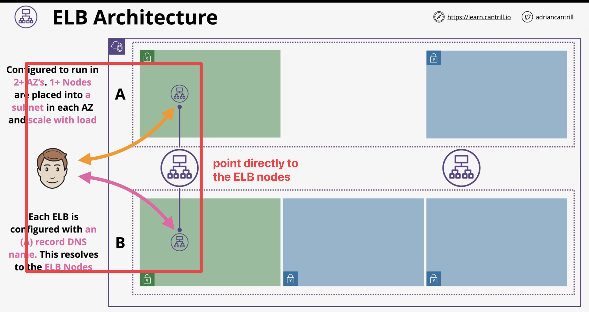
    
- Why are ELB nodes highly available?
    
    If a particular node (in an AZ) fails they get immediately replaced.
    
    If the load to the ELB increases, more nodes get added.
    
- How can we set up our ELB based on where we want to do our load balancing?
    - Internet-facing ELB
    - Internal ELB
- What is the difference between Internet-facing and Internal ELB?
    - Internet-facing ⇒ Nodes have **public and private** IP addresses
    - Internal ⇒ Nodes **only have private** IP addresses
- What is the similarity between Internet-facing and Internal ELBs?
    
    They are the same (same nodes, same load balancing features) besides the IP addressing
    
- Load Balancers (Nodes) are configured with {{listeners}} which accept traffic on a {{port & protocol}} and communicate with {{targets on a port and protocol}}
- What types of instances are accessible from Internet-facing ELB nodes?
    
    Internet-facing LB nodes can access **public & private EC2 instances**
    
- What do you need to set up so that your Load Balancer is reachable from the Public Internet?
    
    It has to be an Internet-facing load balancer
    
- What is the subnet size and available IP addresses recommended for your ELB to be able to scale?
    - a /27 or larger subnet
    - 8+ free IPs per subnet
- What’s one common way that internal facing load balancers are used?
    
    Separating different tiers of applications
    
    ---
    
    e.g. our user Bob connect to the web-server using an Internet-facing load balancer. The web server connects to an application server via an internal load balancer. This allows for separating application tiers and allow for independent scaling
    
    
    
- What is cross-zone load balancing?
    
    It allows every load balancer node to distribute any connections it receives equally across all registered instances
    
    
    
- Cover these facts about ELB Architecture:

- ELB is a {{DNS A Record}} pointing at {{1+ Nodes per AZ}}
- Nodes {{(in one subnet per AZ)}} can scale
- Internet-facing means nodes have {{public IPv4 IPs}}
- Internal is private {{only IPs}}
- EC2 doesn't need to be public to work with {{Internet-facing LBs}}
- {{Listener Configuration}} controls what the LB does
- {{8+}} Free IPs per subnet, and {{/27}} subnet to allow scaling
- Cover these facts about Application Load Balancer:
    - {{Layer 7}} Load balancer .. listens on {{HTTP and/or HTTPS}}
    - It doesn’t {{support other Layer 7 protocols (SMTP, SSH)}} and NO TCP/UDP/TLS Listeners
    - Can take advantage of other {{information available at L7}}: content type, cookies, custom headers, user location and app behaviour
    - HTTP HTTPS (SSL/TLS) are {{always terminated on the ALB}} - no unbroken SSL (security teams!) ....a new connection is made to the application
    - ALBs {{MUST have SSL certs}} if HTTPS is used
    - ALBs are slower than {{NLB}} .. more levels of the network stack to process
    - Given that ALB are a L7, they are able to evaluate {{application health}
- Cover these facts about Application Load Balancer rules:
    - Rules {{direct connections}} which arrive at a listener
    - Processed in {{priority order}}
    - Default rule = {{catchall}}
    - {{Rule Conditions}}: host-header, http-header, http-request-
    method, path-pattern, query-string & source-ip
    - {{Actions}}: forward, redirect, fixed-response, authenticate-
    oidc & authenticate-cognito
- Cover the rule and actions we’re seeing in this simple ALB deployment
    
    
    
    in the question
    
    - Simple ALB deployment with a single domain
    - One host-based rule with an attached SSL certificate
    - The rule ⇒ using host-header as a condition and forward as an action (forwarding any connections to [catagram.io](http://catagram.io) to the target group for the catagram application
- What type of load balancer would you use in this scenario?

”If you have to forward encrypted connections through to the instances without terminating them on the load balancer”
    
    Network Load Balancing (NLB) + TCP listeners
    

- If you see in the exam questions that talk about things that aren’t web (or secure web) and don’t use HTTP or HTTPS, you should default to {{Network Load Balancers}}
- Cover these facts about Network Load Balancers
    - {{Layer 4}} load balancer ... TCP, TLS, UDP, TCP_UDP
    - No visibility or understanding of {{HTTP or HTTPS}}
    - No {{headers}}, no {{cookies}}, no {{session}} stickiness
    - Really Really Really Fast (millions of rps, {{25% of ALB}} latency)
    - Use for SMTP, SSH, Game Servers, financial apps BUT not {{HTTP/S}}
    - Health checks JUST check ICMP / TCP Handshake they are not aware of the {{application health}}
    - NLB's can have {{static IP's}} - useful for whitelisting
    - You can forward TCP to instances which allows for {{unbroken encryption}} between your client’s connection and application instances
    - Used with {{private link}} to provide services to other VPCs
- How would you pick between ALB and NLB for your load balancing needs?
    
    **Use NLB if:**
    
    - Need unbroken end-to-end communication between a client and your instances
    - Need to use static IPs for whitelisting
    - The fastest performance (scaling up to millions of requests per second)
    - Need to operate on protocols that are not HTTP/S
    - Have requirements for VPC Privatelink
    
    **Otherwise default to ALB**
    
- What AWS technologies  do you need to create elastic architectures?
    - Auto-scaling groups
    - Elastic Load Balancers
    - Launch Templates
- What does ASG acronym stand for?
    
    Auto Scaling Groups
    
- What does Auto Scaling Groups do?
    
    Provide automatic scaling and self-healing for EC2
    
- How does an Auto Scaling Group know what to provision?
    
    Using Launch Templates or Launch Configurations
    
- How many launch configurations can you have at a time for an Auto Scaling Group?
    
    Use one Launch Configuration or one specific version of Launch Template
    
- What are the three important values that are part of any Auto Scaling Group?
    - Minimum size
    - Desired capacity
    - Maximum Size
    
    e.g. 1:2:4
    
    
    
- What is the main job that Auto Scaling Groups performs?
    
    Keep running instances at the **Desired capacity** (by provisioning or terminating instances)
    
- What do scaling policies do in the context of Auto Scaling Groups?
    
    Update the desired capacity based on a certain criteria (e.g. CPU load) between the MIN and MAX size values.
    
    
    
- Where do Auto Scaling Groups run from?
    
    Inside of a VPC within one or more subnets
    
    
    
- What are the three types of Scaling Policies?
    - Manual Scaling - Manually adjust the desired capacity (set min, desired, max manually)
    - Scheduled Scaling - Adjust the desired capacity based on schedules - e.g. scaling in outside of business hours
    - Dynamic Scaling
- What are the three types of Dynamic Scaling?
    - Simple Scaling ⇒ Provision/Terminate based on a metric
        - e.g. "CPU above 50%; +1 instance", "CPU Below 50; -1 instance”
    - Stepped Scaling ⇒ Provision/Terminate based on how out of normal the metric value is
        - e.g. CPU above 60-70%, add 1 instance; CPU above 70-80%, add 2 instances; CPU above 80-100%, add 3 instances
    - Target Tracking ⇒ Priovision/Terminate to remain at that target amount
        - e.g. set CPU = 40% with ASG handling the rest
- What does a Cooling Period dictate within an ASG?
    
    Value in seconds that controls how long to wait at the end of scaling action before doing another 
    
- Cover these exam points about ASG
    - Autoscaling Groups are $ {{free}}
    - Only the {{resources}} created are billed ...
    - Use {{cool downs}} to avoid rapid scaling
    - Use {{smaller instances}} over larger ones for granularity
    - Use with ALB's for {{elasticity}} by providing an extra layer of abstraction
    - ASG defines {{WHEN}} and {{WHERE}}, Launch Templates defines {{WHAT}}
- Do ASG need Scaling Policies?
    
    No, they can be created without one.
    
- What type of ASG is this an example of?
    
    
    
    in the question
    
    Simple Scaling
    
- What type of ASG is this an example of?
    
    
    
    in the question
    
    Step Scaling
    
- What do ASG Lifecycle Hooks help with?
    
    It’s a way to add extra steps (wait + proceed) which allows for the opportunity to run custom actions during our scale in / scale out ASG events.
    
    
    
- What are the three types of Health Checks that can be associated with ASG?
    - EC2 (Default)
    - ELB (Can be enabled)
    - Custom
- What is a health check grace period?
    
    Delay before starting health checks
    
- What happens if you do not have a sufficiently long enough grace period?
    
    You can be in a situation where the health checks start taking effect before the instances (launched by the ASG) can finish configuring. ⇒ instances will be viewed as unhealthy, terminated, and new instances will be provisioned
    
- How long should the health check grace period be?
    
    Long enough to allow for:
    
    - Allow for system launch
    - Bootstrapping
    - Application start
- What are the benefits of ELB’s SSL Bridging?
    - ELB gets to see the unencrypted HTTP and can take actions based on what’s contained within the plaintext protocol
- Complete these facts about SSL Bridging in ELB.
    
    
    
    use image occlusion to cover the facts in pink and purple
    
- Complete these facts about SSL Pass-through in ELB.
    
    
    
    use image occlusion to cover the facts in pink and purple
    
- Complete these facts about SSL Offload in ELB
    
    
    
    use image occlusion to cover the facts in pink and purple
    
- What are the downsides of ELB SSL Bridging?
    - The SSL certificate needs to be stored on the ELB (security risk)
    - EC2 instances need a copy of that SSL certificate
    - EC2 instances need the compute to perform the cryptographic operations (decrypting HTTPS to HTTP)
    
    
    
- What is the downside of SSL Pass-through for ELB?
    - You never do load balancing based on the HTTP part (given that you never decrypt the payload and you only forward it to the instance)
    - Instances (still) need the SSL certificates
    - Instances (still) need to perform cryptographic operations
- When should we use session stickiness with our Load Balancer?
    
    Whenever we store a customer’s sessions on a particular server (stateful servers)
    
- What does session stickiness do in the context of ELB?
    
    It help ensure that our Load balancer sends a customer’s traffic to a particular (stateful) server using a cookie
    
    
    
- What is the downside of session stickiness?
    
    Cause uneven load on backend servers (as the user will always be pointed to the same server no matter the load caused)
    
- Complete these facts about Connection Stickiness in ELB.
    
    
    
    use image occlusion to cover the facts in pink and purple
    
- Which load balancer is allocated with a static IP: ALB or NLB?
    
    NLB
    

### Serverless

- What does putting a queue between two application tiers enable?
    
    It **decouples** the two tiers using a **asynchronous architecture**. 
    
    One adds them to the queue, and another reads jobs from the queue
    
    
    
- If every application component required a queue between it and every other component to put events into it would be a really {{complex application architecture}}.
- Cover these facts about Event-driven Architecture:
    - No {{constant running}} or waiting for things
    - {{Producers}} generate events when something happens
        - .. clicks, errors, criteria met, uploads, actions
    - Events are delivered to {{consumers}} using an {{event router}}
    - Actions are {{taken}} & the system returns to {{waiting}}
    - Mature event-driven architecture only consumes resources {{while handling events}}
- Cover these facts about Lambda:
    - Function-as-a-Service (FaaS) - {{short running}} & {{focused}}
    - Lambda function - a {{piece of code}} lambda runs
    - Functions use a {{runtime (e.g. Python 3.8)}}
    - Functions are loaded and run in a {{runtime environment}}
    - The environment has a {{direct memory + indirect CPU}} allocated
    - You are billed for {{the duration that a function runs}}
    - A key part of {{Serverless}} architectures
    - Lambda runtime enwvironments have {{no state}} (new invocation, new environment)


- You directly control the memory allocated for Lambda functions whereas {{vCPU is allocated indirectly}}
    
    
    
- What does function timeout mean in the context of Lambda?
    
    How long a Lambda function can run
    
- What is the function timeout for Lambda functions?
    
    900 seconds or 15 minutes function timeout
    
- By default lambda functions are given {{public networking}}. They can access {{public AWS services}} and {{the public internet}}
    
    
    
- Public networking offers the {{best performance}} because {{no customer specific VPC}} networking is required
- Lambda functions (default public networking) have no access to {{VPC based services}} unless you’ve set up {{extra configuration}}: public IPs are provided & security controls allow external access
    
    
    
- Lambda functions running in a VPC obey all {{VPC networking rules}}
    
    
    
- Lambda {{execution roles}} are IAM roles attached to lambda functions which control the {{permissions}} the Lambda function {{receives}}.
    
    
    
- Lambda {{resource policy}} controls what services and accounts can {{invoke}} lambda functions
    
    
    
- Cover these facts about logging in Lambda:
    - Lambda uses {{CloudWatch, CloudWatch Logs & X-Ray}} for logging
    - Logs from Lambda executions are sent to {{CloudWatchLogs}}
    - Metrics - invocation success/failure, retries, latency are stored in {{CloudWatch}}
    - Lambda can be integrated with {{X-Ray}} for distributed tracing
    - CloudWatch Logs requires {{permissions via Execution Role}}
- What are the three ways you can invoke a Lambda function?
    - Synchronous invocation
    - Asynchronous invocation
    - Event Source mappings
- Who has to handle errors or retries within synchronous invocations of Lambdas?
    
    The client
    
- What is a key requirement of using Retries within an asynchronous Lambda invocation?
    
    Function code is idempotent
    
    
    
- Events can be sent to {{dead letter queues}} after repeated failed processing
- Permissions from the {{lambda execution role}} are used by the Event Source Mapping to interact with the event source
    
    
    
- Event Source Mapping is typically used on streams or queues which {{don't support event generation}} to invoke lambda (Kinesis, DynamoDB streams, SQS)
    
    
    
- Cover these facts about Lambda Version:
    - Lambda functions have {{versions}} - v1, v2, V3 ....
    - A version is the {{code + configuration}} of the lambda function
    - Versions are {{immutable}} - it never changes once published & has its own
    {{Amazon Resource Name}}
    - {{$Latest}} points at the latest version
    - {{Aliases}} (DEV, STAGE, PROD) point at a version; they can be changed
- What is a cold start in the context of Lambda?
    
    Time it takes for the full creation and configuration of your execution context?
    
- What is execution context in Lambda?
    
    Environment where a lambda function runs in
    
- With a warm start, the same {{execution context}} is reused. A new event is passed in but the execution context creation can be skipped.
- What feature would you use to improve speeds by keeping execution context warm?
    
    Provisioned concurrency
    
- Cover these facts about serverless
    - Serverless isn't one single thing
    - You manage {{few, if any servers}} - low overhead
    - Applications are a collection of {{small & specialised functions}}
    - ... {{Stateless}} and Ephemeral environments - duration billing
    - {{Event-driven}} .. consumption only when being used.
    - FaaS is used where possible for compute functionality
    - {{Managed}} services are used where possible
- Where does SNS run from?
    
    AWS Public Zone
    
- What does SNS do?
    
    Coodinate the sending and delivery of messages
    
- How large are the SNS messages in size?
    
    In the kilobytes (less than 256 kb)
    
- What is the base entity of SNS?
    
    SNS Topics
    
- What are the two parties you can observe in SNS?
    
    Publisher and Subscribers
    
- What does a SNS publisher do?
    
    Sends messages to a topic
    
- What does a SNS Subscriber do?
    
    SNS Subscriber stays subscribed to an SNS topic and receives messages
    
- What does SNS acronym stand for?
    
    Simple Notification Server
    
- What is the resilience of SNS?
    
    Region Resilience
    
- Lambda offers delivery {{status}} (to Lambda, and SQS) and {{retries}}
- How would you make an SNS topic available across multiple different AWS accounts?
    
    Using Topic Policy
    
- Cover these API Gateway Errors:
    
    
    
- How are API Gateways deployed?
    
    Per stage (i.e. prod, dev stages each with different DNS endpoint names)
    
- Say you have API Gateway enabled for a prod stage. When will calls be made to the backend services?
    
    Calls are only made to backend integrations if request is a cache miss
    
- Cache is defined per {{stage}} within API Gateway
- Can API Gateway cache be encrypted?
    
    Yes
    
- How manages SQS?
    
    AWS
    
- Is SQS a public or private AWS service?
    
    AWS Public Zone service
    
- What are the two types of SQS queues?
    - Standard
    - FIFO
- How large can messages in SQS be?
    
    256 kilobytes
    
    (getting kilobytes here is enough to count)
    
- How do you store data larger than 256kb within SQS queues?
    
    You link to the larger object inside of the message payload
    
- A client can {{send}} messages to a queue and other clients will be able to {{poll}} that queue.
- What is polling within the context of queues?
    
    The process of checking for any messages within a given queue
    
- What is the VisibilityTimeout within the context of SQS?
    - The period of time when the message is hidden from the queue.
    - During that time the processing should explicitly delete the message or put it back in the queue.
    - After the VisibilityTimeout expires the message is once again available for polling
    
    
    
- What is the name of this system architecture?
    
    
    
    SNS + SQS Fanout
    
- What guarantee of delivery and order do Standard and FIFO SQS queues make?
    - Standard ⇒ at-least-once delivery, no guarantee on the order
    - FIFO ⇒ exactly-once, guarantee order
- What is the main downside of FIFO SQS queues?
    
    Limited performance
    
- What is the performance of FIFO queues?
    - Batching: 3,000 messages per second
    - No Batching: up to 300 per second
- How are you billed for SQS?
    
    Based on the number requests you make to SQS
    
- What are the two types of polling you can do to an SQS queues?
    - Short polling
    - Long polling
- Why should use long polling over short polling when dealing with SQS queues?
    
    Long polling as you make fewer requests to SQS leading to lower costs (as you’re billed by the number of requests).
    
- What does a “request” mean in the context of polling SQS queues?
    
    1 request = 1 to 10 messages up to 64kb in total
    
- What do you need to have a valid FIFO SQS queue?
    
    .fifo suffix
    
- What is the difference between VisibilityTimeout and Delay queues in SQS?
    - VisibilityTimeout ⇒ Message is initially visible and it’s hidden only after it’s consumed from the queue and automatically reappears if that message isn’t deleted
    - Delay Queues ⇒ Message is hidden automatically when it’s first being added to the queue
    
    
    
- When would you use Kinesis versus SQS for the following cases:
    1. Ingestion of data ⇒ Kinesis 
    2. Worker pools ⇒ SQS
    3. Decoupling application ⇒ SQS
    4. Asynchronous communication ⇒ SQS
- In SQS you mainly have {{one}} group that produces data and {{one}} group that consumes that data.
- What does Kinesis Data Stream do?
    - Allow for producers to send large quantities of data into AWS
    - Storing that data for a window of time
    - Allow multiple consumers to get that data at different rates
- What are the three things that Kinesis Data Firehose allow you to do?
    - It allows you to persist data from Kinesis Stream past its rolling window (of the Kinesis Data Streams)
    - It allows you to deliver data to other AWS services natively
    - It allows you to store the data in another format by processing it with a Lambda
- Does Kinesis Data Firehose deliver data in real-time?
    
    No. It delivers it near real-time delivery
    
- What AWS technology should you use if you need real-time complex manipulation of data?
    
    Kinesis Data Analytics
    
- What is AWS Cognito used for?
    
    Authentication, Authorization, and user management for web/mobile apps
    
- What do Cognito User Pools do?
    
    Database of users, where users sign in and get a JWT token
    
- What is the limitation of Cognito used pools?
    
    The received JWT token cannot be used to interact with most AWS services
    
    
    
- What is the purpose of a Cognito identity pool?
    
    Exchange external identity (i.e. JWT token from the Cognito User Pools or Google login) for a set of temporary AWS credentials (which can then be used to access AWS resources).
    
    
    
- What can User Pool JWT token be used for?
    
    Only for the below but not AWS resources
    
    - API Gateway
    - Self-managed server based resources
    
    
    
- What are User and Identity Pools all about?
    - User Pool ⇒ sign in and sign out for users
    - Identity Pool ⇒ identity pools are about swapping identity tokens
- What does “federation” mean in the context of Cognito?
    
    Swapping external identity tokens for AWS identity credentials (e.g. swapping Google sign-in JWT token for Cognito JWT)
    
    
    

### AWS CloudFront

- Cover these facts about CloudFront:
    - Origin - {{The source location of your content}}
    - {{S3}} Origin or {{Custom}} Origin
    - Distribution - The {{'configuration'}} unit of CloudFront
    - Edge Location - {{Local cache of your data}}
    - {{Regional Edge Cache}} - Larger version of an edge
    location. Provides another layer of caching.
- What type of caching does CloudFront do: read-only or write and read caching?
    
    Read-only
    
- Say we’re using CloudFront to serve content to our user. What is the process that AWS will go through to get that content for our user?
    1. Check Edge location (local cache)
    2. If not in local cache, check Regional Edge Cache.
    3. If not in the regional edge cache, fetch the data from the origin (caching on both local and regional before sending it back to the user).
    
    
    
- A CloudFront distribution always has to have at least one {{behaviour}} but it can have many more.
- What is between an origin and a distribution within CloudFront?
    
    Cache Behavior
    
    
    
- What is the validity period of the Default TTL of a Cache Behavior?
    
    24 hours
    
- How do you apply a TTL value for a particular object?
    
    Using two headers:
    
    - Origin Header : `Cache-Control max-age` (seconds)
    - Origin Header : `Cache-Control s-maxage` (seconds)
    - Origin Header : `Expires` (Date & Time)
- How does validity work in CloudFront?
    - If there is no validity set at the object level (using specific headers), then the default TTL is used (24 hours)
- Say you have an user that’s trying to access an object that is viewed as expired by Cloudfront. What happens now?
    - User makes request for expired object
    - CloudFront makes request to origin.
    - If it gets 304 (Not modified) back it means that the object is still valid. Object is returned from the Edge Location
    - If it gets 200 it means that the Edge location needs to fetch from the origin before sending that to the client.
    
    
    
- What does cache invalidation do?
    
    Immediately expire any objects regardless of their TTL based on the invalidation pattern that you specify.
    
    ---
    
    for exampke potential invalidation patterns:
    
    - /images/whiskers.jpg ⇒ invalidate a particular object
    - /images/whiskers* ⇒ anything matching this wild card
    - /images/* ⇒ anything contained within this path
- What is cache invalidation applied to?
    
    A Cloudfront distribution
    
- What do you need to perform an invalidation?
    - Create an invalidation request where you specify one or more paths inside of that request
- How should you perform invalidations if you are cost sensitive?
    - Perform bigger invalidations less frequently rather than small invalidations less frequently (as you get billed for invalidation events)
- Say you’re worried about caching returning stale content and you do not want to use cache invalidation. What can you do?
    
    Use object version and have your application point to that new version of the object
    
    ---
    
    This will perform an origin fetch making sure your user sees the latest content
    
- What another tool you can use that’s better than cache invalidation?
    
    Using versioned file names and having your application point to these new versions
    
- What do you need for a web browser to view your application as secure?
    
    DNS Name + Certificate
    
    ---
    
    1. Pick a DNS name (i.e. animals4life.org)
    2. Generate a certificate and gets it signed
    3. Uses the certificate to prove its identity
- Cover these facts about AWS Certificate Manager (ACM):
    - ACM can {{generate or import}} Certificates
    - If {{generated}}, it can automatically renew
    - If {{imported}}, you are responsible for renewal
    - Certificates can be deployed out to {{supported services}}. For example you can use it with CloudFront and ALBs but not {{EC2}}
- What does ACM acronym stand for?
    
    AWS Certificate Manager
    
- What is the resilience level of ACM?
    
    Region resilience
    
- Can ACMs (Certificate Manager) be imported into / leave to another AWS region?
    
    No.
    
    
    
- What would you need to use an certificate with ALB in ap-southeast-2 region?
    
    A certificate in ACM in ap-southeast-2
    
    
    
- What region do you need to use to use certificates with CloudFront?
    
    us-east-1
    
    ---
    
    further explanation: distribution which is the unit of configuration in CloudFront is actually in us-east-1
    
    
    
- Can you use self-signed certificates for CloudFront distributions?
    
    No. You need certificates signed by a trusted Certificates Authority (CA)
    
- Say we’re using CloudFront for our distribution. This means that we need to establish two SSL Connections: Viewer => CloudFront and CloudFront => Origin. What does this imply from a certificates perspective?
    
    Both Need valid public certificates (Viewer to CloudFront AND CloudFront to Origin)
    
- Say you have a S3 as the origin for your CloudFront distribution. Do you need a dedicated certificate for SSL to work with this architecture?
    
    No as that is taken care of by S3 natively.
    
    
    
- What does the OAI acronym stand for?
    
    Origin Access Identity
    
- What does the OAC acronym stand for?
    
    Origin Access Control
    
- When should we use Origin Access Identity / Origin Access Control (OAI/OAC)?
    
    When we want to use CloudFront with an S3 origin
    
- What is the only type of origin you can pair with Origin Access Identity/Origin Access Control?
    
    S3 origin
    
- Is static website hosting an S3 origin or custom origin?
    
    Custom origin
    
- What are the steps that you need to take to use OAI/OAC with an S3 origin?
    1. Create an Origin Access Identity or Origin Access Control
    2. Associate it with a CloudFront distribution
    3. Create/adjust the bucket policy on the S3 bucket to explicitly allow OAI and implicitly deny all traffic
    
    
    
- What are the two ways you can secure a custom origin?
    - Using a custom header injected by the data passing through the a CloudFront Edge Location
    - Using a traditional firewall where we block all access that’s not coming from a CloudFront Edge location (assumes you can find the ip address range of CF edge locations)
    
    
    
- How come we can verify that traffic using a header is coming through a CloudFront Edge Location. Won’t another party be able to spoof that header?
    
    No. Because you can pass the header through HTTP but given that you’re using HTTPS means that you’re using an encrypted tunnel for communication making it impossible for a third party to parse your header
    
- What are the two modes for a CloudFront Distribution?
    - Public
    - Private
- Say you have a private CloudFront Distribution. What do you need for your requests to CloudFront to pass?
    - Signed Cookie OR Signed URL
- What is a signer in the context of CloudFront Distributions?
    
    Entity that can create signed URL and signed cookies
    
- What happens when you add a signer to a CloudFront behavior?
    
     Behavior is now private and only signed cookies/urls can be used to access content
    
- What does having “1 Behaviour” imply for your CloudFront distribution?
    
    Whole distribution is either public or private
    
- For the exam, what does the term trusted signed imply?
    
    That you’re looking at a private behavior or private distribution
    
- What does a CloudFront Signed URL give access to?
    
    A single object
    
- What does a CloudFront Signed Cookies give access to?
    
    Groups of objects
    
    ---
    
    Use for groups of files/all files of a type - e.g. all cat gifs
    
- What is presented in the white box?
    
    
    
    In the question image occlusion
    
- What is the purpose of Anycast IPs?
    
    Anycast IP's allow a single IP to be in multiple locations. Routing moves traffic to closest location
    
- How do customers arrive at one of the Global Accelerator Edge Locations?
    
    Using one of the two Anycast IP addresses (1.2.3.4 & 4.3.2.1) that are allocated to us when we create a Global Accelerator.
    
- What is the purpose of the AWS Global Accelerator?
    
    Get customers onto the global AWS architecture as quickly as possible (as quickly to their location as possible).  
    
- What is the difference between Global Accelerator and CloudFront from the perspective of the content they can handle?
    - Global accelerator can be used for non-HTTP/S (TCP/UDP) while CloudFront is HTTP/S only.
- CloudFront is a Global CDN capable of caching {{static & dynamic content}}

### AWS VPC

- What do VPC Flow Logs capture?
    
    Only metadata
    
    ---
    
    example: source/destination ip, source/destination port, packet size
    
- Where can VPC Flow logs be attached?
    - To VPC (captures all ENIs in the VPC)
    - To Subnet (capture ENIs within the subnet)
    - To a specific ENI
- Are Flow Logs real-time?
    
    No
    
- Complete the blurred out segments from this image:
    
    
    
    image occlusion on ICMP, TCP, and UDP numbers
    
- Say you have the following VPC Flow logs. One accepting the inbound and the other rejecting the outbound. What might’ve caused this given that they are from the same req/res event?
    
    
    
    Network ACL allowing the inbound and blocking outgoing packet. Resulting in an accept and reject for the same event
    
- What is Egress-only Internet Gateway?
    
    Allow outbound, restrict inbound for IPv6 enabled instances
    
    
    
    ---
    
    It allows the ability to connect to the Internet/AWS Public zone BUT restrict any externally initiated connections to our instances with IPv6 enabled
    
    ---
    
    In IPv4, you have NAT gateways which provide outbound only access but given that NAT Gateway are only accessible with IPv4 and NOT IPv6 ⇒ Egress-only IGW is meant to fill the functionality of outbound ok, inbound restricted for IPv6
    
- Does the architecture of an Internet Gateway and Egress-only Internet Gateway differ?
    
    No. Just the way you use it is different.
    
- What is the purpose of Gateway Endpoints?
    
    Allow private access to services such as S3 and DynamoDB without needing to set up an appropriate infrastructure.
    
    
    
    ---
    
    Eg. you try to access a S3 bucket from your private EC2 instance. Instead of going through a NATGW + IGW you have a prefix in the route table that moves that packet to the gateway endpoint arriving directly at S3.
    
    By appropriate infrastructure we mean an Internet Gateway with Public IPv4/6 OR NAT Gateways.
    
- What is the resilience of a Gateway Endpoint?
    
    Region resilience
    
- What do you need to do to use a Gateway Endpoint?
    1. Associate it to a VPC
    2. Set which subnets are going to be used with it
- What happens when you associate a Gateway Endpoint to a VPC and set which subnets to use?
    
    Configures a route on the route table for the selected subnets with the prefix list (pointing to the Gateway Endpoint)
    
- What do you need to use to control what a Gateway Endpoint can be used for?
    
    Endpoint Policy
    
- Are Gateway Endpoints are accessible outside the VPC their are associated to?
    
    No
    
- What is the resilience level of Interface Endpoints?
    
    AZ resilient
    
    ---
    
    Due to the fact that we use normal VPC (elastic) network interfaces (in a given subnet) with it means that Interface Endpoints is an AZ resilient service)
    
- Cover these facts about Interface Endpoints
    - Provide {{private access}} to AWS Public Services
    - Non-supported services: {{DynamoDB}}
    - Added to specific {{subnets on an ENI}} - not HA
    - For HA.. {{add one endpoint, to one subnet, per AZ}} used in the VPC
    - Network access controlled via {{Security Groups}}
    - {{Endpoint Policies}} - restrict what can be done with the endpoint
    - {{TCP and IPv4}} ONLY
    - Uses {{PrivateLink}}
- What does AWS PrivateLink do?
    
    Technology that allows AWS services (or third-party services) to be injected into your VPC and be given ENIs inside of your VPC subnet.
    
- Do Gateway Endpoints require changes to an application?
    
    No. As you only add a prefix list to the route table
    
    ---
    
    With Gateway Endpoints we’re only influencing the route that that traffic flows uses
    
- Interface endpoints don’t use routing, they use {{DNS}}
- What is VPC peering?
    
    It’s a way to securely connect two VPCs together
    
- VPC Peering does not support {{transitive peering}}
    - A peered into B.
    - B peered into C.
    - A will not be peered into C. You need a separate connection for that.
- What needs to be true for you to use VPC peering between to different VPCs?
    
    The VPC CIDR ranges cannot overlap
    

### Hybrid Environments and Migration

- What is the speed limitation of VPNs within AWS?
    
    1.25 Gbps
    
- Are there latency concerns for using VPNs within AWS?
    
    Yes. The VPN connection transits over the public internet which can have many hops between you and the AWS VPN Endpoints (each hops adds latency) 
    
- We know that VPNs within AWS are not suitable for latency sensitive application. What should you use instead?
    
    Direct Connect 
    
- What is the advantage of VPNs over other similar services like Direct Connect?
    
    They are fast to set up as it is all software defined
    
- What is the resilience of Direct Connect?
    
    There is no resilience level for Direct Connect unless specifically architected to be highly-available
    
- When should you use Storage Gateway in Volume Store mode?
    
    When you need “full disk” backups of servers OR need help with disaster recovery.
    
- What does Storage Gateway — Volume store mode — NOT do ?
    
    **Doesn't improve datacenter capacity.** (data stored locally, copy sent to AWS S3)
    
- What is the difference for Storage Gateway between Volume store mode and Cache mode?
    
    Volume Storage mode ⇒ data is managed by Storage Gateway on-premise but a copy of the data is sent to AWS
    
    Cache mode ⇒ primary data runs from S3 and the only thing stored locally is the frequently accessed data (cached data)
    
    ---
    
    
    
    
    
- When should you use Storage Gateway in Cache Mode?
    
    When you want to extend the capacity of your data center as the data is being stored in AWS.
    
- What is the similarity between Storage Gateway in Volume Store Mode and Cache Mode?
    
    They both work with Raw Block Devices
    
- What does File Gateway do?
    
    Bridges on-premises file storage and S3
    
- What does File Gateway offer?
    
    Mount Points available via NFS
    
- How does File Gateway display files stored into a mount point?
    
    As objects in an S3 bucket
    
    
    
- Say you’re trying to transfer 10TB to 10PB of data. What is the most economical service you should use to transfer the data?
    
    AWS Snowball
    
- Can you send multiple Snowball devices to multiple premises?
    
    Yes
    
- What is the economical range of AWS Snowball?
    
    10TB to 10PB
    
- What does Snowball as a product offer?
    
    Only storage
    
- What does Snowball Edge as a product offer?
    
    Storage and compute
    
- When should you ideally use Snowball Edge?
    
    Need to perform data processing on data as it’s ingested
    
- When should you use AWS Snowmobile?
    
    Ideal for 
    
    - single location
    - 10 PB+ of data transfer is required
- When is AWS Snowmobile not economical?
    
    Multi-site OR sub 10PB of required data transfer
    
    ---
    
    
    
- Which of the modes would you pick from AWS Directory Service?
    - {{Simple AD}} - The default. Simple requirements. A directory in AWS.
    - {{Microsoft AD}} - Applications in AWS which need MS AD DS, or you need to TRUST AD DS
    - {{AD Connector}} - Use AWS Services which need a directory without storing any directory info in the cloud ... proxy to your on-premises Directory
- Say the exam talks about the need to reliably transfer data between on-premises AND needs to integrate with EFS, FSX, S3 AND support bi-directional transfer. What do you need to use?
    
    AWS DataSync
    
    
    
- Complete these facts about AWS DataSync:
    - {{Task}} - A 'job' within DataSync, defines what is being synced, how quickly, FROM where and TO where
    - {{Agent}} - Software used to read or write to on-premises data stores using NFS or SMB
    - {{Location}} - every task has two {{locations}} FROM and TO. E.g. Network File System (NFS), Server Message Block (SMB), Amazon EFS, Amazon FSx and Amazon S3
    
    ---
    
    
    
- Complete these facts about FSx:
    
    dfs ⇒ distributed file system 
    
- What is FSx?
    
    Native Windows  file system accessible over SMB
    
- What OS does SMB protocol assume you’re using?
    
    Windows
    
- Say you’re in the exam and you see the SMB protocol being mentioned. What does this mean?
    
    The environment is a Windows one and FSx is involved
    
- How does FSx handle permissions?
    
    Using the windows permission model 
    
- When should you use FSx?
    
    When you want to provision a Windows file server with file shares, but without the admin overhead of running the server yourself.
    
- What does FSx integrate with?
    - Directory Service
    - Your own Active Directory directly
- What feature does FSx offer as it relates to restores?
    
    VSS - User-Driven Restores
    
    ---
    
    in a windows system you can view previous file version and right click to restore them
    
- How does public VIF differ from private VIF?
- What modes does the AWS Directory Service Support?
    - Simple Active Directory
    - Active Directory Connector
    - AWS Managed Microsoft AD

### **Security, Deployments & Operations**

- Say in the exam, you receive a question related to the rotation of secrets or rotation of secrets for RDS
    
    AWS Secrets Manager
    
- How does Secrets Manager handle rotation of secrets?
    
    Using Lambda
    
    
    
- What does Secrets Manager offer on top of the SSM Parameter Store’s ability to securely store secrets?
    
    Rotation of secrets
    
- Cover these facts about Firewalls:
    - At Layer 3 and 4 (packets and segments) REQUEST and RESPONSE are seen as {{different operations}}
    - At Layer 5 (session) capability REQUEST and RESPONSE can be considered as part of one {{sessions}}
    - L7 Firewall keeps all L3, L4 & L5 features but can react to {{L7 elements}}
    (such as {{DNS, RATE, Content, Headers}})
    
    
    
- What does WAF acronym stand for?
    
    Web Application Firewall
    
- What is the main selling point of WAF?
    
    Event driven architecture to improving security
    
    
    
    ---
    
    You can have an event driven architecture that takes in Web ACL logs, interprets them and updates the Web ACL as needed in order to improve security
    
- What is the main unit of configuration within WAF?
    
    Web ACL
    
- What is the relationship between a resource and Web ACL?
    - 1 Resource = 1 Web ACL
    - 1 Web ACL = many Resources
- What does AWS Shield do?
    
    It provides DDOS protection
    
- What type of attacks does AWS Shield Standard help guard against?
    
    Common Network (L3) or Transport (L4) layer attacks
    
- Does Shield Advanced require explicit configuration?
    
    Yes.
    
    ---
    
    Not automatic - must be explicitly enabled in Shield Advanced or AWS Firewall Manager Shield Advanced policy
    
- What does Shield Advanced offer on top of Shield Standard in the type of attack it can block?
    
    Protects DDOS coming from the Application Layer (Layer 7) using WAF
    
- What is the similarity and difference between CloudHSM and KMS?
    
    Similarity: both use a Hardware Security Module
    
    Differences: 
    
    - CloudHSM
        - AWS provisioned fully customer managed
        - You are the only tenant
    - KMS
        - the HSM is shared with multiple customers BUT separate
        - AWS has access
- What is the compliance level of CloudHSM?
    
    FIPS 140-2 Level 3
    
- What does HSM acronym stand for?
    
    Hardware Security Module
    
- What service should you use If you need to utilize industry standard encryption APIs such as - **PKCS#11**, Java Cryptography Extensions (**JCE**), Microsoft **CryptoNG** (CNG) libraries?
    
    CloudHSM
    
- What APIs do you need to use to access your CloudHSM?
    - PKCS#11
    - JCE (Java Cryptography Extensions)
    - Microsoft CryptoNG
- With CloudHSM, AWS Provision HSM but have {{no access}} to the secure area where key material is held
- What is CloudHSM not able to do from an integration perspective?
    
    No Native AWS integration .. e.g. no S3 SSE
    
- What are the x uses cases of CloudHSM?
    - Offload the SSL/TLS Processing for Web Servers
    - Enable Transparent Data Encryption (TDE) for Oracle Databases
    - Protect the Private Keys for an Issuing Certificate Authority (CA)
- What does AWS Config do?
    
    Record configuration changes over time on resources
    
- What does AWS Macie do?
    
    Discover, Monitor and Protect Data stored in S3 Buckets
    
- How does AWS Macie know what data in S3 needs to be filtered in order to protect its contents?
    - Managed Data Identifiers - maintaned by AWS
    - Custom Data Identifiers - created by you
    
    
    
- What does AWS Inspector do?
    
    Scans For vulnerabilities and deviations from best practices
    
- What does AWS Inspector scan?
    - EC2 instances
    - Instance’s OS
    - Containers
- What are the two types of assesments that Inspector can run?
    - Network Assessment (Agentless)
    - Network & Host Assessment (Agent)
- Cover these Host Assessment that AWS Inspector performs:
    - Common {{vulnerabilities and exposures}} (CVE)
    - Center for {{Internet Security}} (CIS) Benchmarks
    - Security {{best practices}} for Amazon Inspector
- Shield Standard is automatically provided with the following services: CloudFormation, CloudFront, R53, API Gateway, and ALB.
    
    CloudFront and Route 53
    
- WAF Provides what type of protections. Chose ALL: Layer 7 attacks, SQL Injection, Cross-Site Scripting, DDOS, and CDOS.
- WAF Can be added to. Choose ALL: EC2, CloudFront, API Gateway, ALB, Lambda
    
    CloudFront, API Gateway, ALB
    

### AWS CloudFormation

- What is defined with CloudFormation templates?
    
    Logical resources
    
- How should you think of Logical Resources?
    
    Think of logical resources as what you want to create but not how you want them created
    
- What are CFN templates used to create?
    
    Stacks
    
- What is the job of CFN stacks?
    
    To create physical resources from the logical resources (defined in the template)
    
- If a stacks template is changed, {{physical resources are changed}}
If a stack is deleted, normally, {{the physical resources are deleted}}
- CloudFormation as a product aims to keep the two: {{logical resources}} and {{physical resources}} in sync.
- When should you use Intrinsic Functions in CloudFormation?
    
    Assign values to properties that are not available until runtime.
    
    ---
    
    While Intrinsic Functions allow you to gain access to data at runtime, your template can take actions based on how things are when the template is being used to create a stack.
    
- What do Creation Policies and Wait Policies do?
    
    They allow a specific resource creation to be paused not allowing progress until signaling is received.
    
- What is the difference between Nested Stack and Cross Stack References in CFN?
    
    Nested Stacks ⇒ Reuse the code (CFN templates)
    
    Cross Stack References ⇒ Reuse the actual resources
    
- When should you use Nested Stacks?
    
    Use only when everything is lifecycle linked (create and delete resources together)
    
- Cover these facts about working with Cross-Stack References:
    - Outputs can be {{exported}}, making them visible from other stacks
    - Exports must have a {{unique name in the region}}
    - {{ImportValue}} can be used instead of Ref to reference region exported values
- What does CFN Stack Sets help with?
    
    Deploying CFN Stack across many regions and AWS accounts
    
- What is CFN Delete Policy?
    
    It is a way to control what happens when a stack is deleted.
    
- What are the CFN Delete Policy options?
    - Default ⇒ when you delete the stack (logical resource) the physical resource is also deleted.
    - Retain ⇒ delete logical resource WON’T delete physical resource
    - Snapshot into S3 ⇒ if supported by the service
- CFN Delete Policy only applies to delete, not {{replace}}
- What feature would you need to use if you needed an identity to use CloudFormation to do things that they wouldn’t otherwise be allowed to do outside of CloudFormation?
    
    CFN Stack Roles
    
- What does CFN Init?
    
    Alternative to EC2 Bootstrapping
    
    
    
- Cover these facts about CFN no-hup:
    - cin-init is run once as part of {{bootstrapping}} (user data)
    - ...if CloudFormation::Init is updated, it isn't {{rerun}}
    - cfn-hup helper is a daemon which can be installed
    - .. it detects {{changes}} in resource metadata
    - .. running {{configurable}} actions when a change is detected
    - So with CFN no-hup when you update the stack you also {{update the config}} on EC2 instances
- {{Custom Resources}} let CFN integrate with anything it doesn't yet, or doesn't natively support

### NOSQL Databases & DynamoDB

- What does “adding capacity” mean in the context of Dynamo DB?
    
    Increase performance
    
- What do you need to set when using provisioned capacity for a Dynamo table?
    
    Need to explicitly set the capacity values on a per-table basis
    
- What are the two types of capacity you need to set on a provisioned capacity Dynamo Table?
    - Write Capacity Unit (WCU)
    - Read Capacity Unit (RCU)
- What does 1 WCU translate to?
    
    Ability to write 1KB of data per second to a Dynamo table
    
- What does 1 RCU translate to?
    
    Ability to read 4KB of data per second from a Dynamo table
    
- What is the trade-off that one makes when going with On-Demand over Provisioned Capacity in Dynamo?
    
    You trade-off unpredictable workload and low admin overhead with higher cost 
    
    ---
    
    On-Demand can be up to 5x the cost of Provisioned Capacity
    
- Every operation on a Dynamo table consumes at least {{1 RCU/WCU}}
- What are the two types of Primary keys in Dynamo?
    - Simple Primary Key ⇒ just the Partition Key
    - Composite Primary Key ⇒ Partition Key + Sort Key
- What does PK stand for?
    
    Partition Key
    
- What does SK stand for?
    
    Sort Key
    
- How is capacity consumed when querying?
    
    Size of the returned data
    
    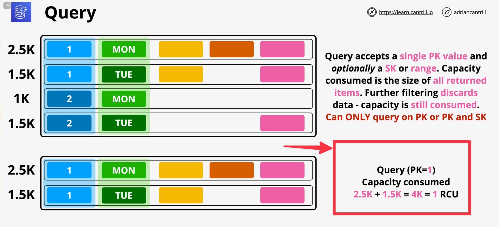
    
- What do you need to pass to use query operation?
    
    Provide a Partition Key or Partition Key + Sort Key
    
- Where does Dynamo always direct writes to?
    
    The Leader Storage Node
    
    
    
- What do you need to calculate the WCU/RCU you should provision?
    - Items you want to store per second
    - Average size per item
    
    ---
    
    
    
- What is a storage node?
    
    A replica of your dynamo table in another AZ
    
    
    
- What can happen when you use eventual consistency for your Dynamo table?
    - Writes are sent to the Leader Storage Node
    - The Leader Storage node replicates to all other Storage Nodes
    - Using eventual consistency it can be that reading from a Storage Node where the data wasn’t replicated yet, it means that **you’ll see out of data information**
    
    
    
- What does LSI acronym stand for?
    
    Local Secondary Index
    
- What does Local Secondary Index allow you to do?
    
    Same Partition Key, Different Sort Key
    
    
    
    ---
    
    Allow for an alternative sort key on the data in the main table.
    
- When can you create LSIs?
    
    Only when the table is first being created
    
- Assuming we’re using provisioned capacity table: is WCU and RCU shared with LSIs?
    
    Yes
    
- What does it mean that LSI “indexes are sparse” in Dynamo?
    
    Only items which have a value in the index alternative sort key are added to the index
    
    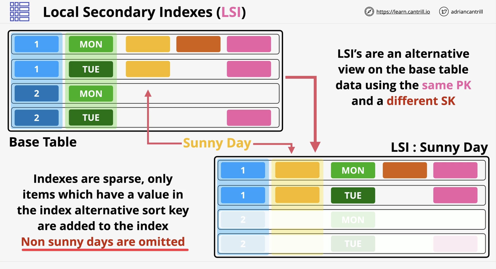
    
- What does GSI acronym stand for?
    
    Global Secondary Index
    
- When can you create GSIs?
    
    At any time
    
- What does Global Secondary Index allow you to do?
    
    Create alternative Partition Key and Sort Key
    
    
    
- Assume you’re using a capacity provisioned table: does your GSI share the WCU/RCU allocations with the table?
    
    No.
    
- What does it mean that GSI's are sparse?
    
    Only ITEMS which have values in the new PK and optional SK are added
    
- What is the consistency level of GSIs?
    
    Eventually consistent
    
- When should you use LSIs?
    
    When strong consistency is required
    
- Cover these facts about DynamoDB Global Tables:
    - Sub-second replication between {{table replicas}}
    - On global tables you have {{eventual consistency}}
    - On same-region tables you have either {{eventual or strongly consistent}}
    - {{Multi-master replication}}, all tables can be used for Read and Write operations
    - Provides Global {{High Availability}} and Global {{Disaster Recovery}} and Business Continuity
    - {{Last writer wins}} conflict resolution
- What does DAX service help with?
    
    In-memory cache (designed to reduce the response time of read Dynamo DB operations)
    
- DAX Considerations:
    - {{Primary Node}} (Writes) and {{Replicas}} (Read)
    - Nodes are HA .. Primary failure means {{we elect a read replica to be bumped to primary node}}
    - Supports write-through {{writing to Dynamo and caching to DAX at the same time}}
    - DAX Deployed {{WITHIN a VPC}}
- Cover these facts about ElasticCache:
    - It is an {{In-memory database}} which provides high performance
    - It provides managed {{Redis or MemcacheD}} as a service
    - Can be used to cache data - for {{Read heavy}} workloads with {{low latency}} requirements
    - It helps reduce database {{workloads}} which can be expensive
    - Can be used to store {{Session Data}} helping make servers {{stateless}}
    - Requires {{application changes}} for the service to function
- What is the HA benefit of Redis vs MemcacheD?
    
    Redis is multi-AZ while MemcacheD has no replication
    
- What is the backup benefit of Redis vs MemcacheD?
    
    Redis has backups and restores while MemcacheD has no backups support.
    
- What is the resilience level of Redshift?
    
    AZ resilience
    
- From where does Redshift run?
    
    VPC
    
- Is Redshift serverless?
    
    No
    
- What do you need to set up in Redshift if you want advanced networking control?
    
    Enable Enhanced VPC Routing